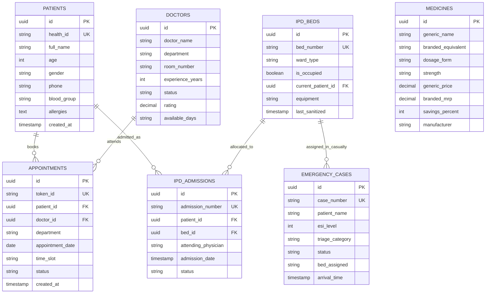

# 🗄️ Backend Schema & Database Specifications
## Module 01: PostgreSQL Database Schemas, Tables & ERD

---

## 1. Entity-Relationship Diagram (ERD)

```
+-------------------------------------------------------------------------------------------------+
|                                 HEALTHGRID POSTGRESQL CLUSTER ERD                               |
+-------------------------------------------------------------------------------------------------+
|                                                                                                 |
|   +-------------------+          +----------------------+          +--------------------+       |
|   |  public.patients  | 1      * |  public.appointments | *      1 |   public.doctors   |       |
|   |-------------------|----------|----------------------|----------|--------------------|       |
|   | id (PK, UUID)     |          | id (PK, UUID)        |          | id (PK, UUID)      |       |
|   | health_id (UNIQUE)|          | token_id (UNIQUE)    |          | doctor_name        |       |
|   | full_name         |          | patient_id (FK)      |          | department         |       |
|   | age, gender       |          | doctor_id (FK)       |          | room_number        |       |
|   | phone, allergies  |          | appointment_date     |          | status, rating     |       |
|   +-------------------+          +----------------------+          +--------------------+       |
|             |                                                                                   |
|             | 1                                                                                 |
|             |                                                                                   |
|             v *                                                                                 |
|   +-----------------------+ 1      * +----------------------+                                   |
|   | public.ipd_admissions |----------|   public.ipd_beds    |                                   |
|   |-----------------------|          |----------------------|                                   |
|   | id (PK, UUID)         |          | id (PK, UUID)        |                                   |
|   | admission_number (UNQ)|          | bed_number (UNIQUE)  |                                   |
|   | patient_id (FK)       |          | ward_type (ENUM)     |                                   |
|   | bed_id (FK)           |          | is_occupied (BOOL)   |                                   |
|   | attending_physician   |          | current_patient_id   |                                   |
|   +-----------------------+          +----------------------+                                   |
|                                                                                                 |
|   +-----------------------+          +----------------------+                                   |
|   | public.emergency_cases|          |   public.medicines   |                                   |
|   |-----------------------|          |----------------------|                                   |
|   | id (PK, UUID)         |          | id (PK, UUID)        |                                   |
|   | case_number (UNIQUE)  |          | generic_name         |                                   |
|   | patient_name          |          | branded_equivalent   |                                   |
|   | esi_level (INT 1-5)   |          | generic_price (NUM)  |                                   |
|   | status (ENUM)         |          | branded_mrp (NUM)    |                                   |
|   | bed_assigned (FK)     |          | savings_percent (INT)|                                   |
|   +-----------------------+          +----------------------+                                   |
+-------------------------------------------------------------------------------------------------+
```



---

## 2. Table Schemas & Constraints (DDL)

### 2.1 `public.patients`
```sql
CREATE TABLE public.patients (
    id UUID PRIMARY KEY DEFAULT gen_random_uuid(),
    health_id VARCHAR(50) UNIQUE NOT NULL,
    full_name VARCHAR(255) NOT NULL,
    age INT NOT NULL CHECK (age >= 0 AND age <= 130),
    gender VARCHAR(20) NOT NULL CHECK (gender IN ('Male', 'Female', 'Other')),
    blood_group VARCHAR(10),
    phone VARCHAR(20),
    allergies TEXT,
    created_at TIMESTAMPTZ DEFAULT NOW(),
    updated_at TIMESTAMPTZ DEFAULT NOW()
);
CREATE INDEX idx_patients_health_id ON public.patients(health_id);
```

### 2.2 `public.doctors`
```sql
CREATE TABLE public.doctors (
    id UUID PRIMARY KEY DEFAULT gen_random_uuid(),
    doctor_name VARCHAR(255) NOT NULL,
    department VARCHAR(100) NOT NULL,
    specialization VARCHAR(255),
    room_number VARCHAR(50) NOT NULL,
    experience_years INT DEFAULT 0,
    status VARCHAR(50) DEFAULT 'Available' CHECK (status IN ('Available', 'In Consultation', 'On Break', 'Off Duty')),
    rating DECIMAL(2,1) DEFAULT 4.8,
    available_days VARCHAR(100) DEFAULT 'Mon - Sat',
    created_at TIMESTAMPTZ DEFAULT NOW()
);
CREATE INDEX idx_doctors_department ON public.doctors(department);
```

### 2.3 `public.appointments`
```sql
CREATE TABLE public.appointments (
    id UUID PRIMARY KEY DEFAULT gen_random_uuid(),
    token_id VARCHAR(50) UNIQUE NOT NULL,
    patient_id UUID REFERENCES public.patients(id) ON DELETE CASCADE,
    doctor_id UUID REFERENCES public.doctors(id) ON DELETE SET NULL,
    department VARCHAR(100) NOT NULL,
    appointment_date DATE NOT NULL,
    time_slot VARCHAR(50) NOT NULL,
    status VARCHAR(50) DEFAULT 'Waiting' CHECK (status IN ('Waiting', 'In Progress', 'Completed', 'Cancelled')),
    created_at TIMESTAMPTZ DEFAULT NOW()
);
CREATE INDEX idx_appointments_status ON public.appointments(status);
CREATE INDEX idx_appointments_date ON public.appointments(appointment_date);
```

### 2.4 `public.ipd_beds` (250 Hospital Beds)
```sql
CREATE TABLE public.ipd_beds (
    id UUID PRIMARY KEY DEFAULT gen_random_uuid(),
    bed_number VARCHAR(50) UNIQUE NOT NULL,
    ward_type VARCHAR(100) NOT NULL CHECK (ward_type IN ('ICU', 'Emergency Casualty', 'Oxygen Ward', 'General Ward')),
    is_occupied BOOLEAN DEFAULT FALSE,
    current_patient_id UUID REFERENCES public.patients(id) ON DELETE SET NULL,
    equipment TEXT,
    last_sanitized TIMESTAMPTZ DEFAULT NOW()
);
CREATE INDEX idx_ipd_beds_ward ON public.ipd_beds(ward_type, is_occupied);
```

### 2.5 `public.emergency_cases`
```sql
CREATE TABLE public.emergency_cases (
    id UUID PRIMARY KEY DEFAULT gen_random_uuid(),
    case_number VARCHAR(50) UNIQUE NOT NULL,
    patient_name VARCHAR(255) NOT NULL,
    esi_level INT NOT NULL CHECK (esi_level BETWEEN 1 AND 5),
    triage_category VARCHAR(50) NOT NULL CHECK (triage_category IN ('Critical Red', 'In Treatment', 'Waiting')),
    status VARCHAR(50) DEFAULT 'Admitted' CHECK (status IN ('Admitted', 'In Treatment', 'Stabilized', 'Transferred')),
    bed_assigned VARCHAR(50),
    arrival_time TIMESTAMPTZ DEFAULT NOW()
);
CREATE INDEX idx_emergency_esi ON public.emergency_cases(esi_level, triage_category);
```

### 2.6 `public.medicines` (Jan Aushadhi Formulary)
```sql
CREATE TABLE public.medicines (
    id UUID PRIMARY KEY DEFAULT gen_random_uuid(),
    generic_name VARCHAR(255) NOT NULL,
    branded_equivalent VARCHAR(255) NOT NULL,
    dosage_form VARCHAR(100) NOT NULL,
    strength VARCHAR(100) NOT NULL,
    generic_price DECIMAL(10,2) NOT NULL,
    branded_mrp DECIMAL(10,2) NOT NULL,
    savings_percent INT NOT NULL CHECK (savings_percent BETWEEN 0 AND 100),
    manufacturer VARCHAR(255) DEFAULT 'PMBJP - Bureau of Pharma PSUs of India'
);
CREATE INDEX idx_medicines_search ON public.medicines(generic_name, branded_equivalent);
```
