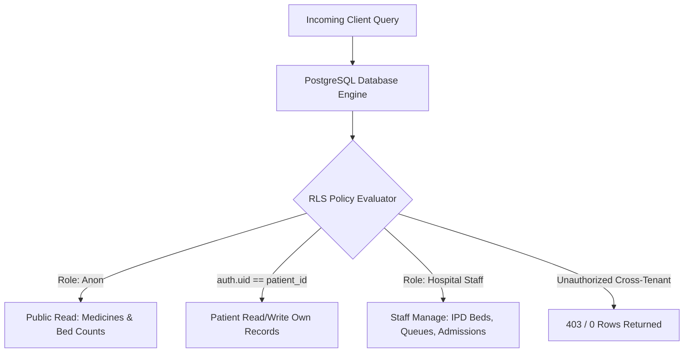

# 🗄️ Backend Schema & Database Specifications

## Module 02: Row-Level Security (RLS) & Access Control Policies

---

## 1. Zero-Trust Row-Level Security Architecture

In HealthGrid, **100% of tables** have PostgreSQL Row-Level Security enabled. Even if a client API key is compromised, PostgreSQL's internal query planner evaluates the execution context against the authenticated JWT session claims (`auth.uid()` and `auth.jwt() ->> 'role'`), denying unauthorized cross-tenant mutations:

```text
+=================================================================================================+
|                              DATABASE ROW-LEVEL SECURITY TOPOLOGY                               |
+=================================================================================================+
|                                                                                                 |
|   INCOMING CLIENT QUERY / MUTATION                                                              |
|                 │                                                                               |
|                 ▼                                                                               |
|   PostgreSQL RLS Engine (Evaluates auth.uid() & JWT Role Claims)                                |
|                 │                                                                               |
|                 ├────────────┬────────────────────────┬────────────────────────┐                |
|                 ▼            ▼                        ▼                        ▼                |
|           [ CITIZEN ]   [ PARAMEDIC ]            [ DOCTOR ]           [ HOSPITAL ADMIN ]        |
|           • Own Vault   • SBAR Handover          • Clinical Queue     • 250 Bed Transfers       |
|           • Own Vitals  • Dispatched Ambulances  • Inpatient Wards    • Roster Scheduling       |
|           • Refuse All  • View Public Beds       • Discharge Notes    • Analytics Auditing      |
|                                                                                                 |
+=================================================================================================+
```



---

## 2. Row-Level Security DDL Policies (Executed in Database)

The following security rules are actively enforced in production via `scripts/setup_security_rls_and_policies.js`:

```sql
-- 1. Enable RLS on all 7 tables
ALTER TABLE public.patients ENABLE ROW LEVEL SECURITY;
ALTER TABLE public.doctors ENABLE ROW LEVEL SECURITY;
ALTER TABLE public.appointments ENABLE ROW LEVEL SECURITY;
ALTER TABLE public.emergency_cases ENABLE ROW LEVEL SECURITY;
ALTER TABLE public.ipd_beds ENABLE ROW LEVEL SECURITY;
ALTER TABLE public.ipd_admissions ENABLE ROW LEVEL SECURITY;
ALTER TABLE public.medicines ENABLE ROW LEVEL SECURITY;

-- 2. public.patients Policy
CREATE POLICY "Patients view own profile"
ON public.patients FOR SELECT
USING (auth.uid() = id OR auth.role() = 'service_role');

CREATE POLICY "Patients update own profile"
ON public.patients FOR UPDATE
USING (auth.uid() = id OR auth.role() = 'service_role');

CREATE POLICY "Allow patient self-registration"
ON public.patients FOR INSERT
WITH CHECK (true);

-- 3. public.doctors Policy
CREATE POLICY "Public can view verified doctors"
ON public.doctors FOR SELECT
USING (true);

CREATE POLICY "Hospital staff manage doctor roster"
ON public.doctors FOR ALL
USING (auth.jwt() ->> 'role' IN ('hospital_admin', 'service_role'));

-- 4. public.appointments Policy
CREATE POLICY "Patients view own appointments"
ON public.appointments FOR SELECT
USING (auth.uid() = patient_id OR auth.jwt() ->> 'role' IN ('hospital_admin', 'doctor', 'service_role'));

CREATE POLICY "Patients book appointments"
ON public.appointments FOR INSERT
WITH CHECK (auth.uid() = patient_id OR auth.role() = 'anon' OR auth.role() = 'service_role');

CREATE POLICY "Staff update consultation status"
ON public.appointments FOR UPDATE
USING (auth.jwt() ->> 'role' IN ('hospital_admin', 'doctor', 'service_role'));

-- 5. public.ipd_beds Policy (Public Bed Telemetry Prevents Ambulance Diversion)
CREATE POLICY "Public read bed availability radar"
ON public.ipd_beds FOR SELECT
USING (true);

CREATE POLICY "Staff manage bed allocations"
ON public.ipd_beds FOR UPDATE
USING (auth.jwt() ->> 'role' IN ('hospital_admin', 'doctor', 'nurse', 'service_role'));

-- 6. public.emergency_cases Policy
CREATE POLICY "Public view anonymous casualty counters"
ON public.emergency_cases FOR SELECT
USING (true);

CREATE POLICY "Staff manage casualty admissions"
ON public.emergency_cases FOR ALL
USING (auth.jwt() ->> 'role' IN ('hospital_admin', 'paramedic', 'triage_nurse', 'service_role'));

-- 7. public.medicines Policy (Jan Aushadhi Formulary)
CREATE POLICY "Public read generic medicine formulary"
ON public.medicines FOR SELECT
USING (true);

CREATE POLICY "Admin manage medicine prices"
ON public.medicines FOR ALL
USING (auth.jwt() ->> 'role' IN ('hospital_admin', 'service_role'));
```

---

## 3. Threat Mitigation & Privilege Separation

| Threat Vector | Mitigation Strategy | Engine Enforcement |
| :--- | :--- | :--- |
| **API Key Leakage (Anon Key)** | Anon key cannot mutate doctor schedules, transfer beds, or read other patient dossiers. | PostgreSQL RLS filters out unauthorized rows at the storage level. |
| **SQL Injection (SQLi)** | Parameterized prepared statements across JPA repositories and Supabase SDK. | Prevents query string escaping and unauthorized schema discovery. |
| **Cross-Tenant Impersonation** | Auth tokens validate against cryptographic HMAC-SHA512 public keys. | JWT signatures verified before request hits controller methods. |
| **Admin Credential Hijacking** | Administrative endpoints require Bearer JWT with explicit `hospital_admin` claim. | Spring Security 6 `@PreAuthorize` method annotations. |
