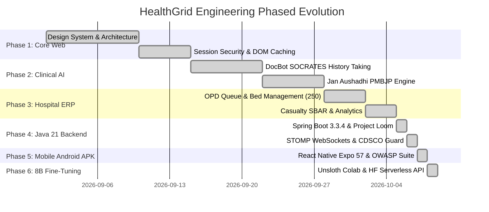

# 📅 Implementation Plan
## Module 01: Engineering Milestones, Phased Roadmap & Technical Evolution

---

## 1. Phased Engineering Evolution

HealthGrid has progressed through 6 rigorously planned engineering phases to reach its finalized enterprise architecture:

```
+=================================================================================================+
|                                  HEALTHGRID ENGINEERING ROADMAP                                 |
+=================================================================================================+
|                                                                                                 |
|   PHASE 1: FOUNDATIONS & DESIGN SYSTEM                                                          |
|   • React 19.x + Vite 8.3 + Tailwind CSS v4 setup with clinical dark mode.                      |
|   • In-memory session security (sessionSecurityManager.ts) eliminating XSS exfiltration.        |
|   • Sub-1ms tab switching via DOM keep-alive caching.                                           |
|                                                                                                 |
|   PHASE 2: CLINICAL AI TRIAGE & PMBJP PHARMACEUTICAL ENGINE                                     |
|   • DocBot autonomous clinical consultant with SOCRATES history taking protocol.                |
|   • 4-tier Multimodal Vision & OCR cascade for handwritten prescription digitization.           |
|   • Jan Aushadhi generic substitution engine matching PMBJP formulary (50% to 90% savings).     |
|   • ABDM CoWIN-standard multi-profile family hub (up to 7 dependents).                          |
|                                                                                                 |
|   PHASE 3: ENTERPRISE HOSPITAL ERP & CASUALTY COMMAND TOWER                                     |
|   • Digital OPD queue scheduling (HG-OPD-XXXX) across specialized departments.                  |
|   • 250 Inpatient bed inventory tracking across ICU, Emergency, Oxygen, and General wards.       |
|   • 3-tier Emergency Severity Index (ESI 1-5) casualty intake with SBAR handover briefs.       |
|   • Reports & Analytics dashboard with AreaCharts and radial capacity gauges.                   |
|                                                                                                 |
|   PHASE 4: ENTERPRISE JAVA 21 BACKEND & CONCURRENCY                                             |
|   • Spring Boot 3.3.4 backend powered by Project Loom Virtual Threads.                          |
|   • Tiered Token-Bucket rate limiting filter with anti-IP spoofing validation.                  |
|   • Real-time STOMP WebSocket broker (/ws-emergency, /topic/ambulance-location).                |
|   • CDSCO Schedule H and Schedule X controlled substance guard (DrugJailbreakAdvice.java).      |
|                                                                                                 |
|   PHASE 5: NATIVE ANDROID APK & OWASP MOBILE SECURITY SUITE                                     |
|   • React Native 0.86.3 + Expo SDK 57 Android project (New Architecture: Fabric & Turbos).      |
|   • OWASP Mobile Top 10 hardening: Android Keystore AES-256 GCM in TEE, BiometricPrompt,        |
|     FLAG_SECURE window shield, network_security_config.xml TLS 1.3 pinning, zero ADB backup.    |
|   • Prebuilt Gradle wrapper and cloud EAS build profiles generating installable .apk.           |
|                                                                                                 |
|   PHASE 6: 8B CLINICAL LLM FINE-TUNING & FREE CLOUD SERVING                                     |
|   • 1-Click Google Colab notebook for Meta Llama-3.1-8B-Instruct with Unsloth AI QLoRA.         |
|   • Multi-task clinical dataset (Medical-O1, MedQA, ChatDoctor, PMBJP, DPDP Act 2023).          |
|   • 100% free-tier cloud deployment via Hugging Face Serverless Inference API in aiService.ts.  |
|                                                                                                 |
+=================================================================================================+
```



---

## 2. Feature Dependency Graph

* **Hospital Bed Telemetry** depends on **Supabase PostgreSQL RLS** and **Realtime WAL Pub/Sub**.
* **AI Live Clinic** depends on **HTML5 MediaDevices / Android CameraX** and **Local Encrypted Transcript Caching**.
* **108 Emergency Dispatch** depends on **Geolocation API** and **Java 21 STOMP Broker (`/ws-emergency`)**.
* **Fine-Tuned 8B Clinical Model** depends on **Unsloth Colab Pipeline** and **Hugging Face Serverless Router**.
