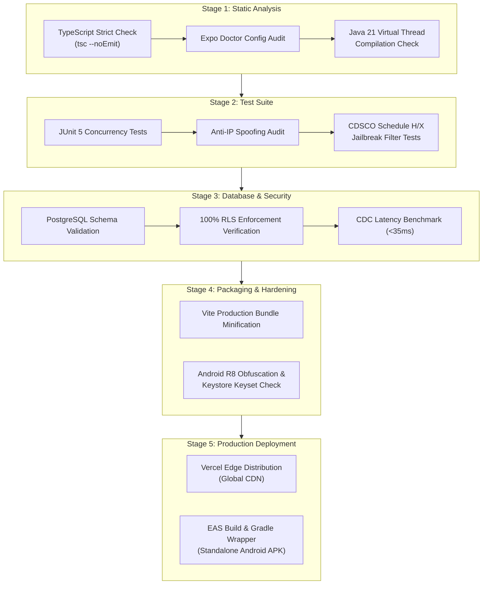
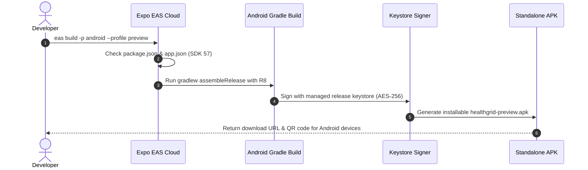

# 🚀 Implementation Plan
## Module 02: Testing, Verification, Quality Gates & Deployment Runbooks

---

## 1. Overview & Verification Strategy

HealthGrid enforces strict multi-stage quality gates to guarantee clinical accuracy, deterministic data security, zero-downtime scalability, and mobile hardening before any code reaches production.

```
+=================================================================================================+
|                              HEALTHGRID VERIFICATION & CI/CD PIPELINE                           |
+=================================================================================================+
|                                                                                                 |
|   STAGE 1: STATIC ANALYSIS & TYPE SAFETY                                                        |
|   • Frontend: TypeScript 5.8+ strict check (`npx tsc --noEmit`)                                 |
|   • Mobile: React Native Expo 57 type audit & `npx expo-doctor` config validation               |
|   • Backend: Java 21 Checkstyle, SpotBugs & compile-time annotation processing                  |
|                                                                                                 |
|   STAGE 2: UNIT & INTEGRATION TESTING                                                           |
|   • Java Spring Boot 3.3.4: JUnit 5 + Mockito virtual thread concurrency testing                |
|   • Security Filter Tests: Anti-IP spoofing validation & Token-Bucket rate limit exhaustion     |
|   • CDSCO Compliance Tests: Schedule H & Schedule X automated prescription jailbreak rejection |
|                                                                                                 |
|   STAGE 3: DATABASE INTEGRITY & ROW-LEVEL SECURITY (RLS) AUDIT                                  |
|   • PostgreSQL 15 schema verification across all 7 core tables                                  |
|   • 100% RLS enforcement test: Unauthenticated SELECT/INSERT/UPDATE rejected with 42501         |
|   • Realtime CDC latency benchmark: <35ms WAL replication over WebSockets                       |
|                                                                                                 |
|   STAGE 4: ARTIFACT PACKAGING & SECURITY HARDENING                                              |
|   • Web: Vite production bundle tree-shaking & code splitting                                   |
|   • Android: ProGuard / R8 bytecode obfuscation, shrinkResources & Android Keystore check       |
|                                                                                                 |
|   STAGE 5: DEPLOYMENT & EDGE DISTRIBUTION                                                       |
|   • Web: Global CDN distribution via Vercel Edge Networks with TLS 1.3 pinning                  |
|   • Mobile: Cloud Expo Application Services (EAS) & local Gradle build generating APK           |
|                                                                                                 |
+=================================================================================================+
```



---

## 2. Testing Quality Gates

### Gate A: Frontend & Mobile Type Safety
Both web and native presentation layers must pass zero-warning TypeScript checks:
```bash
# Run in c:\HealthGrid\frontend
cd c:\HealthGrid\frontend
npx tsc --noEmit
npm run build
```
* **Acceptance Criteria**: Exit code `0`. Bundle size report generated with no circular dependency warnings.

### Gate B: Java 21 Enterprise Backend Verification
The Spring Boot enterprise service must compile and pass all test suites on Project Loom virtual threads:
```bash
# Run in c:\HealthGrid\backend-java
cd c:\HealthGrid\backend-java
mvn clean test
```
* **Acceptance Criteria**: All JUnit tests pass, including:
  1. `RateLimiterFilterTest`: Verifies 429 response when client exceeds 300 requests/minute.
  2. `DrugJailbreakAdviceTest`: Verifies that requests attempting to prescribe Morphine, Fentanyl, or Alprazolam without an authenticated specialist medical registration number (RMP) are blocked with a `403 Forbidden` response and an audit log event.
  3. `VirtualThreadExecutorTest`: Confirms dispatching 10,000 parallel requests without OS thread starvation.

### Gate C: Supabase PostgreSQL Row-Level Security (RLS) Verification
Execute SQL verification against the production or staging Supabase instance to ensure zero data leaks:
```sql
-- Verify all 7 core tables have RLS enabled
SELECT tablename, rowsecurity 
FROM pg_tables 
WHERE schemaname = 'public' 
  AND tablename IN ('patients', 'doctors', 'appointments', 'emergency_cases', 'ipd_beds', 'ipd_admissions', 'medicines');
```
* **Acceptance Criteria**: All 7 rows must return `rowsecurity = true`. Any table returning `false` fails the deployment gate immediately.

---

## 3. Local Development Runbooks

### Runbook 1: Frontend Development Server
```bash
cd c:\HealthGrid\frontend
npm install
npm run dev
```
* **URL**: `http://localhost:5173`
* **Configuration**: Ensure `.env` contains:
  ```env
  VITE_SUPABASE_URL=https://<project-ref>.supabase.co
  VITE_SUPABASE_ANON_KEY=<anon-jwt>
  VITE_GROQ_API_KEY=<gsk_api_key>
  VITE_GEMINI_API_KEY=<gemini_api_key>
  VITE_HF_API_KEY=<hf_api_token>
  ```

### Runbook 2: Java 21 Spring Boot Backend Server
```bash
cd c:\HealthGrid\backend-java
mvn spring-boot:run
```
* **Port**: `8080`
* **WebSocket Endpoint**: `ws://localhost:8080/ws-emergency`
* **Health Check**: `GET http://localhost:8080/actuator/health`

### Runbook 3: Native Android Mobile Build (Local Debug APK)
```bash
# From workspace root
npx expo run:android

# Or assemble standalone debug APK via Gradle wrapper
cd android
.\gradlew.bat assembleDebug
```
* **Output Artifact**: `android/app/build/outputs/apk/debug/app-debug.apk`

---

## 4. Production Deployment Runbooks

### Deployment 1: Global Edge Web Deployment (Vercel)
HealthGrid web application is architected for Vercel edge deployment:
```bash
cd c:\HealthGrid\frontend
npx vercel --prod
```
* **Build Command**: `npm run build`
* **Output Directory**: `dist`
* **Header Policies**:
  * `Strict-Transport-Security: max-age=63072000; includeSubDomains; preload`
  * `X-Frame-Options: DENY`
  * `X-Content-Type-Options: nosniff`
  * `Content-Security-Policy: default-src 'self'; script-src 'self' 'unsafe-eval' https://apis.google.com; connect-src 'self' https://*.supabase.co wss://*.supabase.co https://api.groq.com https://generativelanguage.googleapis.com https://api-inference.huggingface.co;`

### Deployment 2: Native Android APK Packaging (Cloud EAS)
For preview and release distribution without local Android Studio / NDK overhead:
```bash
# Configure project credentials
npx eas login

# Run Preview Build (produces installable universal .apk)
npx eas build -p android --profile preview

# Run Production Release Build (produces .aab for Google Play Store)
npx eas build -p android --profile production
```



---

## 5. Operations, Circuit Breakers & Incident Runbooks

### Incident 1: Groq LPU Rate Limit Exceeded (HTTP 429)
* **Trigger**: Sudden surge in DocBot triage conversations exceeding Groq tier limits.
* **Automated Mitigation**:
  1. `aiService.ts` complexity arbiter intercepts HTTP 429 response.
  2. Fallback cascade redirects prompt to Hugging Face Serverless endpoint (`Meta-Llama-3.1-8B-Instruct`).
  3. If Hugging Face endpoint is cold-starting (>5s latency), traffic automatically reroutes to Google Gemini Flash.
* **Human Operator Action**: Check Groq dashboard usage metrics; scale tier or adjust token quota in `aiService.ts`.

### Incident 2: High Casualty Surge & Bed Saturation (ICU/Emergency Wards)
* **Trigger**: Hospital casualty intake registers mass casualty incident (MCI, ESI 1 or 2).
* **Automated Mitigation**:
  1. STOMP WebSocket channel `/topic/emergency-dispatch` broadcasts high-priority alert to all connected medical workstations.
  2. ERP Bed Command Tower highlights green buffer beds in adjacent wards suitable for rapid step-down conversion.
* **Operator Action**: Click "Convert General to Oxygen Bed" in ERP Ward Manager to reallocate dynamic inventory.

### Incident 3: Network Disconnect on Paramedic Ambulance Tablet
* **Trigger**: Paramedic in transit loses 4G/5G cellular connectivity while completing SBAR handover.
* **Automated Mitigation**:
  1. Frontend / Native App caches SBAR vitals into IndexedDB / Encrypted SQLite local storage.
  2. Offline Banner displays: *"Offline mode active: Vitals queued for background sync"*.
  3. Service Worker / Background fetch automatically replays queue to `POST /api/v1/emergency/sbar` immediately upon connectivity restoration.
