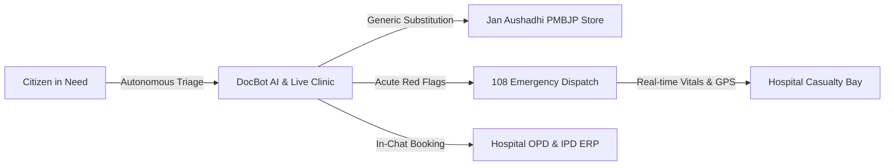

# 🎯 Product Requirements Document (PRD)

## Module 01: Executive Summary, Problem Statement & Scope

---

## 1. Executive Summary

**HealthGrid (நலம் AI)** is a unified digital healthcare operating system engineered to resolve systemic bottlenecks across citizen accessibility, out-of-pocket medical expenditures, acute emergency ambulance routing, and hospital clinical throughput.

By integrating autonomous pre-hospital clinical AI triage, real-time Jan Aushadhi (PMBJP) generic drug price substitution, camera-based live tele-examination, 108 Emergency Ambulance telemetry with digital trauma handovers, and an enterprise multi-department Hospital ERP suite, HealthGrid creates a continuous digital bridge between citizens in remote communities and tertiary medical institutions.

```text
+=================================================================================================+
|                                     HEALTHGRID ECOSYSTEM VISION                                 |
+=================================================================================================+
|                                                                                                 |
|   [ CITIZEN & FAMILY ]                [ EMERGENCY FLEET ]             [ HOSPITAL HEALTHCARE ]   |
|   • AI Symptom Triage (SOCRATES)      • 108 Ambulance Dispatch        • Digital OPD Tokens      |
|   • Camera-Based AI Live Clinic       • GPS Real-time Telemetry       • 250 IPD Bed Tracking    |
|   • Jan Aushadhi Generic Savings      • Paramedic SBAR Handover       • Emergency Trauma Ward   |
|   • ABDM Multi-Profile Health Hub     • Casualty Notification         • Doctors OPD Roster      |
|                                                                                                 |
+=================================================================================================+
```



---

## 2. Core Problem Statement & Healthcare Pain Points

Public and private healthcare systems face severe systemic challenges across affordability, physical infrastructure capacity, and communication latencies:

| # | Healthcare Bottleneck | Systemic Reality | HealthGrid Engineered Solution |
| :- | :--- | :--- | :--- |
| **1** | **Overburdened Outpatient Departments (OPD)** | Patients frequently endure 3–6 hours in congested waiting halls for routine 3-minute physical consultations, exhausting clinical staff. | 24/7 autonomous pre-hospital triage with digital OPD queue token distribution and in-chat booking. |
| **2** | **Crippling Out-of-Pocket Prescription Costs** | Up to 70% of out-of-pocket health expenditures in India are spent on branded medications despite identical bioequivalent generics existing. | Automatic generic substitution engine matching prescribed branded medications against the official **Jan Aushadhi (PMBJP)** formulary with **50% to 90% cost savings**. |
| **3** | **Ambulance Diversion & Blind Handovers** | Ambulances arrive at emergency trauma bays without advance vitals warning, while hospitals turn away critical cases due to unseen bed shortages. | Real-time 108 Emergency Ambulance dispatch with live GPS telemetry, paramedic-to-hospital SBAR handover packets, and live casualty bed tracking. |
| **4** | **Illegible Handwritten Prescriptions** | Medication errors caused by illegible or smudged physician handwriting lead to severe adverse drug reactions and dispensing delays. | 4-Tier Multimodal Vision & OCR cascade translating handwritten scripts into verified dosages, frequency instructions, and interaction warnings. |
| **5** | **Fragmented Family Medical Records** | Dependent elderly parents and young children lack individual smartphones, leaving records unlinked across facilities. | ABDM-aligned Multi-Profile Family Hub supporting up to 7 dependents under one account, featuring distinct Health IDs and age-calibrated dosing. |
| **6** | **Patient Privacy & Data Exfiltration** | Centralized patient logs and third-party AI scraping risk exposing sensitive diagnosis histories. | Client-side zero-trace privacy under India's **DPDP Act 2023**, in-memory volatile session closures, Android Keystore AES-256 encryption, and database Row-Level Security. |

---

## 3. Product Scope & User Personas

### Target Personas

```text
+-------------------------------------------------------------------------------------------------+
|                                     HEALTHGRID PERSONA MATRIX                                   |
+-------------------------------------------------------------------------------------------------+
| 1. CITIZEN / PATIENT                                                                            |
|    • Goals: Instant symptom clarity, affordable generic medicines, 1-tap emergency support.     |
|    • Context: Variable connectivity, low digital literacy, multilingual (Tamil, Tanglish).     |
|                                                                                                 |
| 2. FAMILY CAREGIVER                                                                             |
|    • Goals: Manage health records for elderly parents and young children without extra phones. |
|    • Context: Needs sovereign Health IDs and age-calibrated medication tracking.                |
|                                                                                                 |
| 3. PARAMEDIC / EMERGENCY FIRST RESPONDER                                                        |
|    • Goals: Rapid patient handover, live GPS transmission, zero delay trauma bay intake.        |
|    • Context: High-stress transit, mobile hardware, needs automated SBAR reporting.             |
|                                                                                                 |
| 4. HOSPITAL PHYSICIAN & NURSING STAFF                                                           |
|    • Goals: Screened patient histories, legible prescription outputs, zero bed bottlenecks.     |
|    • Context: Fast-paced casualty wards, needs high-contrast triage queues and bed telemetry.   |
|                                                                                                 |
| 5. HOSPITAL ADMINISTRATOR                                                                       |
|    • Goals: Real-time bed occupancy, department revenue, OPD token throughput, crisis control.  |
|    • Context: Desktop command dashboard, requires CSV exports and instant metric gauges.        |
+-------------------------------------------------------------------------------------------------+
```

### Out-of-Scope (Non-Goals)

* **Automated Surgical Interventions**: HealthGrid is an assistive clinical intelligence and workflow platform; it does not perform automated invasive procedures.
* **Direct Narcotics Dispensing**: The platform strictly prohibits autonomous generation or dispensing of CDSCO Schedule H and Schedule X controlled narcotics.
* **Replacing In-Person Physical Trauma Triage**: DocBot provides pre-hospital guidance and emergency dispatch; acute life-threatening trauma requires physical physician care.
