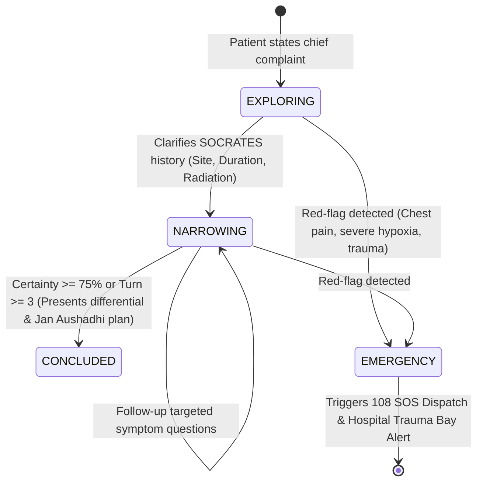

# 🎯 Product Requirements Document (PRD)
## Module 02: Functional Requirements Specification

---

## 1. Citizen & Patient Experience Modules

### 1.1 DocBot AI Autonomous Clinical Consultant
* **Conversational Diagnostic Triage**: Operates as a chief medical AI consultant conducting structured history taking adhering to the **clinical SOCRATES protocol** (Site, Onset, Character, Radiation, Associations, Timing, Exacerbating/Relieving factors, Severity).
* **Anti-Premature Diagnosis Invariant**: Forbidden from making immediate turn-1 diagnoses. Progresses through 4 gated phases:
  `EXPLORING` $\rightarrow$ `NARROWING` $\rightarrow$ `CONCLUDED` $\rightarrow$ `EMERGENCY`.
* **Multilingual & Vernacular Fluency**: Full conversational fluency in English, Tamil (தமிழ்), and Tanglish, including cultural idioms (*"kaichal"*, *"nenju vali"*, *"sugar problem"*).
* **Zero Robotic Slop Invariant**: Prohibits robotic disclaimers, asterisks, bulleted questionnaires, or sterile templates. Formulates empathetic, human physician prose.
* **In-Chat Automated OPD Appointment Booking**: Detects patient interest in physical evaluation and generates embedded booking cards linking directly to hospital departments.



### 1.2 AI Live Clinic (`LiveVisionDoctorModal.tsx` & `LiveClinicScreen.tsx`)
* **Full-Bleed Viewfinder**: Native camera feed (HTML5 MediaDevices on web, native CameraX on Android) with **zero static doctor imagery** for realistic immersion.
* **Kinetic Audio Equalizer**: Floating non-intrusive `DocBot Speaking` indicator displaying 4 animated kinetic sound bars active exclusively during audio playback.
* **Dynamic Clinical Verification Checklist**: AI dynamically extracts observable symptoms and asks the patient to confirm targeted visual signs via interactive checkboxes.
* **Client-Side Encrypted Transcript Caching**: Live transcripts are continuously encrypted and cached in device local storage (`localStorage` / Android Keystore) under session-specific keys with 1-tap restore and copy actions.
* **Real-Time Supabase Telemetry**: Displays verified appointment details and live round-trip ping latency (`performance.now()`) with adaptive network health badges (`Excellent`, `Good`, `Fair`).

### 1.3 Personal Health Vault & Records Hub (`VitalsTelemetryModal.tsx` & `RecordsHubScreen.tsx`)
* **6-Metric Clinical Navigation**: Tabbed tracking across:
  1. *Vitals & Measurements* (BP, Blood Glucose, BMI, Resting Heart Rate)
  2. *Blood Sugar* (Fasting, Postprandial, HbA1c)
  3. *Pulse Rate* (Resting, Active, Arrhythmia alerts)
  4. *SpO2 Blood Oxygen* (Continuous oxygen saturation percentages)
  5. *Body Temperature* (°F / °C with fever classifications)
  6. *Weight & BMI* (Longitudinal trend trajectories)
* **Zero-Knowledge Privacy**: End-to-end encrypted local storage; biometric authentication prompt (Fingerprint / FaceID) on mobile before opening vault.

### 1.4 ABDM Multi-Profile Family Hub (`ConsultationBeneficiaryModal.tsx`)
* **CoWIN-Standard Caregiver Architecture**: Primary account holders can manage up to 7 family dependents (elderly parents, infants, spouses) without requiring separate smartphones.
* **Sovereign Health IDs**: Generates distinct Health IDs (`HG-FAM-XXXX`) with age-calibrated dosing rules and independent medical dossiers.

### 1.5 108 Emergency Casualty SOS Dispatch (`EmergencyView.tsx` & `EmergencyScreen.tsx`)
* **1-Tap Satellite Dispatch**: Captures precise GPS coordinates via browser/device Geolocation APIs.
* **Real-Time Fleet Telemetry**: Connects to Spring WebSocket STOMP (`/ws-emergency`) broadcasting ambulance route progress.
* **Paramedic SBAR Handover**: Transmits digital Situation, Background, Assessment, Recommendation briefs directly to hospital trauma desks before ambulance arrival.

---

## 2. Prescription Digitization & PMBJP Generic Store

```
[ Handwritten Prescription Slip ]
               │
               ▼
[ 4-Tier Multimodal OCR Cascade ]
  Google Gemini Flash • Groq Vision • Hugging Face TrOCR
               │
               ▼
[ PMBJP Formulary Grounding Engine ]
  Matches Branded Molecules against Indian Pharmacopeia Standards
               │
               ▼
[ Output: Jan Aushadhi Savings Slip ]
  • Side-by-side brand vs generic price comparison
  • Verified 50% to 90% cost savings
  • 1-Tap WhatsApp export & Google Calendar dose alarms
```

* **Prescription OCR Cascade**: Deciphers cursive physician handwriting into validated drug molecules, strengths (mg/ml), dosage intervals, and durations.
* **Jan Aushadhi Substitution**: Automatically matches branded medicines (e.g. *Glycomet*, *Telma*, *Pan 40*, *Dolo 650*, *Augmentin*) to official government PMBJP generics, displaying exact retail savings.
* **Automated Dose Reminders**: Generates 1-click `.ics` calendar files and WhatsApp reminders for daily morning, afternoon, and night regimens.

---

## 3. Hospital ERP & Casualty Command Tower

### 3.1 Patient Management & OPD Queue Intake
* **Digital Token Dispatch**: Assigns unique OPD queue tokens (`HG-OPD-XXXX`) routed to specialized hospital departments (Cardiology, Pediatrics, General Medicine, Orthopedics).
* **Live Waiting Room Radar**: Real-time waiting time estimations decremented dynamically as doctors complete consultations.

### 3.2 Inpatient Department (IPD) & 250-Bed Telemetry
* **Bed Inventory Tracking**: Live status across **250 hospital beds** segmented into 4 clinical wards:
  1. *Intensive Care Unit (ICU)* (Critical ventilators and multi-parameter monitors)
  2. *Emergency Casualty Ward* (Trauma bays and crash carts)
  3. *Oxygen-Supported Ward* (High-flow nasal oxygen ports)
  4. *General Ward* (Standard inpatient recovery beds)
* **Real-Time CDC Synchronization**: When a bed is allocated or vacated, PostgreSQL WAL Change Data Capture broadcasts updates to all connected screens in **<35ms**, preventing ambulance diversion.

### 3.3 Emergency Casualty Department
* **3-Tier ESI Acuity Intake**: Color-coded casualty triage gauges:
  - *Critical Red (Immediate Life Threat)*
  - *In Treatment (Stabilizing)*
  - *Waiting (Urgent Observation)*
* **Clinical Actions Desk**: Instant STAT laboratory order placement, wristband thermal printing generation, and 1-tap admission to IPD beds.

### 3.4 Doctors & OPD Roster Management
* **Physician Scheduling**: Backed by `public.doctors` database schema with 24 seeded specialist doctors across 8 clinical departments.
* **Consultation Room Routing**: Real-time room assignments and live availability toggling (`On Duty`, `In Consultation`, `On Break`).

### 3.5 Reports & Analytics Suite
* **Database Aggregation**: Real metrics compiled from Supabase tables:
  - *Patient Intake Volume*: AreaCharts depicting daily patient registrations.
  - *Bed Occupancy Gauge*: Radial bar gauge tracking hospital capacity (e.g. 79% occupancy).
  - *Department Revenue Breakdown*: Stacked bars reflecting OPD consultations, IPD admissions, and pharmacy dispensations.
  - *Data Portability*: 1-tap CSV report generation for statutory health directorate audits.
