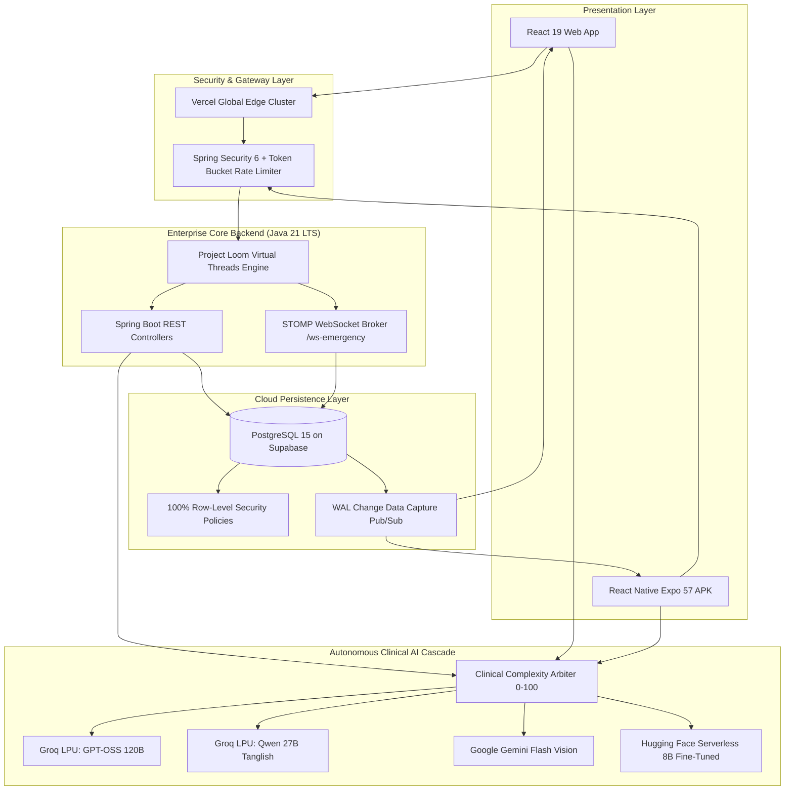

# ⚙️ Technical Requirements Document (TRD)
## Module 01: System Architecture, Technology Stack & Topology

---

## 1. High-Level Multi-Tier Architecture

HealthGrid employs a zero-trust, decoupled cloud architecture connecting responsive web clients, native Android devices, an enterprise Java backend, and distributed AI models:

```
+===================================================================================================+
|                                    CLIENT PRESENTATION LAYER                                      |
|                                                                                                   |
|   +---------------------------------------------+   +-----------------------------------------+   |
|   |         RESPONSIVE WEB PORTAL               |   |        NATIVE ANDROID APP (APK)         |   |
|   |   React 19.x • Vite 8.3 • Tailwind CSS v4   |   |   React Native 0.86 • Expo SDK 57       |   |
|   |   Lenis Smooth Scroll • Recharts Analytics  |   |   Native CameraX • Android Studio JBR   |   |
|   +---------------------------------------------+   +-----------------------------------------+   |
+===================================================================================================+
                                                |
                                                v
+===================================================================================================+
|                              ZERO-TRUST SECURITY & HARDWARE SHIELD                                |
|                                                                                                   |
|   +-----------------------+  +-----------------------+  +-----------------------+  +-------------+  |
|   |   Android Keystore    |  | Biometric App Lock    |  |  Screen Privacy Shield|  | CDSCO Guard |  |
|   |  AES-256 GCM (TEE)    |  | Fingerprint / FaceID  |  |  FLAG_SECURE Windows  |  | Sched H / X |  |
|   +-----------------------+  +-----------------------+  +-----------------------+  +-------------+  |
+===================================================================================================+
                                                |
                                                v
+===================================================================================================+
|                                 EDGE ROUTING & API GATEWAY                                        |
|                                                                                                   |
|   +---------------------------------------------+   +-----------------------------------------+   |
|   |        Vercel Global Edge CDN Cluster       |   |      Spring Security 6 Gateway          |   |
|   |  4 Synchronized Domain Aliases • HTTP/2     |   |  Stateless Bearer JWTs • IP Rate Limit  |   |
|   +---------------------------------------------+   +-----------------------------------------+   |
+===================================================================================================+
                                                |
                                                v
+===================================================================================================+
|                         ENTERPRISE CORE BACKEND (Java 21 LTS + Spring Boot)                       |
|                                                                                                   |
|   +---------------------------------------------+   +-----------------------------------------+   |
|   |         REST API Controllers                |   |        WebSocket STOMP Broker           |   |
|   |   Auth • OPD Queue • IPD Beds • Triage      |   |   /ws-emergency • /topic/ambulance-gps  |   |
|   +---------------------------------------------+   +-----------------------------------------+   |
|   |             Project Loom Virtual Threads (spring.threads.virtual.enabled=true)            |   |
|   +-------------------------------------------------------------------------------------------+   |
+===================================================================================================+
                         |                                               |
                         v                                               v
+=============================================+   +=============================================+
|       DISTRIBUTED PERSISTENCE (Supabase)    |   |     AUTONOMOUS MULTI-MODEL AI CASCADE       |
|                                             |   |                                             |
|  +---------------------------------------+  |   |  +---------------------------------------+  |
|  |     PostgreSQL Cloud Database         |  |   |  |   Clinical Complexity Scorer (0-100)  |  |
|  |  patients • doctors • appointments    |  |   |  +---------------------------------------+  |
|  |  emergency_cases • ipd_beds • medicines|  |   |     |             |             |             |
|  +---------------------------------------+  |   |     v             v             v             v
|  | Row-Level Security (RLS) on all Tables|  |   |  +--------+  +--------+  +--------+  +--------+  |
|  +---------------------------------------+  |   |  | Groq   |  | Groq   |  | Gemini |  | HF Hub |  |
|  | Realtime WAL Change Data Capture (CDC)|  |   |  | 120B   |  | Qwen   |  | Flash  |  | SFT 8B |  |
|  +---------------------------------------+  |   |  | Reason |  | Indic  |  | Vision |  | Server |  |
|  | pgvector Semantic Hybrid Embeddings   |  |   |  +--------+  +--------+  +--------+  +--------+  |
+=============================================+   +=============================================+
```



---

## 2. Core Technology Stack Matrix

| Subsystem | Framework / Technology | Version | Purpose & Rationale |
| :--- | :--- | :--- | :--- |
| **Web Client** | React + Vite | 19.x / 8.3 | High-performance SPA with concurrent rendering, sub-1ms tab switching. |
| **Styling & Motion** | Tailwind CSS + Lenis | v4.x / 1.1 | Modern design tokens, responsive breakpoints, smooth scrolling physics. |
| **Mobile Client** | React Native + Expo | 0.86.3 / SDK 57 | Cross-platform Android deployment with New Architecture (Fabric + TurboModules). |
| **Mobile Security** | Android Keystore / Biometrics | API 34+ | Hardware-backed AES-256 GCM in TEE, BiometricPrompt, `FLAG_SECURE`. |
| **Core Backend** | Java LTS + Spring Boot | Java 21 / 3.3.4 | Project Loom virtual threads, enterprise security filter chains, JPA ORM. |
| **Messaging** | Spring STOMP WebSockets | 3.3.4 | Sub-second bidirectional ambulance telemetry and trauma desk alerts. |
| **Cloud Database** | PostgreSQL on Supabase | 15.x | ACID persistence, WAL Change Data Capture, 100% Row-Level Security. |
| **Vector Search** | pgvector + Hybrid RAG | 0.5.x | High-dimensional embeddings matching colloquial symptoms to ICMR guidelines. |
| **Inference Providers**| Groq LPU, Google Gemini, HF | API v1 | Sub-300ms open-weight inference, multimodal OCR, free serverless 8B serving. |
