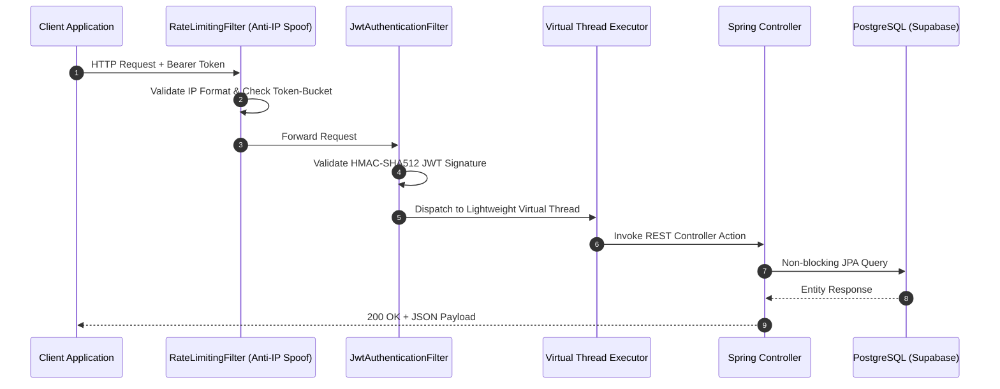

# ⚙️ Technical Requirements Document (TRD)
## Module 02: Java 21 Spring Boot Backend & Enterprise Services

---

## 1. Directory Structure & Subsystem Breakdown

```
backend/
├── pom.xml                               # Java 21 LTS, Spring Boot 3.3.4, JJWT 0.12, PostgreSQL Driver
└── src/main/java/com/healthgrid/
    ├── HealthGridApplication.java        # Spring Boot Entry Point (Project Loom Enabled)
    ├── auth/                             # Enterprise Authentication & Identity Management
    │   ├── AuthController.java           # Login, Registration, Token Refresh Endpoints
    │   ├── JwtTokenProvider.java         # HMAC-SHA512 Cryptographic Signature Generation
    │   ├── model/User.java               # JPA User Entity (CITIZEN, PARAMEDIC, DOCTOR, HOSPITAL_ADMIN)
    │   └── repository/UserRepository.java# Spring Data JPA Repository
    ├── config/                           # Network, Concurrency & Security Filters
    │   ├── JwtAuthenticationFilter.java  # Stateless Bearer Token Extraction Filter
    │   ├── RateLimitingFilter.java       # Tiered Token-Bucket Filter with Anti-IP Spoofing
    │   ├── SecurityConfig.java           # Spring Security 6 Filter Chain, Strict CORS & CSP Headers
    │   └── WebSocketConfig.java          # STOMP Broker (/ws-emergency, /topic/ambulance-location)
    ├── emergency/                        # 108 Emergency Fleet & Paramedic Telemetry
    │   ├── AmbulanceController.java      # Dispatch REST Endpoints (/api/emergency/dispatch)
    │   ├── model/AmbulanceDispatch.java  # Fleet Entity (GPS Coordinates, Status Lifecycle)
    │   └── repository/AmbulanceRepository.java
    ├── epidemiology/                     # Vector Disease Surveillance Radar
    │   ├── EpidemiologyController.java   # GCC Outbreak Endpoints (/api/epidemiology/outbreaks)
    │   ├── model/CitizenHazardReport.java# Environmental Hazard Entity
    │   ├── model/DiseaseOutbreak.java    # Outbreak Cluster Entity (Dengue, Malaria, Viral)
    │   ├── repository/CitizenHazardRepository.java
    │   └── repository/DiseaseOutbreakRepository.java
    ├── prescription/                     # Jan Aushadhi (PMBJP) Formulation Engine
    │   ├── PrescriptionController.java   # Generic Matching REST API (/api/prescription/generic-match)
    │   ├── model/GenericMedicine.java    # Generic Salt Entity (Branded vs Generic MRP, Savings %)
    │   └── repository/GenericMedicineRepository.java # Fuzzy Pharmacopeia Queries
    ├── security/                         # Medical Governance & Anti-Abuse Defenses
    │   ├── DrugJailbreakAdvice.java      # ControllerAdvice Intercepting CDSCO Schedule H/X Inquiries
    │   ├── FileSanitizerService.java     # MIME Verification & EXIF Stripping on Medical Uploads
    │   └── SecurityEvaluator.java        # Method-Level SpEL RBAC Access Evaluator
    └── triage/                           # ICMR Clinical Triage & Acuity Engine
        ├── TriageController.java         # Clinical Assessment Endpoint (/api/triage/evaluate)
        ├── TriageService.java            # Rule-Based Emergency Severity Index (ESI 1-5) Calculator
        ├── dto/TriageRequest.java        # Vitals, Symptoms & Comorbidities DTO
        └── dto/TriageResponse.java       # Urgency Tier, Acuity Score & Department Routing DTO
```

---

## 2. Key Java 21 Engineering Mechanisms

### 2.1 Project Loom Virtual Threads
* **Configuration**: `spring.threads.virtual.enabled=true` in `application.properties`.
* **Execution Paradigm**: Rather than pinning an expensive OS kernel thread (costing ~1MB memory per thread) per request, incoming HTTP requests and WebSocket connections run on lightweight JVM-managed virtual threads.
* **Impact**: Enables 25,000+ simultaneous connections with sub-millisecond context switching, preventing thread-pool exhaustion during surge casualty admissions.



### 2.2 Tiered Token-Bucket Rate Limiter (`RateLimitingFilter.java`)
* **Anti-IP Spoofing Protection**: Validates all incoming IP strings against strict regex standards (`IPV4_PATTERN` and `IPV6_PATTERN`) before trusting `X-Forwarded-For` headers.
* **Identity-Bound Buckets**: Binds buckets to user hash (`user:<hash>`) for authenticated callers and IP hash (`ip:<hash>`) for public callers.
* **Tiered Throttle Capacities**:
  - `AUTH_TIER`: 5 requests per 5 minutes (Mitigates brute-force credential stuffing).
  - `AI_CONSULTATION_TIER`: 10 requests per minute (Protects LLM inference budgets).
  - `MUTATION_TIER`: 20 requests per minute (Guards bed allocations, admissions).
  - `DEFAULT_READ_TIER`: 60 requests per minute (Standard catalogue queries).

### 2.3 Real-Time STOMP WebSocket Broker (`WebSocketConfig.java`)
* **Endpoint Registration**: Exposes `/ws-emergency` using SockJS fallback.
* **Topic Routing**:
  - `/topic/ambulance-location`: Dispatched ambulances stream live GPS coordinates every 2 seconds.
  - `/topic/casualty-alerts`: Notifies trauma desks of incoming high-acuity ESI-1/2 cases.

### 2.4 CDSCO Schedule H & Schedule X Controlled Substance Guard (`DrugJailbreakAdvice.java`)
* **Algorithmic Defense**: Intercepts requests attempting to generate prescriptions or dosing plans for controlled narcotics (Fentanyl, Morphine, Alprazolam, Diazepam, Tramadol, Ketamine).
* **Statutory Abort**: Rejects execution with HTTP 403 Forbidden and returns a mandatory statutory medical notice directing the patient to an accredited government de-addiction or pain palliative clinic.
