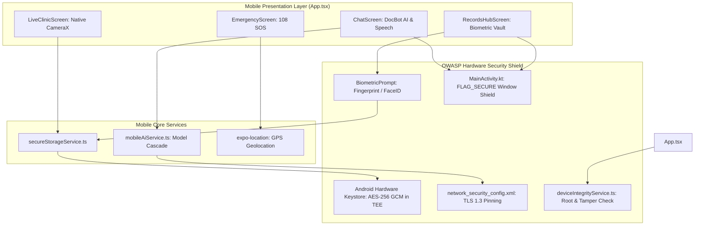

# ⚙️ Technical Requirements Document (TRD)

## Module 03: Native Android APK Architecture & OWASP Mobile Security

---

## 1. React Native & Expo SDK 57 Architecture

The mobile client is built on **React Native 0.86.3** and **Expo SDK 57**, utilizing the **React Native New Architecture** (Fabric C++ renderer and TurboModules) for high-performance camera inspection, biometric authentication, and hardware-accelerated encryption.

```text
mobile/
├── package.json                          # React Native 0.86.3, Expo 57, Lucide Icons, Supabase JS
├── App.tsx                               # Clinical Bottom Navigation Dock with Integrity Watcher
├── eas.json                              # EAS Cloud Build Profile (Direct .apk Output)
├── android/                              # Prebuilt Native Android Project
│   └── app/src/main/
│       ├── AndroidManifest.xml           # Hardened Manifest (allowBackup="false", Network Config)
│       ├── java/com/healthgrid/app/
│       │   └── MainActivity.kt           # Hardened Window (FLAG_SECURE Screen Privacy Shield)
│       └── res/xml/
│           └── network_security_config.xml # TLS 1.3 Pinning & Zero Cleartext Traffic Enforcement
└── src/
    ├── services/                         # Hardened Mobile Cryptographic Services
    │   ├── secureStorageService.ts       # Android Keystore AES-256 GCM Hardware Storage
    │   ├── biometricService.ts           # Native BiometricPrompt (Fingerprint/FaceID)
    │   ├── deviceIntegrityService.ts     # Anti-Root Detection & SHA-256 Hardware Fingerprint
    │   └── mobileAiService.ts            # Mobile DocBot Cascade with Speech Output
    └── screens/                          # 4 Core Clinical Touchscreens
        ├── ChatScreen.tsx                # Conversational Triage with Voice Read-Aloud
        ├── LiveClinicScreen.tsx          # Native CameraX Inspection (Zero Doctor PIP Canvas)
        ├── RecordsHubScreen.tsx          # Biometric-Gated Health Vault & Vitals Logging
        └── EmergencyScreen.tsx           # 108 Emergency Casualty with GPS Satellite Fix
```



---

## 2. OWASP Mobile Top 10 Security Implementations

```text
+=================================================================================================+
|                              OWASP MOBILE TOP 10 HARDENING SPECS                                |
+=================================================================================================+
|                                                                                                 |
|   1. ANDROID HARDWARE KEYSTORE (AES-256 GCM)                                                    |
|      • Backed by Android Hardware Trusted Execution Environment (TEE) / StrongBox Keymaster.    |
|      • Implemented via secureStorageService.ts wrapping expo-secure-store.                      |
|      • Sensitive session tokens, transcripts, and vitals are encrypted with hardware keys.      |
|                                                                                                 |
|   2. SCREEN PRIVACY SHIELD (FLAG_SECURE)                                                        |
|      • Injected into MainActivity.kt onCreate():                                                |
|        window.setFlags(WindowManager.LayoutParams.FLAG_SECURE, FLAG_SECURE)                     |
|      • Blocks Android OS screenshots, screen recording, and masks recent apps task previews.    |
|                                                                                                 |
|   3. BIOMETRIC VAULT APP LOCK                                                                   |
|      • Implemented via biometricService.ts wrapping expo-local-authentication.                  |
|      • Requires native Android BiometricPrompt (Fingerprint or FaceID) before unlocking         |
|        confidential personal health records in RecordsHubScreen.tsx.                            |
|                                                                                                 |
|   4. NETWORK SECURITY CONFIGURATION (TLS 1.3)                                                   |
|      • android/app/src/main/res/xml/network_security_config.xml:                                 |
|        <base-config cleartextTrafficPermitted="false">                                          |
|        Enforces TLS 1.3 encryption and blocks all unencrypted cleartext HTTP transmissions.      |
|                                                                                                 |
|   5. ANTI-ADB BACKUP EXTRACTION                                                                 |
|      • Configured in AndroidManifest.xml:                                                       |
|        android:allowBackup="false"                                                              |
|      • Blocks USB cable data extraction via adb backup commands.                                |
+=================================================================================================+
```

---

## 3. APK Compilation & Distribution Channels

The project is configured for two parallel, reliable APK build pipelines:

### 3.1 Local Android Studio Gradle Wrapper Build

```bash
cd mobile/android
$env:JAVA_HOME = "C:\Program Files\Android\Android Studio\jbr"
.\gradlew.bat assembleDebug
```

* **Output Path**: `mobile/android/app/build/outputs/apk/debug/app-debug.apk`
* **Direct Install via ADB**: `adb install -r app-debug.apk`

### 3.2 Cloud EAS Build Pipeline (`mobile/eas.json`)

```json
{
  "cli": { "version": ">= 15.0.0" },
  "build": {
    "preview": {
      "android": {
        "buildType": "apk"
      }
    }
  }
}
```

* **Build Command**: `npx eas-cli build -p android --profile preview`
* **Output**: Downloadable release `.apk` hosted on Expo Cloud for instant device side-loading.
