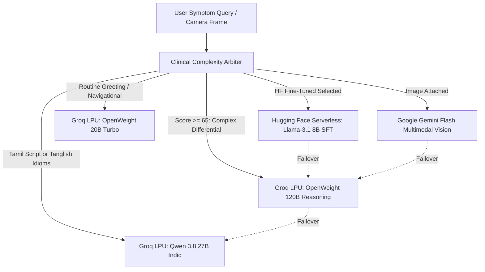

# ⚙️ Technical Requirements Document (TRD)
## Module 04: Autonomous AI Intelligence, Model Cascade & Clinical Gating

---

## 1. Autonomous Multi-Model Arbitration Cascade

HealthGrid prevents vendor lock-in, rate-limit outages, and single-model bottlenecks by deploying an **Autonomous Multi-Tier Clinical Model Cascade** in `frontend/src/services/aiService.ts`:

```
+-----------------------------------------------------------------------------------+
|                        PATIENT QUERY / CAMERA FRAME / VITALS                      |
+-----------------------------------------------------------------------------------+
                                          |
                                          v
+-----------------------------------------------------------------------------------+
|               CLINICAL COMPLEXITY ARBITRATOR (decideOptimalClinicalModel)         |
|                     Evaluates acute red flags, symptoms, and language             |
+-----------------------------------------------------------------------------------+
       |                        |                        |                        |
       v (Score >= 65)          v (Tamil / Tanglish)     v (Score < 40)           v (Fine-Tuned 8B)
+--------------------+   +--------------------+   +--------------------+   +--------------------+
| FRONTIER REASONING |   | INDIC VERNACULAR   |   | TURBO INSTANT      |   | HUGGING FACE SFT   |
| Groq LPU: 120B     |   | Groq LPU: Qwen 27B |   | Groq LPU: 20B      |   | Llama-3.1 8B SFT   |
| Deliberative AGI   |   | Tamil & Tanglish   |   | Sub-200ms Triage   |   | Serverless Router  |
+--------------------+   +--------------------+   +--------------------+   +--------------------+
                                          |
                                          v (Prescriptions & Dermatological Photos)
                         +-----------------------------------+
                         |    MULTIMODAL CLINICAL VISION     |
                         |   Google Gemini 2.5/3.8 Flash     |
                         |   Handwritten HTR & Skin Triage   |
                         +-----------------------------------+
```



---

## 2. Clinical Gating & SOCRATES History-Taking Invariants

### 2.1 The Anti-Premature Diagnosis Invariant
In real-world clinical practice, a physician never proclaims a definitive diagnosis after hearing a single symptom sentence. DocBot strictly implements this rule:
* **Turn 1 Mandatory Behavior**: When a patient states a complaint (e.g. *"I have severe stomach pain"*), the AI must acknowledge the discomfort with warm bedside empathy and ask **1 to 2 targeted clinical questions** regarding duration, exact location, radiation, or associated symptoms.
* **Gated Diagnostic Conclusion**: A differential diagnosis and Jan Aushadhi generic plan can only be issued when:
  1. Diagnostic Certainty Score reaches $\ge 75\%$, OR
  2. The consultation reaches Turn $\ge 3$ of clinical narrowing, OR
  3. An acute emergency red flag is detected, OR
  4. The patient explicitly clicks the `[ 🩺 Give me your initial diagnosis now ]` override chip.

### 2.2 Living Clinical Case Dossier (`LivingClinicalDossier`)
The conversational state maintains an active clinical blackboard synchronized across model invocations:
* **Chief Complaint**: Canonical symptom statement.
* **Timeline (SOCRATES: T)**: Duration and onset progression (e.g., 3 days, acute postprandial).
* **Severity (SOCRATES: S)**: Patient-reported intensity score (1 to 10).
* **Character (SOCRATES: C)**: Quality of sensation (burning, sharp, colicky, dull, throbbing).
* **Triggers & Relievers (SOCRATES: A/R)**: Aggravating or alleviating factors.
* **Associated Symptoms**: Nausea, vomiting, fever, chills, dizziness.
* **Pertinent Negatives**: Confirmed absence of chest pain, shortness of breath, blood in stools.

---

## 3. Two-Tier Agentic Tool Permission Model

```
+=================================================================================================+
|                            TWO-TIER AGENTIC EXECUTION PERMISSIONS                               |
+=================================================================================================+
|                                                                                                 |
|   TIER 1: SAFE READ-ONLY ACTIONS (EXECUTES AUTONOMOUSLY IN <10MS)                               |
|   • searchJanAushadhi(query): Queries PMBJP generic drugs and calculates savings.               |
|   • findNearbyCare(service, city): Locates 24/7 government PHCs and casualty hospitals.        |
|   • checkDiseaseOutbreaks(district): Fetches GCC vector disease outbreak alerts.                |
|   • longitudinalHealthMemory: Extracts vitals and correlates historical blood pressure trends. |
|                                                                                                 |
|   TIER 2: IRREVERSIBLE ACTIONS (MANDATORY INTERACTIVE USER CONFIRMATION)                        |
|   • emergencySOSDispatch(urgency, details): Triggers 108 Emergency Ambulance dispatch.          |
|     -> Generates interactive amber confirmation card with confirm/cancel buttons.               |
|   • chronicRefillOrder(medications, duration): Authorizes 30-day generic pharmacy refills.      |
|     -> Generates interactive summary with exact cost, savings, and delivery address.            |
+=================================================================================================+
```

---

## 4. Fine-Tuned 8-Billion Parameter Clinical Model Serving

* **Base Model**: **Meta Llama-3.1-8B-Instruct** (or Qwen-2.5-7B-Instruct).
* **Quantization**: 4-bit NormalFloat (NF4) with bfloat16 compute.
* **Training Engine**: Unsloth AI QLoRA on free Google Colab T4 GPU (Notebook: `notebooks/HealthGrid_Llama3_8B_Clinical_FineTuning.ipynb`).
* **Cloud Endpoint**: `https://router.huggingface.co/hf-inference/models/${hfModelId}/v1/chat/completions`.
* **Zero Cost**: Runs serverless on Hugging Face Hub using the existing `VITE_HF_API_KEY`.
* **Runtime Fallback**: If the serverless endpoint is cold-starting or throttled, `aiService.ts` automatically catches the exception and routes the request to Groq LPU without user disruption.
