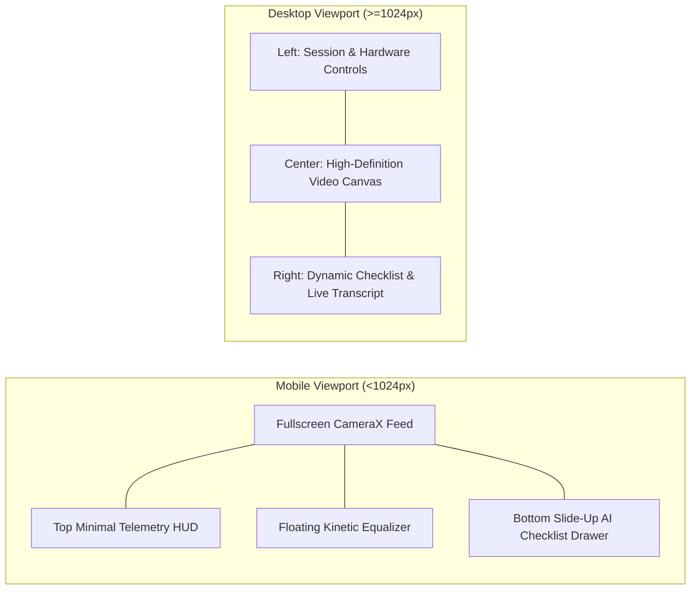

# 🎨 UI/UX Design Specifications
## Module 02: Screen Layouts, Responsive Grids & Viewport Breakpoints

---

## 1. Breakpoint Grid Architecture

HealthGrid adheres to a **Mobile-First Responsive Grid** ensuring zero horizontal scroll overflow on 320px screens while expanding into multi-column clinical workspaces on widescreen monitors:

* **Mobile Compact (`xs` / `< 640px`)**: Single-column vertical stacking, sticky bottom navigation docks, full-height slide-up bottom sheets.
* **Tablet (`sm` / `md` - `640px` to `1023px`)**: Dual-column card layouts, collapsible sidebar drawers.
* **Desktop Workstation (`lg` / `xl` - `1024px` to `1536px`)**: 3-column clinical workspaces, persistent multi-view tabs.
* **Widescreen Clinical Tower (`2xl` - `> 1536px`)**: 1672px max-width container, high-density ERP telemetry monitors.

---

## 2. AI Live Clinic Responsive Layout

### Desktop Layout (3-Column Clinical Workspace)
```
+-------------------------------------------------------------------------------------------------+
|                                  DESKTOP AI LIVE CLINIC (>= 1024px)                             |
+-------------------------------------------------------------------------------------------------+
| LEFT COLUMN (280px)            | CENTER COLUMN (FLEX-1)          | RIGHT COLUMN (340px)         |
| • Session Details              | • Full-Bleed Camera Viewport    | • AI Assistant Observations  |
| • Verified Supabase Booking    | • AI Vision Scanning Frame      | • Dynamic Symptoms Checklist |
| • Network Round-Trip Latency   | • Floating Kinetic Equalizer    |   [x] Facial flushing        |
| • Audio/Video Input Selectors  | • Floating Call Action Controls |   [ ] Swollen tonsils        |
|                                |   (Mic, Camera, Switch, End)    | • Encrypted Transcript Feed  |
+-------------------------------------------------------------------------------------------------+
```

### Mobile Layout (< 1024px)
```
+-------------------------------------------------------------+
|               MOBILE AI LIVE CLINIC (< 1024px)              |
+-------------------------------------------------------------+
| [ Top HUD: Time • Battery • Verified Telemetry Indicator ]  |
|                                                             |
|                                                             |
|                 FULLSCREEN CAMERA VIEWPORT                  |
|                 (Native HTML5 / Android CameraX)            |
|                                                             |
|           [ Floating DocBot Equalizer Pill: |||| ]          |
|                                                             |
|                                                             |
| [ Floating Call Actions: Mic • Flip Camera • End Call ]     |
+-------------------------------------------------------------+
| [ Swipe-Up Drawer: AI Checklist & Encrypted Transcript ]    |
+-------------------------------------------------------------+
```



---

## 3. Records Hub & Vitals Vault Responsive Layout

* **End-to-End Encrypted Banner**: Prominent top security notice with lock icon and zero-knowledge storage confirmation.
* **6-Metric Clinical Tab Strip**:
  Horizontal scrolling tab bar with active indicator glows:
  `[ Vitals & Measurements ]` `[ Blood Sugar ]` `[ Pulse ]` `[ SpO2 ]` `[ Temperature ]` `[ Weight ]`
* **Quick-Add Measurement Form**:
  Compact inline inputs with automatic clinical range validation (e.g. Systolic BP 70–240 mmHg, SpO2 70–100%).
* **Longitudinal History Table**:
  - Desktop: Multi-column tabular view with timestamp, reading, clinical status badge (`Normal`, `Elevated`, `Critical`), and actions.
  - Mobile: Smooth horizontal touch scrolling with sticky timestamp column preventing table truncation.

---

## 4. Hospital ERP Dashboard Layout (`HospitalErpDashboard.tsx`)

```
+=================================================================================================+
|                              HOSPITAL ERP CASUALTY COMMAND TOWER                                |
+=================================================================================================+
| TOP METRIC RIBBON:                                                                              |
| [ 142 Active OPD Tokens ] [ 3 Critical Red ] [ 79% Bed Occupancy ] [ 18 On-Duty Doctors ]       |
+-------------------------------------------------------------------------------------------------+
| SUB-MILLISECOND DOM KEEP-ALIVE TAB BAR:                                                         |
| [ Patient Intake ] [ OPD Queues ] [ IPD Bed Telemetry ] [ Casualty ] [ Roster ] [ Analytics ]   |
+-------------------------------------------------------------------------------------------------+
| ACTIVE WORKSPACE VIEW (Switches in 0.6ms - 1.4ms via display: none / block):                    |
|                                                                                                 |
| • Patient Management View: Digital OPD token generation and biometric lookup.                   |
| • IPD Bed Management View: 250-bed ward grid (ICU, Emergency, Oxygen, General).                |
| • Emergency Casualty View: 3-tier ESI triage cards, STAT lab orders, wristband printing.       |
| • Doctors OPD View: Doctor consultation room assignments and availability toggles.             |
| • Reports & Analytics View: AreaCharts, occupancy radial gauges, revenue stacked bars.          |
+=================================================================================================+
```
