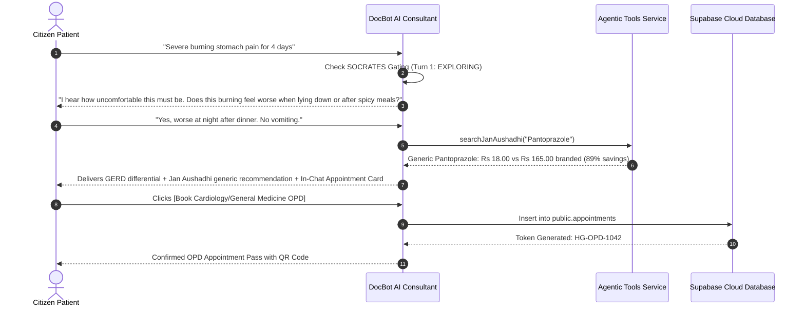
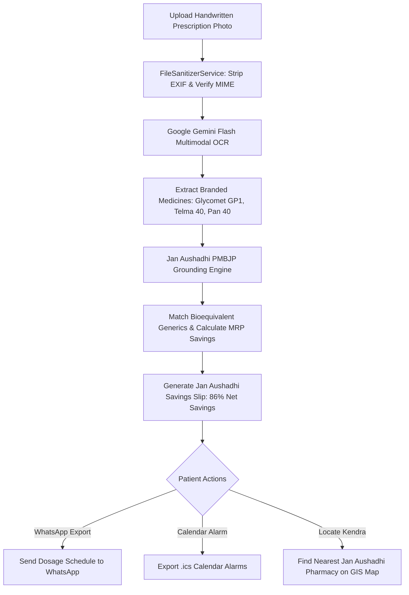

# 🗺️ User Flow Specifications
## Module 01: Citizen & Patient Clinical Journeys

---

## 1. Journey 1: Citizen Symptom Triage to Consultation

```
[ Citizen Opens DocBot Chat ]
              │
              ▼
[ Types Chief Complaint ("Severe burning stomach pain for 4 days") ]
              │
              ▼
[ DocBot AI Executes SOCRATES History Taking ]
  • Empathetically acknowledges discomfort
  • Asks 1-2 focused questions: Timing, radiation, relation to meals
              │
              ▼
[ Citizen Answers Clarifications ]
              │
              ├──────────────────────────────────────────────┐
              ▼ (Certainty >= 75% or Turn >= 3)              ▼ (Red Flag: Vomiting Blood)
[ Differential Conclusion Presented ]               [ EMERGENCY SOS TRIGGERED ]
  • Explains Gastroesophageal Reflux (GERD)         • Immediate 108 Dispatch Button
  • Jan Aushadhi Pantoprazole 40mg (85% savings)    • Pre-hospital Trauma Bay Alert
  • Embedded Hospital OPD Appointment Card          • Direct dial to emergency line
              │
              ▼
[ Citizen Taps "Book In-Person OPD Consultation" ]
  • Digital Token HG-OPD-1042 issued
  • Added to Hospital Department Queue
```



---

## 2. Journey 2: AI Live Clinic Virtual Consultation

```
[ Citizen Launches AI Live Clinic ]
              │
              ▼
[ Grants Camera & Microphone Permissions ]
              │
              ▼
[ Full-Bleed Viewfinder Activates (No static doctor imagery) ]
  • Front/Back CameraX feed fills viewport
  • Top HUD confirms verified appointment & round-trip ping latency
              │
              ▼
[ Patient Speaks & Shows Physical Symptom (e.g. Skin Rash / Throat) ]
  • Floating kinetic equalizer waves animate when DocBot speaks
  • AI Assistant dynamically populates observation checklist:
    [x] Erythematous annular border
    [ ] Scaling central clearing
              │
              ▼
[ Interactive Patient Confirmation ]
  • Patient taps checkboxes to confirm physical sensations
  • Bi-directional reasoning updates clinical dossier
              │
              ▼
[ Session Completed ]
  • Encrypted transcript saved in device storage (localStorage / Keystore)
  • 1-Tap Copy Transcript & Download Clinical Summary
```

---

## 3. Journey 3: Prescription Upload to Generic Medicine Savings



---

## 4. Journey 4: Family Member Caregiver Management (ABDM Standards)

* **Step 1 (Add Dependent)**: Primary user opens Family Hub and selects relationship (Elderly Parent, Child, Spouse).
* **Step 2 (Assign Health ID)**: System generates independent sovereign Health ID (`HG-FAM-XXXX`) with age-calibrated pediatric or geriatric dosing profiles.
* **Step 3 (One-Tap Switching)**: User toggles active beneficiary profile from the consultation header with zero account logging out.
* **Step 4 (Data Sovereignty Porting)**: When a child turns 18, the caregiver initiates a sovereign account porting protocol under the DPDP Act 2023, migrating all records to an independent phone number while preserving clinical audit trails.
