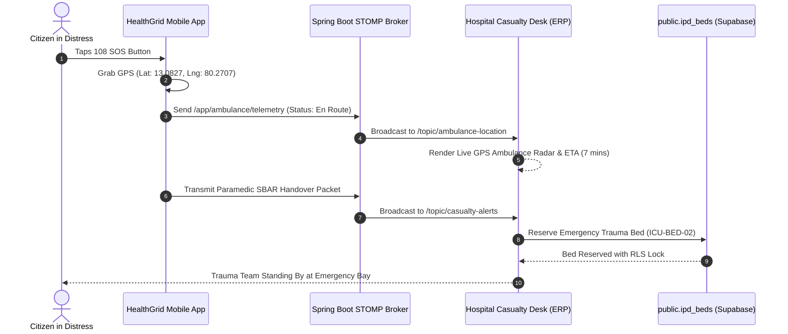
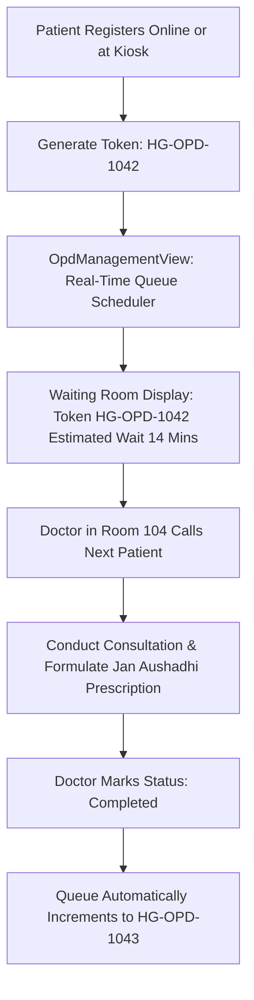

# 🗺️ User Flow Specifications

## Module 02: Emergency Telemetry & Hospital ERP Operations

---

## 1. Journey 1: 108 Emergency SOS Dispatch & Trauma Handover

```text
[ Citizen in Acute Distress / Paramedic in Transit ]
                     │
                     ▼
[ 1-Tap SOS Button / DocBot Red-Flag Trigger ]
  • Geolocation API captures latitude/longitude
  • Native dialer connects to 108 emergency line
                     │
                     ▼
[ Spring WebSocket STOMP Broker (/ws-emergency) ]
  • Ambulance begins streaming telemetry to /topic/ambulance-location
  • Live ETA, Speed, and GPS coordinates update every 2 seconds
                     │
                     ▼
[ Paramedic Compiles Digital SBAR Handover Brief ]
  • Situation: 45M acute retrosternal chest pain, diaphoresis
  • Background: Diabetic, hypertensive
  • Assessment: STEMI suspect, lead II/III/aVF elevations
  • Recommendation: Prepare Cath Lab & Trauma Bay
                     │
                     ▼
[ Hospital Casualty Desk Alerts Attending Trauma Team ]
  • Visual trauma alert flashes in EmergencyView.tsx
  • Staff reserves emergency bed in public.ipd_beds
  • Trauma bay prepared before ambulance arrives at the gate
```



---

## 2. Journey 2: Walk-In / Online OPD Registration & Queue Intake



---

## 3. Journey 3: Physician Examination to IPD Bed Allocation

```text
[ Attending Physician Examines Patient in OPD or Casualty ]
                       │
                       ▼
[ Determines Inpatient Admission is Required ]
                       │
                       ▼
[ Opens IPD Bed Management View (IpdBedManagementView.tsx) ]
  • Real-time grid displays 250 hospital beds
  • Filters by ward: Intensive Care Unit (ICU)
  • Inspects equipment: Ventilator, Multi-parameter monitor
                       │
                       ▼
[ Allocates Bed in public.ipd_beds ]
  • Generates formal admission sheet (public.ipd_admissions)
  • Sets is_occupied = true and assigns patient_id
                       │
                       ▼
[ Real-Time CDC Broadcast in <35ms ]
  • Decrements available ICU bed count on hospital monitors
  • Updates public hospital bed radar on citizen apps, preventing ambulance diversion
```

---

## 4. Journey 4: Hospital Administrator Capacity & Revenue Audit

1. **Morning Inspection**: Administrator opens `HospitalErpDashboard.tsx` and reviews the top metric ribbon (Bed Occupancy: 79%, OPD Token Count: 142, Emergency Red Cases: 3).
2. **Bed Rebalancing**: If General Wards approach 95% occupancy while Oxygen Wards are at 50%, administrator re-allocates nursing staff dynamically.
3. **Department Revenue Review**: Reviews stacked bar charts comparing revenue streams (OPD registration fees, IPD bed day charges, Jan Aushadhi pharmacy sales).
4. **Statutory Export**: Generates 1-click CSV reports for submission to the state Directorate of Medical and Rural Health Services (DMS).
