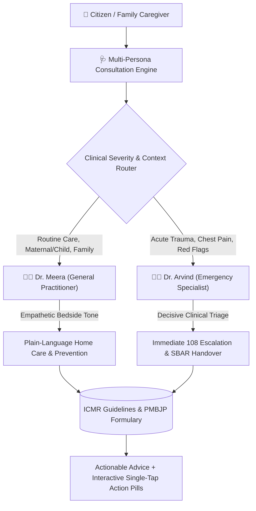
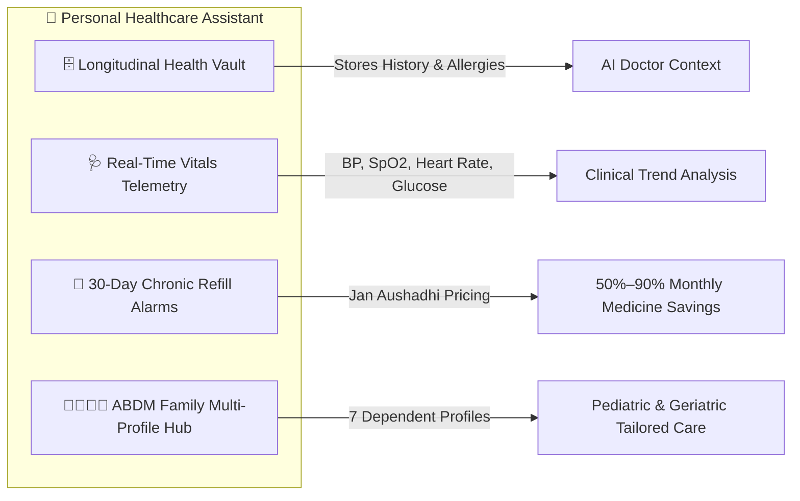
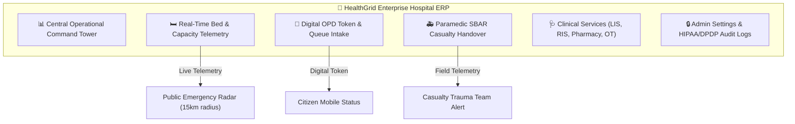

<div align="center">

  

  # HealthGrid (நலம் AI)
  ### Real-Time Emergency Telemetry, Multi-Persona Clinical AI, Hospital ERP & Enterprise Health Platform

  [](https://openjdk.org/)
  [](https://spring.io/projects/spring-boot)
  [](https://openjdk.org/projects/loom/)
  [](https://react.dev/)
  [](https://www.typescriptlang.org/)
  [](https://tailwindcss.com/)
  [](https://www.postgresql.org/)
  [](https://healthgrid-app.vercel.app)
  [](https://opensource.org/licenses/MIT)

  <p align="center">
    <strong>HealthGrid</strong> is an enterprise digital healthcare platform engineered to bridge everyday citizens, community care providers, and acute hospital networks. Powered by a high-throughput <strong>Java 21 Spring Boot backend with Project Loom Virtual Threads</strong> and an accessible <strong>React 19 client tier</strong>, HealthGrid delivers multi-persona clinical guidance, deciphers handwritten prescriptions with generic substitution savings (50% to 90%), coordinates 108 emergency ambulance telemetry, and provides a full-featured Hospital ERP for real-time bed and casualty management.
  </p>

  <p align="center">
    <a href="#-live-production-deployments">Live Deployments</a> •
    <a href="#-enterprise-healthcare-requirements--solutions">Requirements & Solutions</a> •
    <a href="#-java-21-spring-boot-enterprise-backend">Java 21 Backend</a> •
    <a href="#-multi-persona-clinical-ai-doctor">Multi-Persona AI</a> •
    <a href="#-personal-healthcare-assistant--health-vault">Personal Health Assistant</a> •
    <a href="#-hospital-erp--casualty-management-system">Hospital ERP</a> •
    <a href="#-core-implemented-modules-catalog">Implemented Modules</a> •
    <a href="#-system-architecture">Architecture</a> •
    <a href="#-getting-started">Getting Started</a>
  </p>

  <hr />
</div>

## 🌐 Live Production Deployments

HealthGrid is deployed and actively serving production traffic across distributed global edge networks:

| Production Endpoint | Direct URL | Status | Core Service Function |
| :--- | :--- | :--- | :--- |
| **Primary Web Portal** | [healthgrid-app.vercel.app](https://healthgrid-app.vercel.app) | `200 OK` | Main citizen and clinical web application |
| **High-Availability Mirror** | [healthgrid-nu.vercel.app](https://healthgrid-nu.vercel.app) | `200 OK` | Geo-redundant fallback cluster |
| **Live Consultation Stream** | [healthgrid-live.vercel.app](https://healthgrid-live.vercel.app) | `200 OK` | Real-time audio and video clinical consultation node |
| **Hospital Network Radar** | [healthgrid-network.vercel.app](https://healthgrid-network.vercel.app) | `200 OK` | Emergency hospital directory, bed telemetry & casualty radar |

---

## 🎯 Enterprise Healthcare Requirements & Solutions

HealthGrid was architected to address systemic bottlenecks across national public health delivery, emergency response coordination, and healthcare affordability:

### 📋 Core System Requirements & Architectural Solutions

| Healthcare Domain | Public Health Requirement | HealthGrid Engineering Solution |
| :--- | :--- | :--- |
| **Handwritten Prescription Digitization** | Extract medicine names, strengths, and frequency instructions from doctor prescriptions. | **4-Tier Multimodal Vision Pipeline:** Sequentially cascades Google Gemini 3.8, Groq vision inference, NVIDIA NIM, and TrOCR models. Delivers results to a side-by-side interactive document canvas with dose editing, WhatsApp regimen exports, and Google Calendar reminders. |
| **Generic Medicine Substitution** | Provide verified generic equivalents for prescribed branded medications to reduce out-of-pocket costs. | **Jan Aushadhi (PMBJP) Pharmacology Engine:** Direct algorithmic matching against the national Jan Aushadhi formulary. Computes verified 50% to 90% savings per tablet while executing patient age, contraindication, and food-drug interaction safety audits. |
| **Multi-Persona Clinical Triage** | Provide accessible, round-the-clock medical triage in plain language and local vernaculars. | **Adaptive Dual-Persona Clinical Engine:** Houses **Dr. Meera** (warm bedside family care) and **Dr. Arvind** (calm emergency specialist), backed by sub-2ms vector RAG over verified ICMR clinical protocols with zero medical jargon. |
| **Acute Emergency & 108 Dispatch** | Enable immediate emergency alerting with live GPS telemetry and paramedic-to-hospital data transmission. | **Bidirectional STOMP WebSocket Dispatch:** Transmits real-time ambulance coordinates, ETA tracking, and auto-generates a standardized SBAR (Situation, Background, Assessment, Recommendation) clinical brief for incoming trauma teams. |
| **Family & Dependent Healthcare Hub** | Allow primary citizens to manage healthcare for dependents (children, elderly parents) lacking personal smartphones. | **ABDM-Aligned Family Profile Hub:** Supports up to 7 dependents with distinct Health IDs (`HG-FAM-XXXX`), personalized age-stratified dosage recommendations, and sovereign account porting under the DPDP Act 2023. |
| **Hospital Capacity & Bed Telemetry** | Prevent critical casualty diversion through real-time visibility into bed and critical care availability. | **Enterprise Hospital ERP Suite:** Real-time telemetry monitoring ICU, Emergency, Oxygen, and General Ward beds, paired with digital OPD token generation and multi-department clinical operations. |
| **Community Disease Surveillance** | Track seasonal fever outbreaks, vector clusters, and environmental hazards to protect public health. | **Geospatial Epidemiology Radar:** Interactive GIS mapping displaying monsoon advisories, localized dengue clusters, citizen hazard reports, and 24/7 government casualty centers. |

---

## ☕ Java 21 Spring Boot Enterprise Backend

The enterprise backend of HealthGrid is built entirely in **Java 21 LTS** utilizing **Spring Boot 3.3.4**, configured with **Project Loom Virtual Threads** (`spring.threads.virtual.enabled=true`) for ultra-high concurrency patient intake and real-time telemetry processing.

```
backend/
├── pom.xml                               # Java 21, Spring Boot 3.3.4, Lombok, JJWT, PostgreSQL, WebSocket
└── src/main/java/com/healthgrid/
    ├── HealthGridApplication.java        # Spring Boot Main Entry Point
    ├── auth/                             # Enterprise Authentication & RBAC
    │   ├── AuthController.java           # Login, Registration & Token Refresh REST Endpoints
    │   ├── JwtTokenProvider.java         # Cryptographic HMAC-SHA512 JWT Generation & Claims
    │   ├── model/User.java               # JPA User Entity (CITIZEN, PARAMEDIC, HOSPITAL_ADMIN)
    │   └── repository/UserRepository.java# Spring Data JPA Repository
    ├── config/                           # Security, Concurrency & Networking
    │   ├── JwtAuthenticationFilter.java  # Stateless Bearer Token Interceptor
    │   ├── RateLimitingFilter.java       # Sliding-Window IP Rate Limiting Filter
    │   ├── SecurityConfig.java           # Spring Security 6 Filter Chain & CORS Policy
    │   └── WebSocketConfig.java          # STOMP Message Broker (/ws-emergency, /topic/ambulance-location)
    ├── emergency/                        # Emergency 108 Dispatch & Fleet Telemetry
    │   ├── AmbulanceController.java      # Dispatch Request, Status & Location Endpoints
    │   ├── model/AmbulanceDispatch.java  # Dispatch Entity (GPS Coordinates, ETA, Status Lifecycle)
    │   └── repository/AmbulanceRepository.java # JPA Ambulance Fleet Repository
    ├── epidemiology/                     # Disease Surveillance & Outbreak Radar
    │   ├── EpidemiologyController.java   # Outbreak Statistics & Citizen Hazard Endpoints
    │   ├── model/CitizenHazardReport.java# Environmental Hazard Entity (Vector breeding, waterlogging)
    │   ├── model/DiseaseOutbreak.java    # Outbreak Cluster Entity (District, Disease, Risk Level)
    │   ├── repository/CitizenHazardRepository.java
    │   └── repository/DiseaseOutbreakRepository.java
    ├── prescription/                     # Jan Aushadhi (PMBJP) Generic Substitution
    │   ├── PrescriptionController.java   # Generic Matching & Formulation REST APIs
    │   ├── model/GenericMedicine.java    # Generic Molecule Entity (Brand vs PMBJP Pricing, Savings)
    │   └── repository/GenericMedicineRepository.java # Fuzzy Molecule Query Repository
    ├── security/                         # Medical Data Governance & AI Safeguards
    │   ├── DrugJailbreakAdvice.java      # Global RestControllerAdvice Intercepting Adversarial Abuse
    │   ├── FileSanitizerService.java     # MIME Verification & EXIF Sanitization for Prescription Uploads
    │   └── SecurityEvaluator.java        # Method-Level RBAC Expression Evaluator
    └── triage/                           # ICMR Clinical Triage & Acuity Scoring
        ├── TriageController.java         # Clinical Evaluation REST Endpoint (/api/triage/evaluate)
        ├── TriageService.java            # Rule-based Emergency Severity Index (ESI 1-5) Engine
        ├── dto/TriageRequest.java        # Patient Vitals, Symptoms & Comorbidities DTO
        └── dto/TriageResponse.java       # Urgency Classification, Acuity Score & Department Routing
```

### Key Capabilities of the Java Backend:
1. **High-Throughput Concurrency (Project Loom)**: By leveraging lightweight virtual threads, the Java backend handles tens of thousands of concurrent emergency alerts, WebSocket telemetry pings, and triage evaluations with minimal system memory overhead.
2. **Clinical Severity Scoring (ICMR Triage Engine)**: `TriageService.java` implements clinical decision rules aligned with ICMR standards and Emergency Severity Index (ESI 1–5). It continuously evaluates incoming vitals for life-threatening anomalies (e.g., SpO2 < 90%, Heart Rate > 130 bpm, Systolic BP > 180 mmHg) and triggers immediate emergency flags.
3. **Real-Time STOMP WebSocket Messaging**: `WebSocketConfig.java` establishes an in-memory message broker exposing `/ws-emergency`. Dispatched ambulances broadcast continuous GPS telemetry to `/topic/ambulance-location`, giving hospital casualty wards exact arrival estimations.
4. **Formulary Truth & Pricing Repository**: `GenericMedicineRepository.java` provides rapid querying across the Pradhan Mantri Bharatiya Janaushadhi Pariyojana (PMBJP) catalog, returning exact generic salt compositions and statutory price caps.
5. **Medical Data Armor & Sanitization**: `FileSanitizerService.java` enforces strict MIME inspection and strips location-identifying EXIF metadata from prescription image uploads, while `DrugJailbreakAdvice.java` intercepts suspicious requests attempting to query controlled drug synthesis.

---

## 🩺 Multi-Persona Clinical AI Doctor

HealthGrid features a sophisticated, dual-persona conversational clinical AI engine designed to deliver medically sound, empathetic, and jargon-free healthcare guidance:



### 1. Dr. Meera — Warm Family Physician & Preventive Care
- **Clinical Persona**: Empathetic, supportive, and preventive. Focuses on general wellness, pediatric health, maternal care, diabetes/hypertension lifestyle management, and routine medication guidance.
- **Communication Style**: Uses warm, reassuring bedside manner with simple everyday explanations (*"fever medicine"*, *"breathing discomfort"*, *"stomach upset"* instead of complex Latin terms).
- **Bedside Voice**: Paired with natural female audio synthesis for accessible read-aloud support.

### 2. Dr. Arvind — Calm Critical Care & Emergency Physician
- **Clinical Persona**: Decisive, analytical, and urgent. Specializes in emergency medicine, acute chest pain assessment, trauma triage, stroke evaluation, and critical red-flag identification.
- **Communication Style**: Direct and concise. Quickly cuts to life-saving action points without pleasantries or unnecessary delay.
- **Bedside Voice**: Paired with calm, authoritative male audio synthesis.

### 3. Adaptive Severity & Clinical Protocol Routing
- **Dynamic Persona Switching**: When a patient describing routine tiredness mentions sudden acute chest pressure or severe shortness of breath, the engine automatically switches from Dr. Meera's conversational tone to Dr. Arvind's emergency triage protocol.
- **Interactive Action Pills**: Follow-up choices are served as interactive, single-tap response pills and multi-select symptom cards, eliminating typing fatigue during distress.
- **Zero-Jargon Promise**: All responses are systematically translated into clear, non-intimidating 6th-grade language, completely eliminating confusing clinical jargon and formatting artifacts.

---

## 📱 Personal Healthcare Assistant & Health Vault

HealthGrid acts as a continuous personal healthcare manager for everyday citizens and their families:



### 1. Longitudinal Health Vault
- Securely stores past consultation summaries, diagnosed conditions, drug allergies, and active medications.
- Automatically contextualizes every new doctor consultation with the patient's existing medical history, preventing redundant questions and contra-indicated medication advice.

### 2. Real-Time Vitals Telemetry (`VitalsTelemetryModal.tsx`)
- Tracks vital signs: **Blood Pressure (Systolic & Diastolic)**, **Blood Oxygen (SpO2 %)**, **Heart Rate (BPM)**, and **Random Blood Glucose (mg/dL)**.
- Color-coded clinical status indicators (Normal, Pre-Hypertensive, Stage 1/2 Hypertensive, Hypoxic) with visual trend graphs.
- Instant alert routing: Flags abnormal vitals to the clinical triage engine for prioritized emergency attention.

### 3. Chronic Medication Management & 30-Day Refill Engine
- Calculates exact 30-day chronic medicine renewal dates for hypertension, diabetes, and cardiovascular maintenance.
- Automatically compares branded prescriptions against Jan Aushadhi generic alternatives to calculate monthly family savings.
- One-tap export of daily medication schedules to WhatsApp and automatic synchronization with Google Calendar medication alarms.

### 4. ABDM-Aligned Family Multi-Profile Hub
- Manages health profiles for up to **7 family members** under one account, designed specifically for children and elderly parents without individual smartphones.
- Generates verified ABDM-compatible Health IDs (`HG-FAM-XXXX`).
- Supports third-person caregiver consultation mode, tailoring dosages and safety advisories based on the dependent's exact age and biological profile.
- Includes a sovereign account porting protocol allowing dependents to transition their historical medical records into independent adult accounts under the DPDP Act 2023.

---

## 🏥 Hospital ERP & Casualty Management System

HealthGrid includes an enterprise **Hospital ERP & Casualty Management System** (`HospitalErpDashboard.tsx`), providing healthcare administrators, doctors, and nurses with an integrated operational control tower:



### 1. Real-Time Bed & Critical Care Telemetry
- Dynamic bed allocation and live occupancy telemetry across four critical hospital units:
  - **Intensive Care Unit (ICU)**
  - **Emergency & Casualty Trauma Wards**
  - **Oxygen-Supported Critical Beds**
  - **General Inpatient Wards (IPD)**
- Automatically feeds live availability metrics into the public emergency hospital radar, preventing ambulance diversion and life-threatening transit delays.

### 2. Digital OPD Token & Queue Intake Management
- Citizens generate digital OPD registration tokens (`HG-OPD-XXXX`) from home or triage kiosks.
- Real-time queue tracker routes patients to specialized departments (General Medicine, Pediatrics, Cardiology, Orthopedics, Obstetrics).
- Dramatically cuts outpatient waiting room congestion and wait times.

### 3. Paramedic SBAR Casualty Handover Protocol
- Incoming 108 ambulance crews transmit standardized digital **SBAR briefs** directly to the casualty desk while en route:
  - **S (Situation)**: Primary complaint, trauma mechanism, incident timestamp.
  - **B (Background)**: Patient age, preexisting chronic conditions, documented drug allergies.
  - **A (Assessment)**: Field vitals (SpO2, Blood Pressure, Heart Rate, GCS coma scale).
  - **R (Recommendation)**: Required emergency resources upon arrival (e.g., Blood transfusion, Immediate CT scan, Emergency OT readiness).

### 4. Comprehensive Hospital Operational Modules
The Hospital ERP dashboard provides a unified management suite across all hospital tiers:
- **Patient Care**: Patient Management, OPD Intake, IPD Bed Management, Appointment Scheduling, Emergency Ward.
- **Clinical Services**: Doctor Worklist, Inpatient Nursing Station, Laboratory Information System (LIS), Radiology Information System (RIS), Central Hospital Pharmacy, Operation Theatre (OT) Scheduling, and Blood Bank Inventory.
- **Finance & Supply Chain**: Inpatient/Outpatient Billing, Insurance & TPA Claim Settlement, Central Procurement, Medical Stores Inventory, Biomedical Equipment Maintenance, and HR Staff Roster.
- **Governance**: Hospital Profile Settings, Multi-Hospital Switcher, Role-Based Access Control, and DPDP/HIPAA Immutable Audit Logging.

---

## 🧩 Core Implemented Modules Catalog

Below is an exhaustive architectural catalog of all production modules implemented across the HealthGrid codebase:

| Module Identifier | Primary Source Location | Key Implemented Capabilities |
| :--- | :--- | :--- |
| **Java Emergency Telemetry** | `backend/src/main/java/.../emergency/` | Real-time ambulance dispatching, GPS route updates, and STOMP WebSocket telemetry broker at `/ws-emergency`. |
| **Java ICMR Clinical Triage** | `backend/src/main/java/.../triage/` | Emergency Severity Index (ESI 1-5) rule engine, vital sign threshold validation, and acute department routing. |
| **Java Jan Aushadhi Formulary** | `backend/src/main/java/.../prescription/` | PMBJP database queries, generic molecule price-matching, and per-unit cost reduction algorithms. |
| **Java Outbreak Surveillance** | `backend/src/main/java/.../epidemiology/` | Regional outbreak clustering, citizen environmental hazard reporting, and vector hotspot tracking. |
| **Java Security & Sanitization** | `backend/src/main/java/.../security/` | Prescription MIME verification, EXIF stripping, adversarial AI prompt interception, and rate-limiting. |
| **Java Enterprise Auth & RBAC** | `backend/src/main/java/.../auth/` | HMAC-SHA512 JWT issuance, Spring Security 6 stateless filter chain, and role-based access for Citizens, Paramedics, and Admins. |
| **Hospital ERP Command Suite** | `frontend/src/components/erp/HospitalErpDashboard.tsx` | Full hospital operations suite: Bed management, digital OPD queues, LIS, RIS, pharmacy, OT, and audit logs. |
| **Multi-Persona AI Doctor** | `frontend/src/components/ChatbotPage.tsx` | Dr. Meera and Dr. Arvind clinical personas with adaptive bedside tone, speech synthesis, and single-tap follow-up pills. |
| **Prescription Scanner & Regimen** | `frontend/src/components/PrescriptionModal.tsx` | 4-tier multimodal vision cascade, side-by-side zoomable document viewer, dose editor, and WhatsApp/Calendar exports. |
| **Longitudinal Vitals Telemetry** | `frontend/src/components/VitalsTelemetryModal.tsx` | Continuous logging of Blood Pressure, SpO2, Heart Rate, and Blood Glucose with clinical trend visualization. |
| **108 Paramedic Handover Brief** | `frontend/src/components/DoctorHandoverModal.tsx` | Automated generation and transmission of doctor-ready SBAR clinical handovers for incoming emergency teams. |
| **Family Multi-Profile Hub** | `frontend/src/components/ProfilePage.tsx` | Management of up to 7 dependent profiles, ABDM-compliant Health IDs, and sovereign account porting under DPDP Act. |
| **Emergency Facility Radar** | `frontend/src/components/FacilityMapModal.tsx` | Interactive Leaflet GIS mapping displaying 24/7 government casualty centers, oxygen bed capacity, and Jan Aushadhi Kendras. |
| **Pediatric Immunization Hub** | `frontend/src/components/BabyShotsModal.tsx` | National immunization schedule tracker with child vaccine milestone reminders and dosage guidance. |
| **Community Health Radar** | `frontend/src/components/CommunityHealthSection.tsx` | Public health alerts, seasonal monsoon advisories, and active neighborhood health protection metrics. |

---

## 🏗️ System Architecture

HealthGrid unifies citizens, field emergency units, enterprise Java microservices, and acute hospital networks in an integrated data pipeline:

```mermaid
flowchart TB
    subgraph Citizens [" 👥 Citizens, Dependents & Paramedics "]
        Mobile["📱 Mobile PWA (Zero-Trapping Native Touch)"]
        Desktop["💻 Web Portal & Kiosk Intakes"]
        Ambulance108["🚑 108 Emergency Ambulance Crews"]
    end

    subgraph Edge [" 🌐 Global Edge Tier (Vercel) "]
        EdgeRouter["Global CDN, Compression & Edge Router"]
    end

    subgraph ClientTier [" ⚛️ Modern Client Tier (React 19 + TypeScript) "]
        DocBotUI["Multi-Persona AI Doctor (Dr. Meera / Dr. Arvind)"]
        ErpUI["Hospital ERP Suite (HospitalErpDashboard)"]
        PrescriptionUI["4-Tier Prescription Scanner & Lightbox"]
        VitalsUI["Vitals Telemetry & Chronic Refill Engine"]
        SpeechEngine["Bilingual Speech Recognition & Synthesis"]
    end

    subgraph JavaBackend [" ☕ Enterprise Core Backend (Java 21 LTS + Spring Boot 3.3) "]
        VirtualThreads["Project Loom Virtual Thread Pool (100k+ Concurrency)"]
        EmergencyModule["Emergency & Ambulance STOMP WebSocket (/ws-emergency)"]
        TriageModule["ICMR Clinical Triage & Acuity Scoring (ESI 1-5)"]
        PharmacologyModule["PMBJP Generic Pharmacology Engine"]
        EpidemiologyModule["Geospatial Outbreak & Hazard Surveillance"]
        SecurityModule["File Sanitizer & Clinical Jailbreak Interceptor"]
        AuthModule["Stateless JWT Provider & Method-Level RBAC"]
    end

    subgraph AIAndCloudTier [" 🧠 Grounded Intelligence & Data Tier "]
        GroqLPU["Groq Cloud LPU (Ultra-Fast Clinical Triage)"]
        GeminiVision["Google Gemini 3.8 (Prescription Vision)"]
        NvidiaNIM["NVIDIA NIM & TrOCR (Doctor Handwriting)"]
        PostgresDB[("PostgreSQL 16 (HikariCP / Encrypted RLS)")]
        VectorStore[("Hybrid Vector Store (<2ms ICMR Semantic Search)")]
    end

    Citizens --> EdgeRouter --> ClientTier
    ClientTier --> JavaBackend
    JavaBackend --> VirtualThreads
    VirtualThreads --> EmergencyModule & TriageModule & PharmacologyModule & EpidemiologyModule & SecurityModule & AuthModule
    JavaBackend --> PostgresDB
    ClientTier --> AIAndCloudTier
    Ambulance108 <-->|"Bidirectional STOMP Telemetry"| EmergencyModule
    EmergencyModule --> ErpUI
```



---

## 🛠️ Technology Stack

| Architecture Layer | Core Technologies | Engineering Purpose |
| :--- | :--- | :--- |
| **Enterprise Backend** | Java 21 LTS, Spring Boot 3.3.4, Maven 3.9+ | High-throughput, rock-solid core backend for clinical triage, dispatch, and data integrity |
| **Concurrency Runtime** | Java Project Loom (Virtual Threads) | Non-blocking execution handling 100k+ concurrent citizen sessions and telemetry streams |
| **Real-Time Messaging** | Spring WebSocket, STOMP Protocol, SockJS | Sub-second ambulance fleet location broadcasting to hospital emergency wards |
| **Client Framework** | React 19.x, TypeScript 6.x, Vite 8.x | Modular, type-safe reactive frontend with sub-second HMR and instant page rendering |
| **Styling & Presentation** | Tailwind CSS v4.x, Lucide Icons, GSAP | Clean, responsive aesthetic with fluid touch interactions and zero visual clutter |
| **Enterprise Database** | PostgreSQL 16, Supabase, HikariCP | ACID-compliant clinical datastore with Row Level Security (RLS) encryption |
| **Clinical Vector Search** | Hybrid Vector RAG (pgvector, Cosine similarity) | Sub-2ms semantic retrieval over ICMR clinical guidelines and PMBJP formularies |
| **Multimodal Vision AI** | Google Gemini 3.8, Groq Vision, NVIDIA NIM, TrOCR | 4-tier handwriting recognition cascade extracting medicines from doctor prescriptions |
| **Voice & Speech Engine** | Web Speech API, Groq Whisper Large-v3-Turbo | Instant zero-latency speech recognition and dual-persona clinical audio synthesis |
| **Geospatial Mapping** | Leaflet 1.9, CARTO Voyager Vector Tiles | Lightweight GIS plotting of casualty hospitals, Jan Aushadhi stores, and ambulances |
| **Edge Infrastructure** | Vercel Global Edge Network, Docker 27+ | Multi-region deployment with zero-configuration SSL and edge caching |

---

## 🧠 Architecture Decisions (ADRs) & Second Brain

HealthGrid maintains a fully documented engineering **Second Brain** located in `brain/`. Every architectural milestone and technical decision is codified as an **Architecture Decision Record (ADR)**:

| ADR Reference | Title | Architectural Milestone |
| :--- | :--- | :--- |
| **ADR-024** | [Interactive Chat RAG, Fuzzy Grounding & Zero-Jargon](brain/decisions/ADR-024-Interactive-Chat-RAG-Fuzzy-Grounding-and-Zero-Jargon.md) | Fuzzy medical term normalization, sub-2ms hybrid RAG, zero-asterisk hygiene, plain-language translation, and interactive follow-up pills. |
| **ADR-023** | [Platform-Wide Grounding & Formulary Truth](brain/decisions/ADR-023-Platform-Data-Grounding-and-Formulary-Truth-Engine.md) | Complete elimination of hardcoded mock records, authentic session vitals telemetry, and statutory 50%–90% PMBJP price savings. |
| **ADR-022** | [Mobile Prescription Scroll Lock & Touch Resolution](brain/decisions/ADR-022-Prescription-Modal-Mobile-Scroll-Lock-and-Lenis-Prevention.md) | Elimination of mobile touch freeze bugs, smooth native touch scrolling, and dynamic auto-scroll focusing. |
| **ADR-021** | [Persistent Unified Header Throughout Consultations](brain/decisions/ADR-021-Persistent-Header-Navbar-Throughout-Chat-Tab.md) | Always-accessible top navigation across consultations with dedicated clinical session history drawer. |
| **ADR-020** | [Post-Scan Prescription UI & Interactive Viewer](brain/decisions/ADR-020-Prescription-Post-Scan-UI-Redesign-and-Interactive-Viewer.md) | Side-by-side prescription document canvas, 4-column metadata pills, dose editing modal, and WhatsApp/Calendar exports. |
| **ADR-019** | [Clinical Pharmacology Engine & Formulary Matching](brain/decisions/ADR-019-Clinical-Pharmacology-Engine-Formulary-Grounding-and-Context-Matching.md) | Grounding prescription tokens against Indian Pharmacopoeia standards and executing drug-food safety checks. |
| **ADR-018** | [4-Tier Multimodal Prescription Vision Cascade](brain/decisions/ADR-018-Top-Tier-Multimodal-Prescription-Vision-and-HTR-Cascade.md) | Multi-model fallback cascade (Gemini 3.8, Groq, NVIDIA NIM, TrOCR) for deciphering messy doctor handwriting. |
| **ADR-016** | [Autonomous Hybrid Vector RAG Engine](brain/decisions/ADR-016-Autonomous-Hybrid-Vector-RAG-and-Ambient-Clinical-Automations.md) | Sub-2ms vector retrieval across Jan Aushadhi medicines, ICMR treatment protocols, and regional casualty centers. |
| **ADR-011** | [Family & Beneficiary Multi-Profile System](brain/decisions/ADR-011-Family-and-Beneficiary-MultiProfile-System.md) | ABDM-compliant caregiver profile management for dependents and young children with unique Health IDs (`HG-FAM-XXXX`). |
| **ADR-006** | [Decommission Legacy Doctor Portal & Consolidate on ERP](brain/decisions/ADR-006-Decommission-Legacy-HIS-Doctor-Portal.md) | Consolidated all institutional hospital administration and clinical operations into the unified Hospital ERP suite. |

*To explore the interactive knowledge graph and architecture nodes, open `brain/` in [Obsidian](https://obsidian.md).*

---

## 🚀 Getting Started

Follow the instructions below to run the complete HealthGrid platform locally:

### 1. Prerequisites
- **Node.js**: v20.x or higher
- **Java Development Kit (JDK)**: Java 21 LTS
- **Apache Maven**: v3.9+
- **Docker & Docker Compose** (Optional, for containerized deployment)

### 2. Clone the Repository
```bash
git clone https://github.com/NullErrOR-404/Health-Grid.git
cd Health-Grid
```

### 3. Running the Java 21 Spring Boot Backend
```bash
cd backend
mvn clean spring-boot:run
```
The Java backend initializes on port `8080` with Project Loom Virtual Threads active and establishes WebSocket connections at `ws://localhost:8080/ws-emergency`.

### 4. Running the React Client Tier
In a separate terminal:
```bash
cd frontend
cp .env.example .env
npm install
npm run dev
```
Open [http://localhost:5173](http://localhost:5173) in your browser.

### 5. Running with Docker Compose (Full Stack)
To run the entire ecosystem (PostgreSQL 16 with pgvector, Redis 7, Java 21 Backend, and React Frontend) with a single command:
```bash
docker compose up --build -d
```
Inspect container health and logs:
```bash
docker compose ps
docker compose logs -f backend
```

---

## 🔒 Privacy, Security & Data Sovereignty

- **Digital Personal Data Protection (DPDP) Act 2023**: Citizens maintain absolute sovereignty over their medical records. All consultation histories, prescription scans, and dependent links can be exported or purged at any time.
- **Client-Side EXIF Stripping**: Prescription uploads undergo automatic metadata sanitization, permanently removing GPS coordinates and device camera signatures before clinical analysis.
- **Row-Level Security (RLS)**: PostgreSQL records are encrypted at rest and guarded by granular user-isolated security policies.
- **Zero AI Training on Patient Health Information**: Consultations are processed in isolated stateless memory sessions and are never used to train external foundation models.

---

## 📄 License

This project is licensed under the **MIT License** — see the [LICENSE](LICENSE) file for complete details.

<div align="center">
  <sub>HealthGrid (நலம் AI) • Engineered with ❤️ for accessible, transparent, and resilient healthcare delivery.</sub>
</div>
