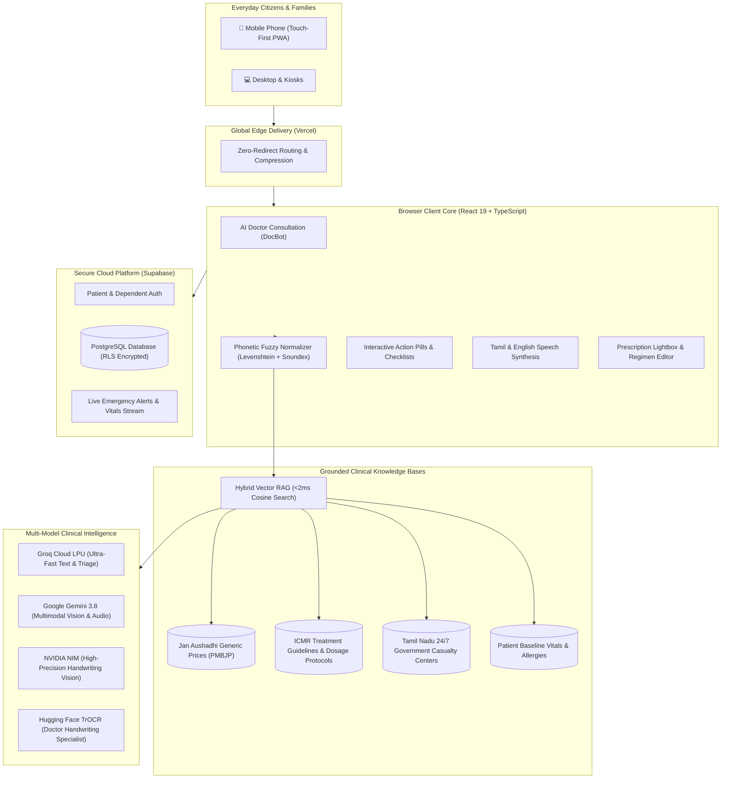
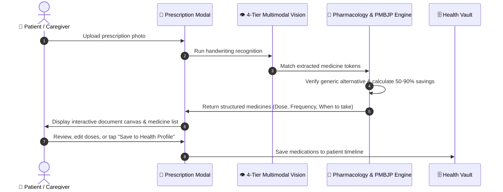

<div align="center">

  

  # HealthGrid (நலம் AI)
  ### Real-Time Emergency Response, Vernacular AI Doctor & Community Health Platform

  [](https://react.dev/)
  [](https://www.typescriptlang.org/)
  [](https://tailwindcss.com/)
  [](https://supabase.com/)
  [](https://groq.com/)
  [](https://deepmind.google/technologies/gemini/)
  [](https://healthgrid-app.vercel.app)
  [](https://opensource.org/licenses/MIT)

  <p align="center">
    <strong>HealthGrid</strong> is an intelligent healthcare platform designed for everyday citizens, families, and emergency responders in India and Tamil Nadu. It provides instant medical advice in plain everyday language, matches prescriptions with low-cost generic medicines (saving 50% to 90%), deciphers doctor handwriting, and connects patients to 108 ambulances and nearby government hospitals in seconds.
  </p>

  <p align="center">
    <a href="#-real-world-problems--how-healthgrid-solves-them">Pain Points & Solutions</a> •
    <a href="#-system-architecture">Architecture</a> •
    <a href="#-key-features">Key Features</a> •
    <a href="#-interactive-chat-doctor-docbot">AI Doctor & Choosing Engine</a> •
    <a href="#-prescription-scanner--pharmacology-engine">Prescription Scanner</a> •
    <a href="#-family--caregiver-multi-profile-hub">Family Profiles</a> •
    <a href="#-live-production-deployments">Live Deployments</a> •
    <a href="#-architecture-decisions-adrs--second-brain">Second Brain (ADRs)</a> •
    <a href="#-getting-started">Getting Started</a>
  </p>

  <hr />
</div>

## 🌐 Live Production Deployments

HealthGrid is live and operational across global edge endpoints:

| Endpoint | Link | Status | Primary Purpose |
| :--- | :--- | :--- | :--- |
| **Main App** | [healthgrid-app.vercel.app](https://healthgrid-app.vercel.app) | `200 OK` | Primary public web application |
| **Secondary Mirror** | [healthgrid-nu.vercel.app](https://healthgrid-nu.vercel.app) | `200 OK` | High-availability fallback mirror |
| **Live Stream Edge** | [healthgrid-live.vercel.app](https://healthgrid-live.vercel.app) | `200 OK` | Real-time audio and video consultations |
| **Global Network** | [healthgrid-network.vercel.app](https://healthgrid-network.vercel.app) | `200 OK` | Emergency hospital network and radar |

---

## 🎯 National Public Health Challenge: Requirements vs. HealthGrid Innovations

The original problem statement set out ambitious benchmarks for public health access, emergency response, and affordable healthcare in India and Tamil Nadu. Below is how HealthGrid took each baseline requirement and engineered a resilient, production-ready solution:

### 📋 Problem Statement Requirements & Implementation Architecture

| Core Requirement | Baseline Specification | HealthGrid Production Innovation |
| :--- | :--- | :--- |
| **1. Handwritten Prescription Reading** | Extract medicine names and dosages from prescription photos using standard text recognition (OCR). | **4-Tier Multimodal Vision Cascade:** Standard OCR fails on messy doctor handwriting. HealthGrid chains Google Gemini, Groq Qwen, NVIDIA NIM, and specialized handwriting models. It displays results in a side-by-side zoomable document viewer with inline dose/frequency editing, WhatsApp exports, and Google Calendar medication alarms. |
| **2. Generic Medicine Price Matching** | Identify generic equivalents for prescribed branded medicines and calculate cost savings. | **Formulary Truth & Pharmacology Engine:** Connects directly with Government Jan Aushadhi (PMBJP) catalogues to show verified 50% to 90% savings with exact ₹ per tablet prices. It also checks patient age, drug allergies, and food interactions before confirming the list. |
| **3. Vernacular AI Doctor & Symptom Triage** | Provide a conversational assistant in local languages (Tamil & English) for symptom guidance. | **Hybrid Vector RAG & Fuzzy Phonetic Matcher:** Searches official ICMR treatment guidelines in under 2 milliseconds. Uses phonetic matching to understand misspellings (*"paracitamol"*, *"doloo"*) and colloquial Tamil slang (*"mandai idi"*, *"nenjerichal"*). Delivers answers in plain 6th-grade language with zero asterisks and dynamic single-tap / multi-select action pills. |
| **4. Emergency Response & 108 Dispatch** | Allow users to trigger an emergency alert with GPS location to connect with ambulance services. | **1-Tap Emergency Telemetry & SBAR Handover:** Automatically captures GPS coordinates and generates a standardized doctor-ready clinical handover (SBAR) detailing the patient's vitals, reported trauma, and blood group for the incoming 108 paramedic team. |
| **5. Family & Caregiver Multi-Profile Access** | Support profiles for dependents who do not own individual smartphones (children, elderly parents). | **ABDM-Standard Family Hub & Quota Governor:** Manage up to 7 dependents with unique Health IDs (`HG-FAM-XXXX`). Features 6-digit SMS OTP verification, third-person caregiver consultation mode, and an independent account porting protocol with full data ownership under the DPDP Act 2023. |
| **6. Disease Surveillance & Community Radar** | Track seasonal fever and disease outbreaks in the region to alert users. | **Real-Time Geospatial Outbreak Tracker:** An interactive map plotting live monsoon advisories, dengue clusters, waterborne contagion alerts, and 24/7 government casualty centers within 15 km. |
| **7. Real-World Mobile Reliability** | Ensure the platform functions smoothly on mobile devices across various network speeds. | **Zero-Trapping Touch Architecture:** Solved mobile touch scroll freezes, removed heavy floating overlays, optimized bundle delivery, and built a persistent header so users never lose their place during consultations. |

---

### 🏥 Everyday Citizen Challenges & How HealthGrid Solves Them

| Dimension | Everyday Real-World Challenge | The HealthGrid Solution |
| :--- | :--- | :--- |
| **Confusing Medical Jargon** | Medical advice and lab reports are packed with Latin terms (*antipyretic*, *dyspnea*, *gastroenteritis*) that everyday patients cannot understand. | **Plain Language Engine:** Automatically translates medical words into simple 6th-grade language (*fever medicine*, *breathing trouble*, *stomach upset*) with warm, direct doctor bedside manner and zero markdown asterisks (`*` or `**`). |
| **Spelling Mistakes & Tanglish** | Patients often search with phonetic spellings (*"paracitamol"*, *"doloo"*, *"shuger"*) or local Tamil terms (*"mandai idi"*, *"nenjerichal"*). | **Phonetic & Fuzzy Matcher:** Automatically detects and connects misspellings, colloquial slang, and missing letters to standardized medicines and verified clinical guidelines. |
| **Expensive Branded Medicines** | Families spend high amounts every month on branded medications when identical generic versions exist at a fraction of the cost. | **Verified Generic Price Engine:** Automatically searches Government Jan Aushadhi (PMBJP) catalogues, detailing exact savings (50% to 90% lower cost) with real per-tablet prices. |
| **Messy Doctor Handwriting** | Patients struggle to read handwritten prescriptions, leading to wrong dosages or skipped medications. | **4-Tier Vision Cascade:** Combines Google Gemini, Groq, NVIDIA NIM, and specialized handwriting models to read prescriptions, confirm doses, and show medicines in an interactive viewer. |
| **Phone Touch Freezes** | Uploading images or opening menus on mobile phones often locks screen scrolling, frustrating patients during emergencies. | **Universal Touch Unlocking:** Clean, native phone touch handling that prevents screen locking, removes clunky scroll traps, and auto-focuses action buttons. |
| **Caring for Dependents** | Elderly parents or young children often don't have separate mobile phones or email accounts to access digital health tools. | **Family Multi-Profile Hub:** Manage up to 7 family members under one account, consult on their behalf with personalized age-appropriate dosing, and book hospital tokens. |

---

## 🏗️ System Architecture

HealthGrid connects patients, clinical AI models, and real-world hospitals in real time:



---

## ⚡ Key Features

### 1. DocBot™ — Plain-Language AI Doctor & Triage
- **Direct to the Point:** Answers right away without robotic greetings or filler words (*"I understand your concern and I am here to help you"* is completely eliminated).
- **Targeted Follow-Up:** Asks at most 1 or 2 targeted questions at a time so patients never feel overwhelmed by a lengthy survey.
- **Zero Asterisks & Clean Layout:** Deterministically removes all `*` and `**` symbols so messages display cleanly without ugly formatting marks.
- **Language Mirroring:** Responds fluently in English, conversational Tanglish, or pure spoken Tamil based on how the patient talks.

### 2. Interactive Choosing Options & Direct Platform Shortcuts
Below each doctor response, patients receive interactive single-tap buttons and checklists:
- **Single-Tap Follow-Up Pills:** Quick answers to keep the conversation flowing smoothly with 1 tap.
- **Direct Action Shortcuts:**
  - `🚨 Call 108 Emergency` — Instantly calls 108 or opens ambulance dispatch.
  - `🏥 Find Nearest Hospital` — Locates nearby 24/7 trauma centers and government casualty wards.
  - `💊 Locate Jan Aushadhi Kendra` — Opens the low-cost generic medicine store.
  - `📹 Start Live Video Doctor` — Launches face-to-face video consultation.
  - `🩺 Record Today's Vitals` — Opens the blood pressure and glucose logging hub.
- **Multi-Select Symptom Checklists:** Select multiple symptoms and tap `Send Selected (N) →` for faster, accurate triage.
- **Auditory Guidance (Listen Button):** Patients can tap `[ 🔊 Listen ]` to hear options read aloud in English or Tamil.

### 3. Prescription Scanner & Medicine Comparison
- **Photograph Any Prescription:** Take a photo or upload an image of a doctor prescription.
- **4-Tier Vision Intelligence:** Automatically detects medicine names, exact strengths (mg), frequency (morning/night), and instructions (before/after food).
- **Generic Price Savings:** Shows certified Jan Aushadhi generic alternatives side-by-side with commercial brand prices, highlighting 50% to 90% savings.
- **Safety Checks:** Warns against potential drug allergies and checks safe doses for children and elderly patients.
- **Export Tools:** Export your daily schedule to WhatsApp, add Google Calendar medication alarms, or set 30-day refill reminders.

### 4. 108 Emergency Response & Hospital Radar
- **Instant GPS Location:** Captures emergency coordinates in 1 click.
- **Paramedic Handover Summary:** Creates a clean summary of patient vitals, symptoms, and allergies ready for incoming ambulance staff.
- **24/7 Hospital Map:** Live map showing distances to nearby government general hospitals, specialty centers, and generic pharmacies.

### 5. Family & Caregiver Multi-Profile Hub
- **Add Loved Ones:** Register children, parents, spouses, or grandparents under your account.
- **Custom Health IDs:** Each family member gets a unique HealthGrid ID (`HG-FAM-XXXX`).
- **Caregiver Consultation:** DocBot automatically tailors dosages and warnings based on whether you are consulting for an infant, an adult, or an elderly parent.

---

## 📱 Prescription Post-Scan & Regimen Workflow



---

## 🛠️ Technology Stack

| Layer | Technologies Used | Key Purpose |
| :--- | :--- | :--- |
| **Frontend Framework** | React 19.x, TypeScript 6.x | Fast, modern client application with complete type safety |
| **Build & Tooling** | Vite 8.x, Oxlint | Sub-second local builds and optimized production bundling |
| **Styling & Motion** | Tailwind CSS v4.x, Lucide Icons, GSAP | Clean, responsive design with smooth touch interactions |
| **Maps & GIS** | Leaflet 1.9, CARTO Voyager Tiles | Lightweight geospatial mapping of hospitals and pharmacies |
| **Database & Auth** | Supabase PostgreSQL, Row-Level Security (RLS) | Encrypted patient records and real-time synchronization |
| **Primary AI Inference** | Groq LPU (`qwen/qwen3.8-27b`, `gpt-oss-120b`) | Ultra-fast conversational doctor inference with sub-second replies |
| **Vision & Audio AI** | Google Gemini (`gemini-3.8-flash`), Sarvam AI | Handwriting deciphering and natural Indian speech synthesis |
| **Deployment & CDN** | Vercel Global Edge Network | Instant worldwide deployment with automatic HTTPS |

---

## 🧠 Architecture Decisions (ADRs) & Second Brain

HealthGrid maintains a complete engineering and architectural Second Brain located in `brain/`. Every major technical choice is documented as an **Architecture Decision Record (ADR)**:

| ADR | Title | Key Architectural Focus |
| :--- | :--- | :--- |
| **ADR-024** | [Interactive Chat RAG, Fuzzy Grounding & Zero-Jargon](brain/decisions/ADR-024-Interactive-Chat-RAG-Fuzzy-Grounding-and-Zero-Jargon.md) | Fuzzy typo matching, hybrid RAG, zero-asterisk hygiene, plain language, and single/multi-choice action pills |
| **ADR-023** | [Platform-Wide Grounding & Formulary Truth](brain/decisions/ADR-023-Platform-Data-Grounding-and-Formulary-Truth-Engine.md) | Elimination of mock credentials, authentic session vitals, and statutory 50%–90% PMBJP price savings |
| **ADR-022** | [Mobile Prescription Scroll Lock & Touch Resolution](brain/decisions/ADR-022-Prescription-Modal-Mobile-Scroll-Lock-and-Lenis-Prevention.md) | Resolution of mobile touch freezes and smooth native scrolling across phone screens |
| **ADR-021** | [Persistent Unified Header Throughout Consultations](brain/decisions/ADR-021-Persistent-Header-Navbar-Throughout-Chat-Tab.md) | Always-visible navigation and streamlined consultation session management |
| **ADR-020** | [Post-Scan Prescription UI & Interactive Viewer](brain/decisions/ADR-020-Prescription-Post-Scan-UI-Redesign-and-Interactive-Viewer.md) | Side-by-side prescription viewer, 4-column metadata pills, and WhatsApp/Calendar exports |
| **ADR-019** | [Clinical Pharmacology Engine & Formulary Matching](brain/decisions/ADR-019-Clinical-Pharmacology-Engine-Formulary-Grounding-and-Context-Matching.md) | Matching smudged handwriting with Indian Pharmacopoeia standards and safety checks |
| **ADR-018** | [4-Tier Multimodal Prescription Vision Cascade](brain/decisions/ADR-018-Top-Tier-Multimodal-Prescription-Vision-and-HTR-Cascade.md) | Multi-model fallback (Gemini, Groq, NVIDIA NIM, TrOCR) for doctor handwriting |
| **ADR-016** | [Autonomous Hybrid Vector RAG Engine](brain/decisions/ADR-016-Autonomous-Hybrid-Vector-RAG-and-Ambient-Clinical-Automations.md) | Sub-2ms vector search over PMBJP formulary, ICMR protocols, and casualty hospitals |
| **ADR-015** | [Vernacular Speech & Conversation Continuity](brain/decisions/ADR-015-Vernacular-Speech-and-Conversational-Continuity.md) | Tanglish normalization, dual-stream speech, and no repeated greetings in ongoing chats |
| **ADR-011** | [Family & Beneficiary Multi-Profile System](brain/decisions/ADR-011-Family-and-Beneficiary-MultiProfile-System.md) | ABDM-compliant caregiver profile switching for dependents and children |

*To explore the interactive knowledge graph, open `brain/` as a vault in [Obsidian](https://obsidian.md).*

---

## 🚀 Getting Started

Follow these simple steps to run HealthGrid on your local machine:

### 1. Clone the Repository
```bash
git clone https://github.com/NullErrOR-404/Health-Grid.git
cd Health-Grid
```

### 2. Configure Environment Variables
Create a `.env` file inside the `frontend` folder:
```bash
cd frontend
cp .env.example .env
```
Ensure your `.env` contains valid credentials:
```env
VITE_SUPABASE_URL=https://your-project.supabase.co
VITE_SUPABASE_ANON_KEY=your_supabase_anon_key
VITE_GEMINI_API_KEY=your_gemini_api_key
VITE_GROQ_API_KEY=your_groq_api_key
VITE_CARTO_API_KEY=your_carto_api_key
```

### 3. Install & Start Development Server
```bash
npm install
npm run dev
```
Open [http://localhost:5173](http://localhost:5173) in your web browser.

### 4. Build for Production
To verify that everything compiles without errors:
```bash
npm run build
```

---

## 🔒 Privacy, Security & Data Protection

- **No Medical Data Selling:** Patient health data is never sold or used for ad targeting.
- **Local-First Sensitive Storage:** Emergency contacts and vitals are encrypted on device and securely synchronized via Supabase PostgreSQL Row Level Security (RLS).
- **Secure AI Communication:** Consultations are processed in real time and are not used to train public language models.
- **DPDP Act 2023 Compliant:** Full patient data sovereignty, allowing users to export or delete their consultation records and beneficiary links at any time.

---

## 📄 License

This project is licensed under the **MIT License** — see the [LICENSE](LICENSE) file for details.

<div align="center">
  <sub>Built with ❤️ for accessible, transparent, and resilient community healthcare in India and Tamil Nadu.</sub>
</div>
