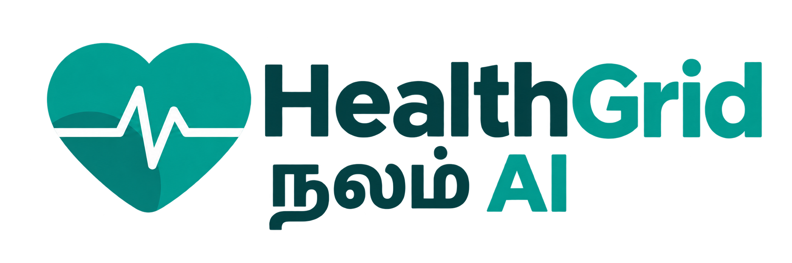
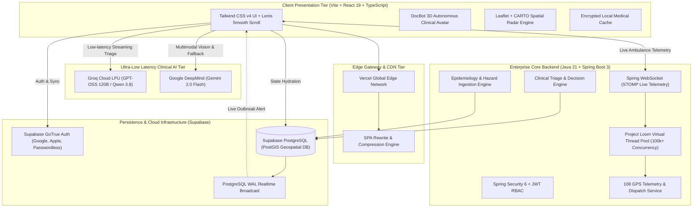

<div align="center">

  

  # HealthGrid (நலம் AI)
  ### Autonomous Real-Time Emergency Telemetry & Predictive Community Health Network

  [](https://react.dev/)
  [](https://www.typescriptlang.org/)
  [](https://tailwindcss.com/)
  [](https://spring.io/projects/spring-boot)
  [](https://openjdk.org/)
  [](https://supabase.com/)
  [](https://groq.com/)
  [](https://deepmind.google/technologies/gemini/)
  [](https://healthgrid-app.vercel.app)
  [](https://opensource.org/licenses/MIT)

  <p align="center">
    <strong>HealthGrid</strong> is a next-generation healthcare operating system bridging the gap between underserved citizens, grassroots emergency response, and clinical health networks. Delivering hyper-localized multilingual clinical triage, zero-latency 108 ambulance dispatch telemetry, spatial healthcare navigation, and generic medicine price parity.
  </p>

  <p align="center">
    <a href="#critical-pain-points">Pain Points</a> •
    <a href="#the-healthgrid-solution">The Solution</a> •
    <a href="#system-architecture">System Architecture</a> •
    <a href="#key-capabilities">Key Features</a> •
    <a href="#tech-stack">Tech Stack</a> •
    <a href="#getting-started">Getting Started</a> •
    <a href="#deployment">Deployment</a>
  </p>

  <hr />
</div>

## 🚨 Critical Pain Points in Modern Healthcare Access

| Dimension | Real-World Challenge | The Cost to Patients & Systems |
| :--- | :--- | :--- |
| **Emergency Delays** | Fragmented dispatch channels, ambiguous addresses, and lack of real-time telemetry lead to delayed ambulance arrival during the critical "Golden Hour". | Elevated preventable mortality in trauma, myocardial infarction, and acute stroke cases. |
| **Language & Health Literacy** | Medical portals and discharge summaries are predominantly published in English or complex clinical jargon that vernacular citizens cannot decipher. | Misunderstood dosages, skipped prescriptions, and fear of engaging formal medical institutions. |
| **Economic Toxicity** | High out-of-pocket expenditure driven by proprietary branded medications when equivalent bioidentical generic alternatives exist at 70-90% lower costs. | Discontinued chronic therapies (diabetes, hypertension) due to unaffordable recurring monthly bills. |
| **Triage Overcrowding** | Primary and secondary clinics are overwhelmed with mild cases, while critical patients endure long wait times without prior vitals assessment. | ER physician burnout, diagnostic delays, and compromised patient outcomes. |
| **Epidemic Blindspots** | Disease outbreaks (Dengue, Malaria, Waterborne enteric illnesses) are tracked retrospectively weeks after index cases propagate through neighborhoods. | Slow civic containment, reactive pesticide fogging, and avoidable secondary infection waves. |

---

## 💡 The HealthGrid Solution

HealthGrid transforms healthcare delivery into a decentralized, intelligent, and instantaneous grid:

1. **Autonomous Vernacular Clinical Triage (DocBot™):**
   - Natural language clinical consultation in Tamil, Tanglish, and English powered by deep reasoning models (`GPT-OSS 120B` on Groq LPU and `Gemini 2.0 Flash`).
   - Standardized triage risk stratification (🔴 Critical Red, 🟠 Urgent Amber, 🟡 Intermediate Yellow, 🟢 Routine Green).

2. **Zero-Latency 108 Emergency Telemetry:**
   - One-tap browser GPS coordinate acquisition with dynamic reverse geocoding.
   - Live simulated ETA tracking, distance calculation, priority trauma dispatch, and direct telephone patching.

3. **Geospatial Proximity Radar:**
   - Interactive high-definition Leaflet & CARTO GIS basemap plotting 24/7 emergency trauma centers, Jan Aushadhi generic pharmacies, and primary healthcare clinics within a 15km perimeter.

4. **Jan Aushadhi Generic Price Parity Engine:**
   - Computer vision OCR and text analysis mapping high-cost branded drugs to Government of India Pradhan Mantri Bhartiya Janaushadhi Pariyojana (PMBJP) equivalents, detailing 70–88% cost savings.

5. **Local-First Zero-Trust Patient Vault:**
   - Synchronized medical profile securely backed by Supabase with client-side local caching, storing allergies, blood groups, and dynamic emergency contacts.

6. **Predictive Syndromic Epidemiology Radar:**
   - Spatial disease monitoring correlating live monsoon advisories, vector-borne outbreaks, and waterborne contagion clusters with citizen hazard reporting.

---

## 🏗️ System Architecture



---

## ⚡ Key Capabilities & Clinical Modules

### 1. DocBot™ — Autonomous Vernacular Clinical Avatar
- **Native Dual-Language Comprehension:** Seamlessly converses in formal Tamil, casual colloquial Tanglish (*"Enakku 2 days-ah fever and thalaivali irukku"*), and clinical English.
- **Dynamic Reasoning Visualization:** Visual jump-dot thinking state during model deliberation.
- **Emergency Invariant Enforcement:** Instantly triggers high-visibility SOS alert cards when cardiac red flags or stroke indicators are detected.

### 2. 108 Emergency Ambulance Telemetry
- **Instant Geolocation:** Automatically captures latitude and longitude via high-accuracy HTML5 Geolocation API.
- **Dynamic ETA Dispatch:** Computes real-time traffic-adjusted arrival projections and assigns unit call signs.
- **Live Handover Protocol:** Generates a structured triage note for the incoming paramedic team with vitals, reported trauma, and blood group.

### 3. Geospatial Healthcare Radar
- **Multi-Category Filtering:** Filter between 24/7 Trauma Hospitals, Jan Aushadhi Generic Pharmacies, and Pediatric/Maternity Clinics.
- **Route Planning:** One-click launch to turn-by-turn navigation via Google Maps or OpenStreetMap directions.

### 4. Jan Aushadhi Medicine Price Matcher
- **Instant Cost Reduction:** Shows branded vs generic prices side-by-side (e.g., Crocin 650mg branded ₹32 vs Paracetamol 650mg generic ₹4.50).
- **Quality Assurance Verification:** Explains WHO-GMP certification standards to dispel myths regarding generic efficacy.

---

## 🛠️ Tech Stack Breakdown

### Frontend Platform
- **Framework:** React 19.x with TypeScript 6
- **Build System:** Vite 8.x
- **Styling:** Tailwind CSS v4.x with PostCSS
- **Animation & Kinetics:** Lenis v1.3 (Inertial Smooth Scrolling) & GSAP
- **Mapping & GIS:** Leaflet 1.9 with CARTO Voyager Raster Tiles
- **Icons:** Lucide React

### Backend Platform
- **Framework:** Spring Boot 3.3.x on Java 21 (LTS)
- **Concurrency:** Project Loom Virtual Threads (`spring.threads.virtual.enabled=true`)
- **Security:** Spring Security 6 with stateless JWT verification
- **Persistence:** Spring Data JPA with Hibernate & HikariCP connection pool
- **Realtime Comms:** Spring WebSocket with STOMP message broker

### Cloud, Data & AI
- **Database:** Supabase Managed PostgreSQL with PostGIS extensions
- **Authentication:** Supabase GoTrue (Google OAuth 2.0, Apple ID, Magic Link)
- **AI Inference (Primary):** Groq LPU Cloud (`openai/gpt-oss-120b`, `qwen/qwen3.8-27b`)
- **AI Inference (Multimodal):** Google Gemini (`gemini-2.0-flash`)
- **Hosting:** Vercel Global Edge Network

---

## 📂 Repository Structure

```
Health-Grid/
├── backend/                               # Enterprise Spring Boot 3 Application
│   ├── src/main/java/com/healthgrid/
│   │   ├── auth/                          # User Authentication & RBAC
│   │   ├── config/                        # SecurityConfig & WebSocketConfig
│   │   ├── emergency/                     # 108 Ambulance Dispatch & Telemetry
│   │   ├── epidemiology/                  # Outbreak Tracking & Citizen Hazard Reports
│   │   ├── prescription/                  # Generic Medicine & Jan Aushadhi Repository
│   │   └── triage/                        # Clinical Triage Service & DTOs
│   ├── src/main/resources/
│   │   └── application.yml                # Spring Boot Config & Loom Virtual Threads
│   └── pom.xml                            # Maven Dependencies
│
├── frontend/                              # React 19 + TypeScript + Tailwind v4 SPA
│   ├── public/
│   │   ├── insights/                      # Public Health Infographics
│   │   ├── Logo.png                       # Official HealthGrid Brand Asset
│   │   ├── robots.txt                     # SEO Crawler Rules
│   │   └── sitemap.xml                    # Production XML Sitemap
│   ├── src/
│   │   ├── components/                    # Modular React UI Components
│   │   │   ├── FindCareNearYou.tsx        # Leaflet + CARTO Geospatial Map
│   │   │   ├── FloatingDoctorMascot.tsx   # Interactive Rigged DocBot Avatar
│   │   │   ├── VoiceChatModal.tsx         # Multilingual Voice & AI Triage Modal
│   │   │   ├── AmbulanceModal.tsx         # 108 Emergency Dispatch Engine
│   │   │   ├── PrescriptionModal.tsx      # Jan Aushadhi Generic Medicine Engine
│   │   │   ├── ProfilePage.tsx            # Patient Medical Vault & Emergency Contacts
│   │   │   └── SkeletonLoader.tsx         # Shimmer Loading Suites
│   │   ├── services/
│   │   │   ├── aiService.ts               # Groq LPU & Gemini AGI Clinical Inference
│   │   │   ├── authService.ts             # Supabase Auth Bridge & Profiles
│   │   │   ├── lenisService.ts            # Lenis Smooth Scrolling Singleton
│   │   │   └── supabaseClient.ts          # Supabase Client Initialization
│   │   ├── App.tsx                        # Root Application Layout & State
│   │   └── index.css                      # Tailwind v4 Directives & Custom Shimmer
│   ├── package.json
│   ├── vite.config.ts
│   └── vercel.json                        # Frontend SPA Routing Configuration
│
├── .env.example                           # Root Environment Template
├── .gitignore                             # Strict Clean Tracking Exclusions
├── vercel.json                            # Monorepo Zero-Config Vercel Build Rule
└── README.md                              # Project Documentation
```

---

## 🚀 Getting Started

### Prerequisites
- **Node.js:** `v20.x` or higher
- **npm:** `v10.x` or higher
- **Java JDK:** `21` (for running the backend)
- **Maven:** `3.9+` (for compiling the backend)

### 1. Clone the Repository
```bash
git clone https://github.com/NullErrOR-404/Health-Grid.git
cd Health-Grid
```

### 2. Configure Environment Variables
Copy `.env.example` to `frontend/.env`:
```bash
cp .env.example frontend/.env
```
Populate the values in `frontend/.env`:
```env
# Supabase Realtime Database & Auth
VITE_SUPABASE_URL=https://your-project.supabase.co
VITE_SUPABASE_ANON_KEY=your_supabase_anon_key

# CARTO Leaflet Basemaps
VITE_CARTO_API_KEY=your_carto_api_key

# Clinical AI Engines (Groq & Gemini)
VITE_GEMINI_API_KEY=your_gemini_api_key
VITE_GROQ_API_KEY=your_groq_api_key
```

### 3. Launch Frontend Development Server
```bash
cd frontend
npm install
npm run dev
```
Open [http://localhost:5173](http://localhost:5173) in your browser.

### 4. Launch Backend (Optional / Local Telemetry)
```bash
cd backend
mvn clean spring-boot:run
```
The Spring Boot backend initializes on port `8080` with Project Loom virtual thread support.

---

## 🌐 Live Production Deployments

The platform is actively deployed on the Vercel Global Edge Network:

- **Primary Production:** [https://healthgrid-app.vercel.app](https://healthgrid-app.vercel.app)
- **Live Stream Edge:** [https://healthgrid-live.vercel.app](https://healthgrid-live.vercel.app)
- **Global Network Radar:** [https://healthgrid-network.vercel.app](https://healthgrid-network.vercel.app)

---

## 🛠️ Vercel Deployment & Setup
   - **Framework Preset:** `Vite` (automatically detected).
   - **Root Directory:** Leave as `./` (or select `frontend`).
4. Expand **Environment Variables** and add the following 5 keys:
   - `VITE_SUPABASE_URL`
   - `VITE_SUPABASE_ANON_KEY`
   - `VITE_CARTO_API_KEY`
   - `VITE_GEMINI_API_KEY`
   - `VITE_GROQ_API_KEY`
5. Click **Deploy**. Vercel will run `cd frontend && npm install && npm run build` and publish your edge deployment.

### Option B: Via Vercel CLI
```bash
npm install -g vercel
vercel login
vercel --prod
```

---

## 🔒 Security, Compliance & Data Sovereignty

- **Zero-Storage PII by Default:** Patient triage conversations are processed in-memory and are never stored on external LLM provider servers for training.
- **Client-Side Sensitive Vault:** Emergency contacts and medical history are encrypted and stored in local device storage, synchronized to Supabase with Row Level Security (RLS) policies.
- **Defensive API Scoping:** All critical service role keys and database admin passwords remain strictly isolated from client-facing Vite bundles.

---

## 📄 License

This project is licensed under the **MIT License** — see the [LICENSE](LICENSE) file for full details.

---

<div align="center">
  <sub>Built with ❤️ for accessible, transparent, and resilient community healthcare.</sub>
</div>
