# 🧠 HealthGrid Second Brain • Map of Content (MOC)

> [!tip] AI Quick-Context Injection
> Read this index note first. It provides instantaneous mental mapping of all subsystems, domain models, and decision logs with minimal token overhead (~300 tokens).

```mermaid
graph TD
    MOC[00_Index: HealthGrid Hub] --> ARCH[Architecture & Infrastructure]
    MOC --> UIUX[UI/UX & Mobile Design System]
    MOC --> MOD[Core Clinical Modules]
    MOC --> INT[External Integrations]
    MOC --> DEC[Architecture Decisions ADR]
    MOC --> CTX[Active Context & State]

    UIUX --> TOK[[Design_System_Tokens]]
    UIUX --> LAW[[Mobile_UI_UX_Laws_Audit]]
    UIUX --> CAT[[Page_By_Page_Audit_Catalog]]

    ARCH --> TS[[Tech_Stack]]
    ARCH --> DEP[[Deployment_and_Domains]]
    ARCH --> MTSE[[Multi_Tenant_State_Engine]]
    ARCH --> DSS[[Data_Sovereignty_and_Security]]

    MOD --> DOC[[DocBot_TeleClinic]]
    MOD --> AMB[[Emergency_108_Ambulance]]
    MOD --> PMB[[Generic_Medicines_PMBJP]]
    MOD --> MAP[[Hospital_Bed_Locator]]
    MOD --> HIS[[Hospital_Information_System_HIS]]
    MOD --> ERP[[Hospital_ERP_Dashboard]]

    INT --> SUP[[Supabase_Auth]]
    INT --> GOA[[Google_OAuth_and_Verification]]
    INT --> AIP[[AI_Providers_and_LLMs]]

    DEC --> ADR1[[ADR-001-Semantic-Privacy-Links]]
    DEC --> ADR2[[ADR-002-Vercel-SSO-Bypass]]
    DEC --> ADR3[[ADR-003-MultiTenant-Hospital-Isolation]]
    DEC --> ADR4[[ADR-004-User-Data-Transparency-Hero]]
    DEC --> ADR5[[ADR-005-Mobile-First-Responsive-Architecture]]
    DEC --> ADR6[[ADR-006-Decommission-Legacy-HIS-Doctor-Portal]]
    DEC --> ADR7[[ADR-007-Decommission-Roaming-Mascot]]
    DEC --> ADR8[[ADR-008-Mobile-Navbar-Zero-Overflow-Architecture]]
    DEC --> ADR9[[ADR-009-Mobile-Login-Scroll-and-ChatUI-Minimal-Pills]]
    DEC --> ADR10[[ADR-010-Mobile-Hamburger-Drawer-Scroll-Lock-and-Navigation]]
    DEC --> ADR11[[ADR-011-Family-and-Beneficiary-MultiProfile-System]]
    DEC --> ADR12[[ADR-012-Beneficiary-to-Independent-Account-Porting]]
    DEC --> ADR13[[ADR-013-Beneficiary-OTP-Verification-and-Emergency-Sync]]
    DEC --> ADR14[[ADR-014-Conversational-Chameleon-and-Speech-Pipeline]]
    DEC --> ADR15[[ADR-015-Vernacular-Speech-and-Conversational-Continuity]]
    DEC --> ADR16[[ADR-016-Autonomous-Hybrid-Vector-RAG-and-Ambient-Clinical-Automations]]
    DEC --> ADR17[[ADR-017-Clinical-Synergy-and-Prescription-Demographic-OCR]]
    DEC --> ADR18[[ADR-018-Top-Tier-Multimodal-Prescription-Vision-and-HTR-Cascade]]
    DEC --> ADR19[[ADR-019-Clinical-Pharmacology-Engine-Formulary-Grounding-and-Context-Matching]]
    DEC --> ADR20[[ADR-020-Prescription-Post-Scan-UI-Redesign-and-Interactive-Viewer]]
    DEC --> ADR21[[ADR-021-Persistent-Header-Navbar-Throughout-Chat-Tab]]
    DEC --> ADR22[[ADR-022-Prescription-Modal-Mobile-Scroll-Lock-and-Lenis-Prevention]]
    DEC --> ADR23[[ADR-023-Platform-Data-Grounding-and-Formulary-Truth-Engine]]
    DEC --> ADR24[[ADR-024-Interactive-Chat-RAG-Fuzzy-Grounding-and-Zero-Jargon]]
    DEC --> ADR27[[ADR-027-Intelligent-Triage-Gating-and-Open-Weight-Fine-Tuning-Pipeline]]
    DEC --> ADR28[[ADR-028-Hospital-ERP-Patient-and-OPD-Management-End-to-End-Architecture]]

    CTX --> ACT[[Active_Context]]
    CTX --> CRED[[Key_Credentials_and_Environments]]
```

---

## 🎨 1. UI/UX & Mobile-First Design System
- [[Design_System_Tokens]]: 8-point spatial grid, fluid typography scale, 48px touch targets, WCAG AAA contrast, and image aspect-ratio guardrails.
- [[Mobile_UI_UX_Laws_Audit]]: Psychological & interaction laws evaluation (Fitts's Law thumb zone, Hick's Law progressive disclosure, Miller's Law chunking, Von Restorff emergency 108 contrast).
- [[Page_By_Page_Audit_Catalog]]: Granular responsive audit, line-heights, and image alignment resolutions across all 11 views and 9 modals.

---

## 🏛️ 2. Architecture & Infrastructure
- [[Tech_Stack]]: Modern React 19, Vite 8, Tailwind CSS, TypeScript, Lenis Smooth Scroll, Lucide.
- [[Deployment_and_Domains]]: 4 Vercel production aliases, automated deployment pipeline, zero SSO bypass configuration.
- [[Multi_Tenant_State_Engine]]: LocalStorage-driven isolated hospital workspace state engine (`healthgrid_erp_userspace_${hospitalCode}`).
- [[Data_Sovereignty_and_Security]]: DPDP Act 2023 compliance, client-side zero-disk clinical triage, HIPAA/DISHA standards.

---

## 🏥 3. Core Clinical Modules
- [[DocBot_TeleClinic]]: 24/7 AI Family Doctor consultation with live camera vision inspection and dual Groq/Gemini fallback.
- [[Emergency_108_Ambulance]]: Real-time ambulance dispatch with GPS ETA tracking, vitals telemetry, and digital doctor handover.
- [[Generic_Medicines_PMBJP]]: Jan Aushadhi generic pharmaceutical store with up to 89% chronic savings engine and Kendra locator.
- [[Hospital_Bed_Locator]]: Interactive Leaflet geospatial map locating government PHCs, casualty centers, and blood banks.
- [[Hospital_Information_System_HIS]]: *(Decommissioned / Deprecated)* Legacy doctor portal prototype superseded by [[Hospital_ERP_Dashboard]].
- [[Hospital_ERP_Dashboard]]: Hospital administrator operations, dynamic credentials, inventory tracking, and clinical alerts.

---

## 🔌 4. External Integrations
- [[Supabase_Auth]]: Real Google OAuth provider, Apple ID, passwordless authentication, and session subscribers.
- [[Google_OAuth_and_Verification]]: Branding verification, Google Search Console meta tag, Limited Use policy, and privacy links.
- [[AI_Providers_and_LLMs]]: Groq LPU (GPT-OSS 120B / 20B), Google Gemini 3.8 / 1.5 Flash, Sarvam AI Bulbul V3 voice.

---

## 📜 5. Architecture Decision Records (ADRs)
- [[ADR-001-Semantic-Privacy-Links]]: Replacing `<button>` with crawlable `<a href="/privacy">` tags to pass automated review bots.
- [[ADR-002-Vercel-SSO-Bypass]]: Disabling Vercel team deployment protection on `.vercel.app` to resolve 302 crawler redirects.
- [[ADR-003-MultiTenant-Hospital-Isolation]]: Dynamically provisioning administrator credentials and state per hospital code.
- [[ADR-004-User-Data-Transparency-Hero]]: Designing the 1672px full-canvas layout exposing the 3D mascot and concise disclosures.
- [[ADR-005-Mobile-First-Responsive-Architecture]]: Mobile-first responsive overhaul, unmounting roaming mascot, and fullscreen mobile modal sheets.
- [[ADR-006-Decommission-Legacy-HIS-Doctor-Portal]]: Decommissioning legacy HIS and consolidating on the multi-tenant Hospital ERP.
- [[ADR-007-Decommission-Roaming-Mascot]]: Decommissioning autonomous roaming mascot and scrolling thought bubbles.
- [[ADR-008-Mobile-Navbar-Zero-Overflow-Architecture]]: Mobile Navbar zero-overflow layout, compact top bar, and high-priority drawer emergency card.
- [[ADR-009-Mobile-Login-Scroll-and-ChatUI-Minimal-Pills]]: Mobile login scroll trap resolution, hidden desktop marketing banners, and ChatUI minimal pill control system.
- [[ADR-010-Mobile-Hamburger-Drawer-Scroll-Lock-and-Navigation]]: Mobile hamburger drawer body scroll locking with Lenis pausing, dynamic viewport height, backdrop tap-to-dismiss, and sticky top header with back button.
- [[ADR-011-Family-and-Beneficiary-MultiProfile-System]]: Multi-profile caregiver architecture (ABDM CoWIN standard) allowing primary account holders to consult with AI doctors and book hospital OPD tokens for family members without personal phones or accounts.
- [[ADR-012-Beneficiary-to-Independent-Account-Porting]]: ABDM beneficiary-to-independent account porting protocol, preserving historical health ID aliases (`linkedHistoricalAliases`), clinical caregiver provenance tags, and establishing delegated co-caregiver permissions with full patient data sovereignty under DPDP Act 2023.
- [[ADR-013-Beneficiary-OTP-Verification-and-Emergency-Sync]]: Beneficiary mobile identity assurance via 6-digit SMS OTP verification (with proxy caregiver OTP for young children/elderly), strict 7-dependent quota governor (`MAX_BENEFICIARIES = 7`), and two-way dynamic synchronization with 108 Emergency Contacts list.
- [[ADR-014-Conversational-Chameleon-and-Speech-Pipeline]]: Conversational Chameleon intent separation in DocBot AI (warm human chit-chat without unprompted medical probing), single-pipeline microphone capture preventing mobile hardware lock collisions, and instant zero-lag browser speech synthesis at 1.1x cadence.
- [[ADR-015-Vernacular-Speech-and-Conversational-Continuity]]: Vernacular speech generation and bidirectional conversational continuity.
- [[ADR-016-Autonomous-Hybrid-Vector-RAG-and-Ambient-Clinical-Automations]]: Autonomous hybrid vector RAG and ambient clinical note generation.
- [[ADR-017-Clinical-Synergy-and-Prescription-Demographic-OCR]]: Clinical-grade prescription OCR engine capturing patient demographics, physician credentials (Lic/PTR), dispensed quantities, chemical formulas, and automated pharmacological synergy insights (e.g., FeSO4 + Vitamin C).
- [[ADR-018-Top-Tier-Multimodal-Prescription-Vision-and-HTR-Cascade]]: 4-tier autonomous multimodal vision & HTR cascade (Gemini 3.8/3.5, Groq Qwen 3.8 27B, hot-swappable NVIDIA NIM & Hugging Face TrOCR) with 15s timeouts and zero UI clutter.
- [[ADR-019-Clinical-Pharmacology-Engine-Formulary-Grounding-and-Context-Matching]]: Intelligent context-reading clinical engine matching prescription tokens against authentic Indian Pharmacopeia formulations and Jan Aushadhi (PMBJP) catalogues, grounding smudged dosages, evaluating pediatric and allergy patient context, and consolidating multi-page daily routines.
- [[ADR-020-Prescription-Post-Scan-UI-Redesign-and-Interactive-Viewer]]: Post-scan prescription UI redesign matching visual reference (`After prescription scanned ref.png`) with side-by-side interactive document canvas (zoom/rotate/fullscreen lightbox), 4-column medicine metadata badges, inline & batch "Edit All" modal, and 3-card primary action tray with secondary clinical tools (WhatsApp, Calendar, 30d Refill).
- [[ADR-021-Persistent-Header-Navbar-Throughout-Chat-Tab]]: Persistent unified header (`GovAlertMarquee` + `Navbar activeView="chat"`) throughout active AI Doctor consultations, eliminating navigation loss, dedicating the left sidebar strictly to consultation history, and introducing an explicit `[ 💬 History ]` mobile pill to eliminate dual-hamburger confusion.
- [[ADR-022-Prescription-Modal-Mobile-Scroll-Lock-and-Lenis-Prevention]]: Mobile prescription post-scan scroll trap resolution via `data-lenis-prevent="true"`, dynamic viewport height (`h-[100dvh] max-h-[100dvh]`), overscroll containment, preview card touch passthrough (`touch-pan-y`), and safe-area clearance for bottom action trays.
- [[ADR-023-Platform-Data-Grounding-and-Formulary-Truth-Engine]]: Platform-wide elimination of hallucinated fallback credentials (K. Sundaram, 98401 23456), real-time PMBJP database lookup for profile medication savings, authentic session vitals for casualty handover, and statutory harmonization of generic savings (50% to 90%).
- [[ADR-024-Interactive-Chat-RAG-Fuzzy-Grounding-and-Zero-Jargon]]: Phonetic and fuzzy clinical grounding (`fuzzyClinicalMatcher.ts`), hybrid vector RAG protocol expansion (ICMR, PMBJP, Tamil Nadu casualties), strict zero-asterisk and plain-language sanitization in `aiService.ts`, and interactive choosing options (single-tap pills and multi-select checklist cards) in `ChatbotPage.tsx`.
- [[ADR-027-Intelligent-Triage-Gating-and-Open-Weight-Fine-Tuning-Pipeline]]: Elimination of false triage card auto-triggers, disconnection of AI response text from condition evaluation, strict 2-3 sentence conciseness for routine and general queries, zero-filler bedside manner, and open-weight Hugging Face/Unsloth QLoRA fine-tuning training pipeline for Meta Llama-3.3-70B and Llama-3.1-8B.
- [[ADR-028-Hospital-ERP-Patient-and-OPD-Management-End-to-End-Architecture]]: End-to-end implementation of Patient Management and OPD Management matching clinical reference designs (`Patient management ERP Ref.png` and `OPD management ERP ref.png`), unified ABDM federated patient store with automatic HealthID generation, interactive modals for vitals, prescriptions, billing, and consultations, and bidirectional real-time synchronization across modules and personal citizen vaults.

---

## ⚡ 5. Real-Time State & Context
- [[Active_Context]]: Active working branch, latest deployed git commit, current focus, and immediate roadmap.
- [[Key_Credentials_and_Environments]]: Seed accounts, test administrator credentials (`gmch_admin`), and environment variables.

---

> [!note] How to View in Obsidian
> Open Obsidian, choose **"Open folder as vault"**, and select `c:\HealthGrid\brain`. Open the **Graph View** (`Ctrl+G`) to see the full interactive visual network!
