# 🧠 HealthGrid Second Brain • Map of Content (MOC)

> [!tip] AI Quick-Context Injection
> Read this index note first. It provides instantaneous mental mapping of all subsystems, domain models, and decision logs with minimal token overhead (~300 tokens).

```mermaid
graph TD
    MOC[00_Index: HealthGrid Hub] --> ARCH[Architecture & Infrastructure]
    MOC --> MOD[Core Clinical Modules]
    MOC --> INT[External Integrations]
    MOC --> DEC[Architecture Decisions ADR]
    MOC --> CTX[Active Context & State]

    ARCH --> TS[[Tech_Stack]]
    ARCH --> DEP[[Deployment_and_Domains]]
    ARCH --> MTSE[[Multi_Tenant_State_Engine]]
    ARCH --> DSS[[Data_Sovereignty_and_Security]]

    MOD --> DOC[[DocBot_TeleClinic]]
    MOD --> AMB[[Emergency_108_Ambulance]]
    MOD --> PMB[[Generic_Medicines_PMBJP]]
    MOD --> MAP[[Hospital_Bed_Locator]]
    MOD --> HIS[[Hospital_Information_System_HIS]]
    MOD --> ERP[[Hospital_ERP_Dashboard]]

    INT --> SUP[[Supabase_Auth]]
    INT --> GOA[[Google_OAuth_and_Verification]]
    INT --> AIP[[AI_Providers_and_LLMs]]

    DEC --> ADR1[[ADR-001-Semantic-Privacy-Links]]
    DEC --> ADR2[[ADR-002-Vercel-SSO-Bypass]]
    DEC --> ADR3[[ADR-003-MultiTenant-Hospital-Isolation]]
    DEC --> ADR4[[ADR-004-User-Data-Transparency-Hero]]

    CTX --> ACT[[Active_Context]]
    CTX --> CRED[[Key_Credentials_and_Environments]]
```

---

## 🏛️ 1. Architecture & Infrastructure
- [[Tech_Stack]]: Modern React 19, Vite 8, Tailwind CSS, TypeScript, Lenis Smooth Scroll, Lucide.
- [[Deployment_and_Domains]]: 4 Vercel production aliases, automated deployment pipeline, zero SSO bypass configuration.
- [[Multi_Tenant_State_Engine]]: LocalStorage-driven isolated hospital workspace state engine (`healthgrid_erp_userspace_${hospitalCode}`).
- [[Data_Sovereignty_and_Security]]: DPDP Act 2023 compliance, client-side zero-disk clinical triage, HIPAA/DISHA standards.

---

## 🏥 2. Core Clinical Modules
- [[DocBot_TeleClinic]]: 24/7 AI Family Doctor consultation with live camera vision inspection and dual Groq/Gemini fallback.
- [[Emergency_108_Ambulance]]: Real-time ambulance dispatch with GPS ETA tracking, vitals telemetry, and digital doctor handover.
- [[Generic_Medicines_PMBJP]]: Jan Aushadhi generic pharmaceutical store with up to 89% chronic savings engine and Kendra locator.
- [[Hospital_Bed_Locator]]: Interactive Leaflet geospatial map locating government PHCs, casualty centers, and blood banks.
- [[Hospital_Information_System_HIS]]: OPD token generation queue, doctor tele-chamber with SOAP notes, and IPD bed census.
- [[Hospital_ERP_Dashboard]]: Hospital administrator operations, dynamic credentials, inventory tracking, and clinical alerts.

---

## 🔌 3. External Integrations
- [[Supabase_Auth]]: Real Google OAuth provider, Apple ID, passwordless authentication, and session subscribers.
- [[Google_OAuth_and_Verification]]: Branding verification, Google Search Console meta tag, Limited Use policy, and privacy links.
- [[AI_Providers_and_LLMs]]: Groq LPU (GPT-OSS 120B / 20B), Google Gemini 3.8 / 1.5 Flash, Sarvam AI Bulbul V3 voice.

---

## 📜 4. Architecture Decision Records (ADRs)
- [[ADR-001-Semantic-Privacy-Links]]: Replacing `<button>` with crawlable `<a href="/privacy">` tags to pass automated review bots.
- [[ADR-002-Vercel-SSO-Bypass]]: Disabling Vercel team deployment protection on `.vercel.app` to resolve 302 crawler redirects.
- [[ADR-003-MultiTenant-Hospital-Isolation]]: Dynamically provisioning administrator credentials and state per hospital code.
- [[ADR-004-User-Data-Transparency-Hero]]: Designing the 1672px full-canvas layout exposing the 3D mascot and concise disclosures.

---

## ⚡ 5. Real-Time State & Context
- [[Active_Context]]: Active working branch, latest deployed git commit, current focus, and immediate roadmap.
- [[Key_Credentials_and_Environments]]: Seed accounts, test administrator credentials (`gmch_admin`), and environment variables.

---

> [!note] How to View in Obsidian
> Open Obsidian, choose **"Open folder as vault"**, and select `c:\HealthGrid\brain`. Open the **Graph View** (`Ctrl+G`) to see the full interactive visual network!
