# 🧠 HealthGrid Second Brain • Map of Content (MOC)

> [!tip] AI Quick-Context Injection
> Read this index note first. It provides instantaneous mental mapping of all subsystems, domain models, and decision logs with minimal token overhead (~300 tokens).

```mermaid
graph TD
    MOC[00_Index: HealthGrid Hub] --> ARCH[Architecture & Infrastructure]
    MOC --> UIUX[UI/UX & Mobile Design System]
    MOC --> MOD[Core Clinical Modules]
    MOC --> INT[External Integrations]
    MOC --> DEC[Architecture Decisions ADR]
    MOC --> CTX[Active Context & State]

    UIUX --> TOK[[Design_System_Tokens]]
    UIUX --> LAW[[Mobile_UI_UX_Laws_Audit]]
    UIUX --> CAT[[Page_By_Page_Audit_Catalog]]

    ARCH --> TS[[Tech_Stack]]
    ARCH --> DEP[[Deployment_and_Domains]]
    ARCH --> MTSE[[Multi_Tenant_State_Engine]]
    ARCH --> DSS[[Data_Sovereignty_and_Security]]

    MOD --> DOC[[DocBot_TeleClinic]]
    MOD --> AMB[[Emergency_108_Ambulance]]
    MOD --> PMB[[Generic_Medicines_PMBJP]]
    MOD --> MAP[[Hospital_Bed_Locator]]
    MOD --> HIS[[Hospital_Information_System_HIS]]
    MOD --> ERP[[Hospital_ERP_Dashboard]]

    INT --> SUP[[Supabase_Auth]]
    INT --> GOA[[Google_OAuth_and_Verification]]
    INT --> AIP[[AI_Providers_and_LLMs]]

    DEC --> ADR1[[ADR-001-Semantic-Privacy-Links]]
    DEC --> ADR2[[ADR-002-Vercel-SSO-Bypass]]
    DEC --> ADR3[[ADR-003-MultiTenant-Hospital-Isolation]]
    DEC --> ADR4[[ADR-004-User-Data-Transparency-Hero]]
    DEC --> ADR5[[ADR-005-Mobile-First-Responsive-Architecture]]
    DEC --> ADR6[[ADR-006-Decommission-Legacy-HIS-Doctor-Portal]]
    DEC --> ADR7[[ADR-007-Decommission-Roaming-Mascot]]
    DEC --> ADR8[[ADR-008-Mobile-Navbar-Zero-Overflow-Architecture]]
    DEC --> ADR9[[ADR-009-Mobile-Login-Scroll-and-ChatUI-Minimal-Pills]]
    DEC --> ADR10[[ADR-010-Mobile-Hamburger-Drawer-Scroll-Lock-and-Navigation]]
    DEC --> ADR11[[ADR-011-Family-and-Beneficiary-MultiProfile-System]]
    DEC --> ADR12[[ADR-012-Beneficiary-to-Independent-Account-Porting]]
    DEC --> ADR13[[ADR-013-Beneficiary-OTP-Verification-and-Emergency-Sync]]
    DEC --> ADR14[[ADR-014-Conversational-Chameleon-and-Speech-Pipeline]]
    DEC --> ADR15[[ADR-015-Vernacular-Speech-and-Conversational-Continuity]]
    DEC --> ADR16[[ADR-016-Autonomous-Hybrid-Vector-RAG-and-Ambient-Clinical-Automations]]
    DEC --> ADR17[[ADR-017-Clinical-Synergy-and-Prescription-Demographic-OCR]]
    DEC --> ADR18[[ADR-018-Top-Tier-Multimodal-Prescription-Vision-and-HTR-Cascade]]
    DEC --> ADR19[[ADR-019-Clinical-Pharmacology-Engine-Formulary-Grounding-and-Context-Matching]]
    DEC --> ADR20[[ADR-020-Prescription-Post-Scan-UI-Redesign-and-Interactive-Viewer]]
    DEC --> ADR21[[ADR-021-Persistent-Header-Navbar-Throughout-Chat-Tab]]
    DEC --> ADR22[[ADR-022-Prescription-Modal-Mobile-Scroll-Lock-and-Lenis-Prevention]]
    DEC --> ADR23[[ADR-023-Platform-Data-Grounding-and-Formulary-Truth-Engine]]
    DEC --> ADR24[[ADR-024-Interactive-Chat-RAG-Fuzzy-Grounding-and-Zero-Jargon]]
    DEC --> ADR27[[ADR-027-Intelligent-Triage-Gating-and-Open-Weight-Fine-Tuning-Pipeline]]
    DEC --> ADR28[[ADR-028-Hospital-ERP-Patient-and-OPD-Management-End-to-End-Architecture]]
    DEC --> ADR29[[ADR-029-IPD-and-Bed-Management-End-to-End-Architecture]]
    DEC --> ADR30[[ADR-030-Hospital-ERP-Appointments-Management-End-to-End-Architecture]]
    DEC --> ADR31[[ADR-031-Hospital-ERP-Emergency-Department-End-to-End-Architecture]]
    DEC --> ADR32[[ADR-032-Zero-Latency-Keep-Alive-and-Kinetic-Performance-Architecture]]
    DEC --> ADR33[[ADR-033-Vercel-Multi-Project-Domain-Alias-Synchronization]]
    DEC --> ADR34[[ADR-034-Hospital-ERP-Doctors-and-OPD-Management]]
    DEC --> ADR35[[ADR-035-Hospital-ERP-Reports-and-Analytics-Suite]]
    DEC --> ADR36[[ADR-036-Enterprise-Zero-Trust-Cybersecurity-and-OWASP-Hardening]]
    DEC --> ADR37[[ADR-037-DocBot-Staged-Attachments-MarkItDown-Token-Optimization-and-Clinical-Differentiators]]
    DEC --> ADR38[[ADR-038-In-Chat-Appointment-Automation-and-Medicine-Intelligence]]
    DEC --> ADR39[[ADR-039-Agentic-Doctor-Cross-Site-Execution-Zero-Trust-Memory-and-SEO-GEO]]
    DEC --> ADR40[[ADR-040-Autonomous-Clinical-Model-Arbitration-and-Zero-Trace-UI]]
    DEC --> ADR41[[ADR-041-Living-Clinical-Case-Dossier-Adaptive-History-Taking-and-Universal-EQ]]
    DEC --> ADR42[[ADR-042-AI-Live-Clinic-and-Records-Hub-Pixel-Perfect-Redesign-and-Mobile-Optimization]]
    DEC --> ADR43[[ADR-043-Dynamic-Live-Clinic-Supabase-Telemetry-and-Frontier-Model-Pipeline]]
    DEC --> ADR44[[ADR-044-React-Native-Android-APK-Architecture-and-OWASP-Mobile-Security]]
    DEC --> ADR45[[ADR-045-Billion-Parameter-Clinical-Model-FineTuning-and-Free-Tier-Cloud-Serving]]
    DEC --> ADR46[[ADR-046-Comprehensive-Engineering-Documentation-Suite-PRD-TRD-UIUX-Schema-Flow-Plan]]
    DEC --> ADR47[[ADR-047-HealthGrid-Clinician-Operating-System-and-Clinical-Workflow-Architecture]]
    DEC --> ADR48[[ADR-048-End-to-End-Authentic-Clinical-Seeding-and-Live-Supabase-Sync]]

    MOD --> APPT[[Appointments_System_Architecture]]
    MOD --> CLIN[[Clinician_Portal_Operating_System]]

    CTX --> ACT[[Active_Context]]
    CTX --> CRED[[Key_Credentials_and_Environments]]
```

---

## 🎨 1. UI/UX & Mobile-First Design System
- [[Design_System_Tokens]]: 8-point spatial grid, fluid typography scale, 48px touch targets, WCAG AAA contrast, and image aspect-ratio guardrails.
- [[Mobile_UI_UX_Laws_Audit]]: Psychological & interaction laws evaluation (Fitts's Law thumb zone, Hick's Law progressive disclosure, Miller's Law chunking, Von Restorff emergency 108 contrast).
- [[Page_By_Page_Audit_Catalog]]: Granular responsive audit, line-heights, and image alignment resolutions across all 11 views and 9 modals.

---

## 🏛️ 2. Architecture & Infrastructure
- [[Tech_Stack]]: Modern React 19, Vite 8, Tailwind CSS, TypeScript, Lenis Smooth Scroll, Lucide.
- [[Deployment_and_Domains]]: 4 Vercel production aliases, automated deployment pipeline, zero SSO bypass configuration.
- [[Multi_Tenant_State_Engine]]: LocalStorage-driven isolated hospital workspace state engine (`healthgrid_erp_userspace_${hospitalCode}`).
- [[Data_Sovereignty_and_Security]]: DPDP Act 2023 compliance, client-side zero-disk clinical triage, HIPAA/DISHA standards.
- [[Emergency_System_Architecture]]: Emergency Department casualty workflow, 3-tier ESI triage, real-time pub/sub, and IPD bed transfer flow.

---

## 🏥 3. Core Clinical Modules
- [[DocBot_TeleClinic]]: 24/7 AI Family Doctor consultation with live camera vision inspection and dual Groq/Gemini fallback.
- [[Emergency_108_Ambulance]]: Real-time ambulance dispatch with GPS ETA tracking, vitals telemetry, and digital doctor handover.
- [[Generic_Medicines_PMBJP]]: Jan Aushadhi generic pharmaceutical store with up to 89% chronic savings engine and Kendra locator.
- [[Hospital_Bed_Locator]]: Interactive Leaflet geospatial map locating government PHCs, casualty centers, and blood banks.
- [[Clinician_Portal_Operating_System]]: Enterprise-grade Clinician Portal ("My Queue", longitudinal patient chart, 10-stage encounter workspace, order sets, CDS rules engine, and embedded HealthGrid AI clinical assistant).
- [[Hospital_Information_System_HIS]]: *(Decommissioned / Deprecated)* Legacy doctor portal prototype superseded by [[Hospital_ERP_Dashboard]].
- [[Hospital_ERP_Dashboard]]: Hospital administrator operations, dynamic credentials, inventory tracking, and clinical alerts.

---

## 🔌 4. External Integrations
- [[Supabase_Auth]]: Real Google OAuth provider, Apple ID, passwordless authentication, and session subscribers.
- [[Google_OAuth_and_Verification]]: Branding verification, Google Search Console meta tag, Limited Use policy, and privacy links.
- [[AI_Providers_and_LLMs]]: Groq LPU (GPT-OSS 120B / 20B), Google Gemini 3.8 / 1.5 Flash, Sarvam AI Bulbul V3 voice.

---

## 📜 5. Architecture Decision Records (ADRs)
- [[ADR-001-Semantic-Privacy-Links]]: Replacing `<button>` with crawlable `<a href="/privacy">` tags to pass automated review bots.
- [[ADR-002-Vercel-SSO-Bypass]]: Disabling Vercel team deployment protection on `.vercel.app` to resolve 302 crawler redirects.
- [[ADR-003-MultiTenant-Hospital-Isolation]]: Dynamically provisioning administrator credentials and state per hospital code.
- [[ADR-004-User-Data-Transparency-Hero]]: Designing the 1672px full-canvas layout exposing the 3D mascot and concise disclosures.
- [[ADR-005-Mobile-First-Responsive-Architecture]]: Mobile-first responsive overhaul, unmounting roaming mascot, and fullscreen mobile modal sheets.
- [[ADR-006-Decommission-Legacy-HIS-Doctor-Portal]]: Decommissioning legacy HIS and consolidating on the multi-tenant Hospital ERP.
- [[ADR-007-Decommission-Roaming-Mascot]]: Decommissioning autonomous roaming mascot and scrolling thought bubbles.
- [[ADR-008-Mobile-Navbar-Zero-Overflow-Architecture]]: Mobile Navbar zero-overflow layout, compact top bar, and high-priority drawer emergency card.
- [[ADR-009-Mobile-Login-Scroll-and-ChatUI-Minimal-Pills]]: Mobile login scroll trap resolution, hidden desktop marketing banners, and ChatUI minimal pill control system.
- [[ADR-010-Mobile-Hamburger-Drawer-Scroll-Lock-and-Navigation]]: Mobile hamburger drawer body scroll locking with Lenis pausing, dynamic viewport height, backdrop tap-to-dismiss, and sticky top header with back button.
- [[ADR-011-Family-and-Beneficiary-MultiProfile-System]]: Multi-profile caregiver architecture (ABDM CoWIN standard) allowing primary account holders to consult with AI doctors and book hospital OPD tokens for family members without personal phones or accounts.
- [[ADR-012-Beneficiary-to-Independent-Account-Porting]]: ABDM beneficiary-to-independent account porting protocol, preserving historical health ID aliases (`linkedHistoricalAliases`), clinical caregiver provenance tags, and establishing delegated co-caregiver permissions with full patient data sovereignty under DPDP Act 2023.
- [[ADR-013-Beneficiary-OTP-Verification-and-Emergency-Sync]]: Beneficiary mobile identity assurance via 6-digit SMS OTP verification (with proxy caregiver OTP for young children/elderly), strict 7-dependent quota governor (`MAX_BENEFICIARIES = 7`), and two-way dynamic synchronization with 108 Emergency Contacts list.
- [[ADR-014-Conversational-Chameleon-and-Speech-Pipeline]]: Conversational Chameleon intent separation in DocBot AI (warm human chit-chat without unprompted medical probing), single-pipeline microphone capture preventing mobile hardware lock collisions, and instant zero-lag browser speech synthesis at 1.1x cadence.
- [[ADR-015-Vernacular-Speech-and-Conversational-Continuity]]: Vernacular speech generation and bidirectional conversational continuity.
- [[ADR-016-Autonomous-Hybrid-Vector-RAG-and-Ambient-Clinical-Automations]]: Autonomous hybrid vector RAG and ambient clinical note generation.
- [[ADR-017-Clinical-Synergy-and-Prescription-Demographic-OCR]]: Clinical-grade prescription OCR engine capturing patient demographics, physician credentials (Lic/PTR), dispensed quantities, chemical formulas, and automated pharmacological synergy insights (e.g., FeSO4 + Vitamin C).
- [[ADR-018-Top-Tier-Multimodal-Prescription-Vision-and-HTR-Cascade]]: 4-tier autonomous multimodal vision & HTR cascade (Gemini 3.8/3.5, Groq Qwen 3.8 27B, hot-swappable NVIDIA NIM & Hugging Face TrOCR) with 15s timeouts and zero UI clutter.
- [[ADR-019-Clinical-Pharmacology-Engine-Formulary-Grounding-and-Context-Matching]]: Intelligent context-reading clinical engine matching prescription tokens against authentic Indian Pharmacopeia formulations and Jan Aushadhi (PMBJP) catalogues, grounding smudged dosages, evaluating pediatric and allergy patient context, and consolidating multi-page daily routines.
- [[ADR-020-Prescription-Post-Scan-UI-Redesign-and-Interactive-Viewer]]: Post-scan prescription UI redesign matching visual reference (`After prescription scanned ref.png`) with side-by-side interactive document canvas (zoom/rotate/fullscreen lightbox), 4-column medicine metadata badges, inline & batch "Edit All" modal, and 3-card primary action tray with secondary clinical tools (WhatsApp, Calendar, 30d Refill).
- [[ADR-021-Persistent-Header-Navbar-Throughout-Chat-Tab]]: Persistent unified header (`GovAlertMarquee` + `Navbar activeView="chat"`) throughout active AI Doctor consultations, eliminating navigation loss, dedicating the left sidebar strictly to consultation history, and introducing an explicit `[ 💬 History ]` mobile pill to eliminate dual-hamburger confusion.
- [[ADR-022-Prescription-Modal-Mobile-Scroll-Lock-and-Lenis-Prevention]]: Mobile prescription post-scan scroll trap resolution via `data-lenis-prevent="true"`, dynamic viewport height (`h-[100dvh] max-h-[100dvh]`), overscroll containment, preview card touch passthrough (`touch-pan-y`), and safe-area clearance for bottom action trays.
- [[ADR-023-Platform-Data-Grounding-and-Formulary-Truth-Engine]]: Platform-wide elimination of hallucinated fallback credentials (K. Sundaram, 98401 23456), real-time PMBJP database lookup for profile medication savings, authentic session vitals for casualty handover, and statutory harmonization of generic savings (50% to 90%).
- [[ADR-024-Interactive-Chat-RAG-Fuzzy-Grounding-and-Zero-Jargon]]: Phonetic and fuzzy clinical grounding (`fuzzyClinicalMatcher.ts`), hybrid vector RAG protocol expansion (ICMR, PMBJP, Tamil Nadu casualties), strict zero-asterisk and plain-language sanitization in `aiService.ts`, and interactive choosing options (single-tap pills and multi-select checklist cards) in `ChatbotPage.tsx`.
- [[ADR-027-Intelligent-Triage-Gating-and-Open-Weight-Fine-Tuning-Pipeline]]: Elimination of false triage card auto-triggers, disconnection of AI response text from condition evaluation, strict 2-3 sentence conciseness for routine and general queries, zero-filler bedside manner, and open-weight Hugging Face/Unsloth QLoRA fine-tuning training pipeline for Meta Llama-3.3-70B and Llama-3.1-8B.
- [[ADR-028-Hospital-ERP-Patient-and-OPD-Management-End-to-End-Architecture]]: End-to-end implementation of Patient Management and OPD Management matching clinical reference designs (`Patient management ERP Ref.png` and `OPD management ERP ref.png`), unified ABDM federated patient store with automatic HealthID generation, interactive modals for vitals, prescriptions, billing, and consultations, and bidirectional real-time synchronization across modules and personal citizen vaults.
- [[ADR-029-IPD-and-Bed-Management-End-to-End-Architecture]]: End-to-end implementation of Inpatient Department (IPD) and Bed Management matching clinical reference design (`IPD & Bed management ref.png`), authentic PostgreSQL Supabase schema with RLS policies, 8 clinical workflows (Admit, Bed Allocation, Transfer, Discharge, Bed Status, Clinical Notes, Doctor Orders, Printable Case Sheet), real-time pub/sub synchronization, and sovereign HealthID live inpatient stay telemetry on citizen mobile profiles.
- [[ADR-030-Hospital-ERP-Appointments-Management-End-to-End-Architecture]]: End-to-end implementation of Appointments module matching clinical reference design (`Appointments ERP ref.png`), persistent Supabase PostgreSQL `appointments` table with real-time subscriptions, bidirectional active OPD queue bridge, 8 interactive clinical modals, dynamic gauge metrics, and dedicated Citizen Mobile App booking pass and queue tracker.
- [[ADR-031-Hospital-ERP-Emergency-Department-End-to-End-Architecture]]: End-to-end implementation of Emergency Department matching clinical reference design (`Emergency ERP ref.png`), authentic PostgreSQL Supabase schema with RLS policies, 3-tier ESI triage, 4 dynamic metric cards, 8 interactive clinical modals (Register, Status, Vitals, STAT Tests, Admit to IPD, Specialist Consult, Discharge, Call Family), and real-time pub/sub synchronization.
- [[ADR-032-Zero-Latency-Keep-Alive-and-Kinetic-Performance-Architecture]]: Three-tier platform performance architecture featuring sub-millisecond (0.6ms - 1.4ms) in-memory keep-alive DOM switching, kinetic smooth scrolling in Lenis, background idle route prefetching, and dedicated motion vendor chunk.
- [[ADR-033-Vercel-Multi-Project-Domain-Alias-Synchronization]]: Resolution of split-project production deployment caching across Vercel aliases, harmonizing healthgrid-app.vercel.app, healthgrid-nu.vercel.app, healthgrid-live.vercel.app, and healthgrid-network.vercel.app onto authoritative production build deployments with zero stale asset leakage.
- [[ADR-034-Hospital-ERP-Doctors-and-OPD-Management]]: End-to-end implementation of Doctors & OPD management matching clinical reference design (`Doctors & OPD.png`), backed by Supabase PostgreSQL `public.doctors` schema, 4 live KPI metric cards, real doctor rosters (24 seeded physicians), interactive modals (Add/Edit doctor, Profile Drawer, Weekly Schedule, Consultation Rooms), and live OPD patient queue handoff with zero hardcoding.
- [[ADR-035-Hospital-ERP-Reports-and-Analytics-Suite]]: End-to-end implementation of Reports & Analytics matching clinical reference design (`Reports & Analytics ref.png`), pure database aggregations across `patients`, `appointments`, `ipd_admissions`, `emergency_cases`, and `ipd_beds`, Recharts visual analytics suite (AreaChart, Donut, BarChart, Bed Occupancy Gauge), 6 functional tabs, live date filtering, and dynamic CSV / Print report export.
- [[ADR-036-Enterprise-Zero-Trust-Cybersecurity-and-OWASP-Hardening]]: Comprehensive enterprise-grade cybersecurity overhaul from dual Senior Cybersecurity Analyst and Senior Red Team perspectives: volatile in-memory session token storage, cryptographic SHA-256 device fingerprinting, multi-dimensional tiered rate limiting with anti-IP spoofing, Zero-Trust authentication barriers on all clinical mutations and server communication, dual-plane input sanitization with CDSCO Schedule H/X controlled drug shields, PostgreSQL Row-Level Security (RLS) enforcement, and industrial HTTP security headers (CSP, HSTS, COOP, CORP).
- [[ADR-037-DocBot-Staged-Attachments-MarkItDown-Token-Optimization-and-Clinical-Differentiators]]: Non-auto-triggering Staged Clinical Attachment Tray with dual voice/text follow-up, MarkItDown document-to-markdown token optimizer (reducing prompt tokens by 65-75%), and 5 unique clinical intelligence differentiators distinguishing HealthGrid from generic LLMs: (1) Live ESI Triage Radar & Casualty HUD with 108 Emergency dispatch, (2) Interactive Jan Aushadhi PMBJP generic savings slips (50-90% savings), (3) Longitudinal EHR & allergy interaction shield, (4) 1-tap physician-ready SBAR clinical handover brief generator with copy & print, and (5) adaptive bilingual follow-up chips.
- [[ADR-038-In-Chat-Appointment-Automation-and-Medicine-Intelligence]]: End-to-end interactive in-chat appointment booking automation and medicine intelligence matching `UI References/ChatUi ref.png`: 5-step in-chat stepper (`renderAppointmentStepper`) with hospital switcher, patient type pills, department filters, fill-in-the-blank doctor and condition inputs, date and time slots, doctor carousel (`renderDoctorCarousel`), desktop appointment summary panel (`renderAppointmentSummaryCard`) with collapsible toggle (`isSummaryExpanded`), verified digital hospital OPD pass (`renderConfirmedBookingPass`), Jan Aushadhi generic price comparison card (`renderMedicineCard`), and quick actions tray below input capsule.
- [[ADR-039-Agentic-Doctor-Cross-Site-Execution-Zero-Trust-Memory-and-SEO-GEO]]: Autonomous clinical agent cross-site execution with two-tier permissions (safe reads autonomous, sensitive mutations require in-chat confirmation), air-gapped multi-tenant memory per user, DPDP Act 2023 / ABDM authority impersonation defense, interactive visual module navigation cards, Generative Engine Optimization (GEO) with Schema.org JSON-LD and robots.txt, and Hugging Face QLoRA dataset preparation/training pipeline.
- [[ADR-040-Autonomous-Clinical-Model-Arbitration-and-Zero-Trace-UI]]: Dynamic multi-factor clinical complexity scoring (0-100) autonomously arbitrating between Frontier Clinical Reasoning (`openai/gpt-oss-120b`), Vernacular & Intermediate (`qwen/qwen3.8-27b`), Instant Turbo (`openai/gpt-oss-20b`), and Multimodal Vision (`gemini-3.8-flash`), with seamless failover cascades and 100% zero-trace UI overhaul removing all manual model pickers, quota progress bars, and debug token footers.
- [[ADR-041-Living-Clinical-Case-Dossier-Adaptive-History-Taking-and-Universal-EQ]]: Living Clinical Case Dossier working memory blackboard synchronized across all open-weight models (`openai/gpt-oss-120b`, `qwen/qwen3.8-27b`, `openai/gpt-oss-20b`, `gemini-3.8-flash`), SOCRATES history taking preventing premature turn-1 diagnoses, 4-phase gating (`EXPLORING` -> `NARROWING` -> `CONCLUDED` -> `EMERGENCY`) with patient initial diagnosis conclusion control, resilient interactive options extraction, and universal EQ intelligence with genuine humor, clean jokes, and versatile roleplay.
- [[ADR-042-AI-Live-Clinic-and-Records-Hub-Pixel-Perfect-Redesign-and-Mobile-Optimization]]: Pixel-perfect redesign of AI Live Clinic (`Live vision Clinic ref.png`) with desktop 3-column workspace, floating AI Vision Scanner, PIP, interactive checklist, and minimal mobile fullscreen camera view with slide-up AI drawer; and Records Hub (`Records Hub ref.png`) with end-to-end encrypted security banner, 6 metric tabs, quick-add form, and mobile horizontal-scroll history table.
- [[ADR-043-Dynamic-Live-Clinic-Supabase-Telemetry-and-Frontier-Model-Pipeline]]: Dynamic Live Clinic removing doctor PIP for full-bleed video canvas, client-side zero-trace transcript caching with local restore, authentic Supabase appointment queries with real network ping latency, dynamic vision-grounded clinical verification checklists, and frontier open-weight fine-tuning pipeline (Medical-O1, MedQA, ChatDoctor, UltraChat, Hermes).
- [[ADR-044-React-Native-Android-APK-Architecture-and-OWASP-Mobile-Security]]: Real React Native Android application architecture (Expo SDK 57 / New Architecture) with complete OWASP Mobile Security Suite (Android Keystore AES-256, Biometric App Lock, Screen Privacy Shield FLAG_SECURE, Network Security Config, anti-ADB backup) and APK build pipelines.
- [[ADR-045-Billion-Parameter-Clinical-Model-FineTuning-and-Free-Tier-Cloud-Serving]]: 8-Billion parameter clinical LLM fine-tuning pipeline targeting Meta Llama-3.1-8B-Instruct with Unsloth AI QLoRA on free Google Colab T4 GPU, multi-task dataset (Medical-O1, MedQA, ChatDoctor, PMBJP), and 100% free-tier cloud deployment via Hugging Face Serverless Inference API integrated into the deployed HealthGrid web and mobile apps.
- [[ADR-046-Comprehensive-Engineering-Documentation-Suite-PRD-TRD-UIUX-Schema-Flow-Plan]]: Comprehensive 6-document engineering documentation suite (PRD, TRD, UI/UX Specification, Database Schema, System Architecture & User Flow, and 12-Week Implementation Plan) detailing HealthGrid's dual citizen/clinician operating system.
- [[ADR-047-HealthGrid-Clinician-Operating-System-and-Clinical-Workflow-Architecture]]: Enterprise-grade Clinician Portal architecture matching visual reference (`My queue Reference.png`) and modern EHR depth (Epic, Oracle Health, athenaOne) with minimal premium UX, reactive Pub/Sub store, 10-stage clinical encounters, CDS rules engine, longitudinal patient charts, and embedded HealthGrid AI assistant.
- [[ADR-048-End-to-End-Authentic-Clinical-Seeding-and-Live-Supabase-Sync]]: End-to-end authentic clinical database seeding (50 real patients, sovereign ABDM UHIDs, 50 appointments), RBAC roles schema (`public.user_roles`), open RLS security policies, live-first Supabase bidirectional sync, dynamic greetings/dates, and zero-hardcoded mock users across Clinician and ERP workspaces.

---

## ⚡ 5. Real-Time State & Context
- [[Active_Context]]: Active working branch, latest deployed git commit, current focus, and immediate roadmap.
- [[Key_Credentials_and_Environments]]: Seed accounts, test administrator credentials (`gmch_admin`), and environment variables.

---

> [!note] How to View in Obsidian
> Open Obsidian, choose **"Open folder as vault"**, and select `c:\HealthGrid\brain`. Open the **Graph View** (`Ctrl+G`) to see the full interactive visual network!
