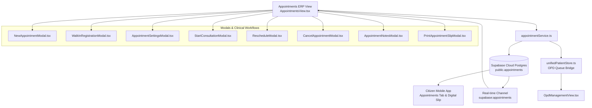

# 📅 Appointments System Architecture • Hospital ERP & Citizen Sync

> [!tip] Subsystem Mental Map
> This document details the end-to-end architecture for HealthGrid's Appointments module, spanning the Hospital ERP, Supabase Cloud persistence, real-time pub/sub synchronization, OPD queue bridge, and the Citizen Mobile App.

---

## 🏛️ 1. Domain Entities & Relational Schema

### Database: Supabase PostgreSQL (`cosnhycbvsxedogtejos.supabase.co`)

### Entity: `public.appointments`
- `id` (UUID, Primary Key)
- `appointment_id` (TEXT, Unique, e.g. `APPT250929001`)
- `patient_id` (UUID, Foreign Key to `public.patients(id)`)
- `patient_health_id` (TEXT, e.g. `HG001245`, `HG-PP27BNQ`)
- `patient_name` (TEXT)
- `patient_phone` (TEXT)
- `patient_age` (INTEGER)
- `patient_gender` (TEXT)
- `patient_avatar` (TEXT)
- `doctor_id` (UUID, Foreign Key to `public.doctors(id)`)
- `doctor_name` (TEXT)
- `department` (TEXT)
- `appointment_date` (DATE)
- `appointment_time` (TEXT, e.g. `09:00 AM`)
- `appointment_type` (TEXT: Consultation, Follow-up, Routine, Emergency)
- `status` (TEXT: Scheduled, Confirmed, Checked In, Waiting, In Consultation, Completed, Cancelled, No Show)
- `checked_in_at` (TIMESTAMPTZ)
- `source` (TEXT: Online Booking, Walk-in, Mobile App, Referral)
- `reason_for_visit` (TEXT)
- `notes` (TEXT)
- `clinical_observations` (TEXT)
- `cancellation_reason` (TEXT)
- `rescheduled_from` (TEXT)
- `created_at` (TIMESTAMPTZ)
- `updated_at` (TIMESTAMPTZ)

---

## ⚡ 2. Reactive Synchronization Engine

1. **Supabase Pub/Sub Subscription**:
   - `appointmentService` establishes a persistent listener on table `public.appointments`.
   - Any insertion, update, or deletion automatically triggers reactive state updates across all connected ERP desks and citizen views without polling.

2. **OPD Queue Interoperability**:
   - When an appointment is set to `Checked In` or clinical staff click `Start Consultation`, `unifiedPatientStore.addOrUpdateQueuePatient` is called.
   - The patient is allocated an active token and injected into the OPD consultation queue.
   - Selecting `Start Consultation` provides quick clinical note entry and a 1-click deep-link to the full OPD consultation desk.

3. **Citizen Mobile Portal**:
   - Dedicated `Appointments` tab in citizen portal.
   - Citizens with sovereign HealthIDs (such as `HG-PP27BNQ`) view their upcoming bookings, live queue status, reporting time, and print digital passes.

---

## 🎨 3. UI Component Hierarchy

- [AppointmentsView.tsx](file:///c:/HealthGrid/frontend/src/components/erp/AppointmentsView.tsx):
  - **Metric Cards**: Total Appointments (148), Checked In (102, 69%), Waiting (28, 19%), Cancelled / No Show (18, 12%).
  - **Tabs Bar**: Today, Upcoming, Past Appointments with date controls.
  - **Filter Bar**: All Departments, All Doctors, All Status, All Appointment Types, Patient Search.
  - **Table**: Checkbox, Time, Patient Details, Department, Doctor, Type, Status, Actions.
  - **Right Inspector Panel**: Patient Header (Avatar, UHID, Age/Gender, Phone), Sub-tabs (Overview, Notes, History, Documents), Metadata list, and 6 Quick Actions.
