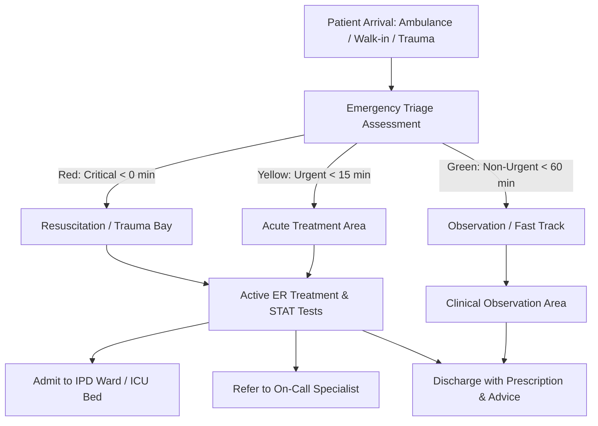
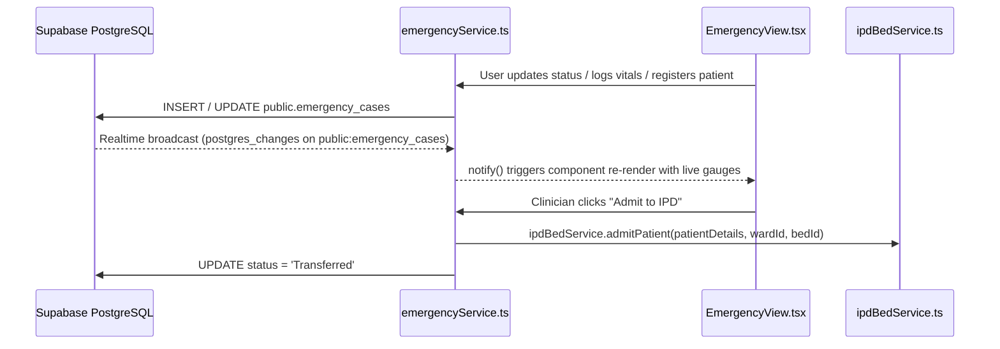

# 🚨 Emergency Department ERP System Architecture

Back to [[00_Index]]

## 1. Overview & Clinical Mandate

The Emergency Department (Casualty) module in HealthGrid Hospital ERP provides real-time situational awareness, rapid clinical triage, vital telemetry monitoring, and patient transit coordination for acute patients.



---

## 2. Relational Schema Design: `public.emergency_cases`

```sql
CREATE TABLE IF NOT EXISTS public.emergency_cases (
  id UUID PRIMARY KEY DEFAULT gen_random_uuid(),
  case_number TEXT UNIQUE NOT NULL,
  patient_id UUID REFERENCES public.patients(id) ON DELETE SET NULL,
  patient_health_id TEXT NOT NULL,
  patient_name TEXT NOT NULL,
  patient_phone TEXT,
  patient_age INTEGER,
  patient_gender TEXT,
  patient_avatar TEXT,
  triage_level TEXT NOT NULL CHECK (triage_level IN ('Red', 'Yellow', 'Green', 'Black')),
  status TEXT NOT NULL CHECK (status IN ('Waiting', 'In Treatment', 'Observation', 'Discharged', 'Transferred')),
  arrival_time TIMESTAMPTZ NOT NULL DEFAULT NOW(),
  mode_of_arrival TEXT NOT NULL CHECK (mode_of_arrival IN ('Ambulance', 'Walk-in', 'Wheelchair', 'Private Vehicle')),
  chief_complaint TEXT NOT NULL,
  assigned_doctor_id UUID REFERENCES public.doctors(id) ON DELETE SET NULL,
  assigned_doctor_name TEXT NOT NULL,
  er_location TEXT NOT NULL,
  accompanied_by TEXT,
  allergies TEXT DEFAULT 'No known allergies',
  latest_vitals JSONB DEFAULT '{"bp":"120/80","hr":72,"spo2":98,"temp":37.0,"time":"10:00 AM"}',
  vitals_history JSONB DEFAULT '[]',
  treatment_orders JSONB DEFAULT '[]',
  clinical_notes JSONB DEFAULT '[]',
  investigations_ordered JSONB DEFAULT '[]',
  discharged_at TIMESTAMPTZ,
  created_at TIMESTAMPTZ DEFAULT NOW(),
  updated_at TIMESTAMPTZ DEFAULT NOW()
);
```

---

## 3. Triage Protocol Standard

The system follows the 3-Tier Emergency Severity Index (ESI) adapted for ICMR and Indian Casualty Departments:

| Triage Level | Color Badge | Clinical Definition | Target Physician Contact | Example Presentations |
| :--- | :--- | :--- | :--- | :--- |
| Red | Red - Critical | Imminent life threat, unstable vitals | Immediate (0 minutes) | Massive trauma, acute chest pain with ST changes, respiratory failure, cardiac arrest |
| Yellow | Yellow - Urgent | Potential life threat, severe distress | Within 15 minutes | High fever with altered sensorium, severe abdominal pain, hypertensive urgency |
| Green | Green - Non-urgent | Stable condition, routine care | Within 60 minutes | Simple laceration, mild allergic reaction, minor sprain, chronic symptoms |

---

## 4. Real-Time Pub/Sub Reactive Architecture



---

## 5. Related Decisions & Architectural Notes
- [[ADR-031-Hospital-ERP-Emergency-Department-End-to-End-Architecture]]
- [[ADR-030-Hospital-ERP-Appointments-Management-End-to-End-Architecture]]
- [[ADR-029-Hospital-ERP-Inpatient-Department-and-Bed-Management]]
- [[ADR-028-Hospital-ERP-Patient-and-OPD-Management-End-to-End-Architecture]]
