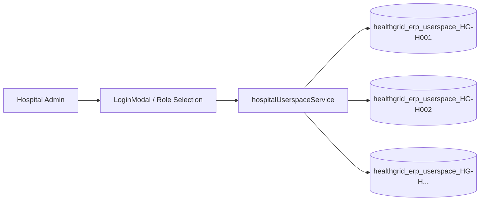

# 🏢 Multi-Tenant Hospital State Engine

Back to [[00_Index]]

## Problem
In a centralized healthcare network, hospitals (e.g. Govt Medical College, Apollo, MIOT) need isolated administrative userspaces so patient censuses, ICU beds, revenue counters, and doctor rosters do not leak into another facility.

## Implementation Architecture
Implemented in `frontend/src/services/hospitalUserspaceService.ts`:

- **Storage Key**: `healthgrid_erp_userspace_${hospitalCode}` in `localStorage`.
- **Isolation Guarantee**: Each hospital code (e.g., `HG-H002`) gets an isolated state bucket.
- **Dynamic Credential Allocation**:
  - Automatically provisions admin credentials upon creation.
  - Generates username based on hospital initials/code (`gmch_admin`, `mmc_admin`).
  - Supports custom password assignment.

## Mock Test Credentials (GMCH HG-H002)
- **Hospital**: Govt Medical College & Hospital, Omandurar
- **Code**: `HG-H002`
- **Username**: `gmch_admin`
- **Password**: `GMCH#Hospital2026`

See [[Key_Credentials_and_Environments]] for all test accounts.

## Related Notes
- [[Hospital_ERP_Dashboard]]
- [[Hospital_Information_System_HIS]]
- [[ADR-003-MultiTenant-Hospital-Isolation]]
