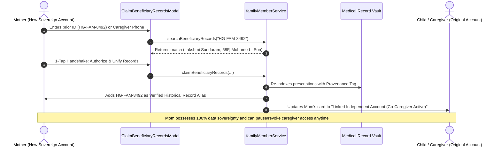

# 📜 ADR-012: Beneficiary-to-Independent Account Porting & Historical Alias Lineage Preservation

Back to [[00_Index]]

## Context
In [[ADR-011-Family-and-Beneficiary-MultiProfile-System]], HealthGrid introduced multi-profile beneficiary management enabling primary account holders (e.g., an adult child) to consult AI doctors and book hospital OPD tokens for elderly parents or dependents using auto-generated ABDM Health IDs (e.g., `HG-FAM-8492`).

However, a fundamental lifecycle transition arises when that dependent (e.g., Mother, Lakshmi) later acquires a smartphone or creates her own independent HealthGrid account. When registering independently, the system issues a new, cryptographically generated immutable primary Health ID (e.g., `HG-600040-9912`).

### The Architectural Dilemmas:
1. **The Dual-ID Collision**: Overwriting past hospital tokens, prescriptions, or clinical intake records with the new Health ID would break the cryptographic audit trail and invalidate previous hospital HIS token verification.
2. **Loss of Clinical Lineage & Provenance**: Medical history recorded during caregiver consultations contains specific clinical context (e.g., *"Consulted via son Mohamed"*). Erasing this context creates ambiguity in doctor-patient consultations.
3. **The Data Sovereignty Transition (DPDP Act 2023)**: Under India's Digital Personal Data Protection Act (DPDP) 2023, once an individual claims their sovereign data, they must have full control over who accesses it, while ensuring seamless transfer from the caregiver proxy.
4. **Caregiver Continuity**: Abruptly severing the caregiver's access leaves elderly patients vulnerable if they still need assistance booking OPD tokens or managing acute episodes.

---

## Decision

We designed and implemented the **ABDM Beneficiary-to-Independent Account Porting Protocol & Historical Alias Lineage Architecture**.



### 1. The Record Identity & Historical Alias Model
Rather than overwriting or re-writing immutable keys, Mom's account maintains:
- **Primary Health ID**: Her new immutable sovereign identifier (e.g., `HG-600040-9912`).
- **Verified Historical Aliases**: An array of linked legacy Health IDs stored in `healthgrid_historical_aliases_${userId}`:
  ```typescript
  export interface LinkedHistoricalAlias {
    historicalHealthId: string;         // e.g. HG-FAM-8492
    beneficiaryName: string;            // e.g. Lakshmi Sundaram
    caregiverName: string;              // e.g. Mohamed
    caregiverPhone?: string;
    relationship: string;               // e.g. Son
    transferredAt: string;              // ISO timestamp
    transferredRecordsCount: number;
    delegatedAccessStatus: 'ACTIVE' | 'REVOKED' | 'PENDING';
    notes?: string;
  }
  ```
- **Unified Hospital Query Resolution**: Hospital HIS and doctor portals querying either `HG-600040-9912` or `HG-FAM-8492` resolve to the same sovereign patient vault.

### 2. Clinical Provenance Tagging
When records are ported, past consultations and prescriptions retain immutable clinical provenance metadata:
```text
Verified Protocol Source:
"ABDM Provenance Tag: Consulted via Caregiver Mohamed (Son) under Health ID HG-FAM-8492 on 2026-10-02"
```
This guarantees zero doctor confusion regarding whether symptoms were self-reported or reported by a caregiver.

### 3. ABDM Delegated Co-Caregiver Mode
Once records are ported:
1. In the child's (caregiver's) family member list, Mom's card automatically reflects:
   - Status: `Linked Independent Account`
   - Identifier: `Linked Sovereign ID: HG-600040-9912`
   - Access: `Co-Caregiver Active`
2. The child can continue to assist Mom by booking hospital OPD tokens or viewing shared records.
3. In Mom's profile view, she sees a **"Verified Historical Aliases & Caregiver Lineage"** control panel where she can pause, restore, or permanently revoke the caregiver's delegated access with a single tap.

### 4. Interactive 1-Tap Handshake UI (`ClaimBeneficiaryRecordsModal.tsx`)
- Provides real-time lookup by Beneficiary Health ID or caregiver contact.
- Features a **Quick Auto-Fill Demo** button (`HG-FAM-8492 • Lakshmi Sundaram`) for rapid verification.
- Displays full preview of discovered records, caregiver details, and legal data sovereignty guarantees before authorization.

---

## Consequences

### Positive
- **Zero Data Loss**: All historical consultations, prescriptions, and OPD tokens are immediately available in the user's new account.
- **Audit Integrity**: Old hospital tokens and prescription QR codes remain valid and traceable.
- **DPDP Act 2023 Compliance**: True patient data sovereignty—proxies can register records initially, but the patient retains complete ownership upon claiming.
- **Family Peace of Mind**: Caregivers are not abruptly locked out; delegated co-caregiving maintains healthcare continuity for elderly parents.

### Considerations
- Multi-device sync requires real-time subscription or sync on page load to reflect revoked caregiver status immediately across both accounts.

---

## Related Notes
- [[00_Index]]
- [[ADR-011-Family-and-Beneficiary-MultiProfile-System]]
- [[Data_Sovereignty_and_Security]]
- [[DocBot_TeleClinic]]
- [[Hospital_Information_System_HIS]]
