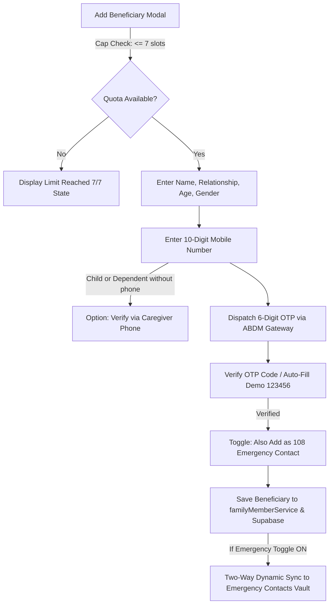

# 📜 ADR-013: Beneficiary Mobile OTP Verification, 7-Dependent Cap, and Two-Way Emergency Contact Synchronization

Back to [[00_Index]]

## Context

Following the implementation of [[ADR-011-Family-and-Beneficiary-MultiProfile-System]] and [[ADR-012-Beneficiary-to-Independent-Account-Porting]], user feedback highlighted three critical operational requirements:

1. **Identity Disambiguation & Anti-Duplication**: Multiple family members can share identical names (e.g., father and son with family names, or common first names). Without verified phone numbers, clinical records risk misattribution.
2. **Authenticity via OTP Verification**: To ensure beneficiaries are legitimate persons with real contact information, adding a dependent requires SMS/OTP phone verification.
3. **108 Emergency Contact Synchronization**: When adding a close dependent (e.g. spouse, mother, or adult child), caregivers need an intuitive toggle to automatically designate that beneficiary as an active emergency contact for 108 Ambulance SOS dispatches.
4. **Beneficiary Quota Management**: In compliance with the ABDM/CoWIN multi-beneficiary standard, accounts must prevent runaway profile creation by capping family profiles at 7 dependents.

---

## Decision

We designed and implemented the **Beneficiary OTP Verification, Quota Governor, and Emergency Contact Synchronization Engine**.

### 1. Quota Enforcement (`MAX_BENEFICIARIES = 7`)

- Strict quota of 7 beneficiaries per user account enforced at the service layer (`canAddBeneficiary()`, `addFamilyMember()`) and in the UI with a live slot counter (`${members.length}/7 Slots`).
- Once 7 beneficiaries are reached, the add button transitions to a disabled *"Limit Reached (7/7)"* badge with guidance on managing existing profiles.

### 2. Mandatory Mobile & OTP Verification Flow

- **10-Digit Mobile Requirement**: Beneficiary phone number is validated and stored to ensure unique disambiguation.
- **Caregiver Proxy Verification**: For young children or elderly dependents without a personal smartphone, caregivers can check *"Dependent has no personal phone (Verify using Caregiver phone)"*, which routes the OTP to the caregiver's registered mobile number.
- **6-Digit OTP Engine**: Built in `familyMemberService` with a 45-second resend countdown and instant demo bypass (`123456`).
- **Verified Status Badge**: A green `[✓ Verified via OTP]` badge is attached to the beneficiary record upon confirmation.

### 3. Two-Way Dynamic Emergency Contact Synchronization

- During creation in `ConsultationBeneficiaryModal.tsx`, caregivers can toggle *"Also Add as Emergency Contact"*.
- On the beneficiary card in `ProfilePage.tsx`, an inline toggle switch (`🚨 108 SOS Contact: Active / Off`) enables live two-way toggling:
  - Turning it **ON** adds the beneficiary's name, relationship, and phone to the user's `emergencyContacts` list and syncs to Supabase.
  - Turning it **OFF** or **Deleting** the beneficiary automatically purges their entry from the 108 emergency dispatch list.

### 4. Direct Navigation & Discoverability

- **Header Jump Pill**: In `ProfilePage.tsx`, a prominent `[ 👥 Manage Beneficiaries (X/7) ]` button in the header actions provides 1-tap smooth scrolling directly to `#manage-beneficiaries`.
- **Navbar Auto-Scroll**: Clicking *"Manage Beneficiaries"* in the user profile dropdown navigates to `/profile#manage-beneficiaries` and automatically scrolls down to the management card.

---

## Consequences

### Positive

- **Guaranteed Record Integrity**: Beneficiary records are uniquely tied to verified phone numbers, preventing duplicate names from colliding.
- **Immediate 108 Ambulance Readiness**: Critical family members are synced to the emergency dispatch list with zero duplicate data entry.
- **ABDM Compliance**: Standardized on the 7-beneficiary cap matching CoWIN and NHA specifications.

---

## Related Notes

- [[00_Index]]
- [[ADR-011-Family-and-Beneficiary-MultiProfile-System]]
- [[ADR-012-Beneficiary-to-Independent-Account-Porting]]
- [[Emergency_108_Ambulance]]
- [[Data_Sovereignty_and_Security]]
