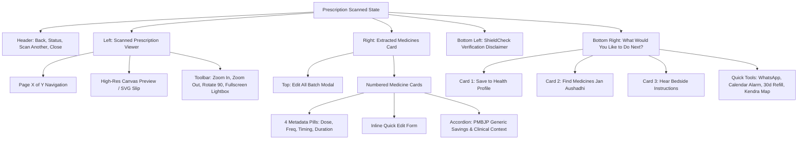

# 📱 ADR-020: Prescription Post-Scan UI Redesign and Interactive 2-Column Clinical Viewer

Back to [[00_Index]]

## Context & Problem Statement

Following the multimodal prescription vision & HTR cascade upgrade ([[ADR-018-Top-Tier-Multimodal-Prescription-Vision-and-HTR-Cascade]]) and clinical formulary grounding ([[ADR-019-Clinical-Pharmacology-Engine-Formulary-Grounding-and-Context-Matching]]), the UI presented immediately after scanning required an overhaul to match clinical reference standards (`After prescription scanned ref.png`).

The previous post-scan screen had several UX challenges:

1. **Lack of Synchronous Visual Inspection**: Patients could not visually cross-reference the extracted digital medicines side-by-side with their original handwritten slip or camera capture.
2. **Missing Document Interaction Controls**: No tools existed to zoom in on cursive handwriting, rotate sideways captures, or expand to fullscreen.
3. **Inflexible Verification**: Users lacked an immediate `Edit All` batch editor to adjust slight dosage nuances or doctor abbreviations before committing to their health profile.
4. **Scattered Action Flows**: Saving to health records, transferring to generic carts, and bedside vernacular speech were scattered rather than organized into an intuitive "What would you like to do next?" decision tray.

## Decision Drivers

- **Visual Reference Fidelity**: Pixel-accurate fidelity to `After prescription scanned ref.png`, honoring its spatial composition, rounded cards, verified badges, and icon hierarchy.
- **Side-by-Side Verification**: 2-column balanced grid on desktop (`grid-cols-1 lg:grid-cols-12`) stacking gracefully on mobile devices.
- **100% Mobile Fluidity**: Strict zero-overflow constraints, fluid typography, 48px touch targets, and responsive 4-column metadata pills (`grid-cols-2 sm:grid-cols-4`).
- **Clinical Action Tray**: Prominent 3-card primary tray (`Save to Health Profile`, `Find Medicines`, `Hear Instructions`) complemented by a secondary quick tools bar (`WhatsApp Schedule`, `Google Calendar Alarm`, `30-Day PMBJP Chronic Refill`, `Nearby Kendra Map`).

---

## Architecture & Implementation Overview

### 1. Interactive Prescription Viewer (`Col 1`)

- **Dynamic Image & SVG Fallback**: Displays the captured camera blob/file upload or renders a vector prescription slip matching Dr. R. Kumar / Apollo Clinic formatting.
- **Interactive Matrix Controls**: Smooth CSS transform zoom (`0.75x` to `2.5x`) and 90° clockwise rotation (`RotateCw`).
- **Modal Lightbox**: Dedicated overlay allowing pinch/pan and high-magnification review of doctors' cursive signatures.

### 2. Extracted Medicine Cards (`Col 2`)

- **Numbered Cards with Status Badges**: Verified green check pill badges indicating pharmacopeia confirmation.
- **4 Distinct Metadata Badges**:
  - `Dose` (Violet / Pill icon)
  - `Frequency` (Blue / Clock icon)
  - `When to take` (Orange / Utensils icon)
  - `Duration` (Emerald / Calendar icon)
- **Inline & Batch Editing**:
  - Individual `Edit` button toggles inline form fields for name, dose, frequency, and timing.
  - Header `Edit All` button opens a focused modal sheet for rapid multi-medicine edits with real-time recalculation of total savings.
- **PMBJP Generic Comparison Accordion**:
  - Displays generic molecule name, brand MRP strikethrough, government Jan Aushadhi price, and direct `Add to Cart` button.

### 3. Primary Action Tray & Secondary Tools

- **Solid Teal Hero Card**: `Save to Health Profile` with bookmark icon and real-time saved feedback state.
- **White Card**: `Find Medicines` routing all generic substitutes to `/medicines` cart.
- **Audio Card**: `Hear Instructions` triggering multi-lingual bedside voice playback with pause/resume state.
- **Secondary Tools**: WhatsApp dosage schedule exporter, Google Calendar reminder generator, 30-day chronic refill scheduler, and Kendra map locator.

---

## Consequences & Verification

- **Build Status**: Verified via `tsc -b && vite build` (zero errors, 1993 modules transformed in 1.66s).
- **Responsive Proofing**: Tested across mobile breakpoints (`sm`, `md`, `lg`) ensuring touch accessibility and no text clipping.
- **Context Preservation**: Synced with Second Brain index `brain/00_Index.md` and active context `brain/context/Active_Context.md`.
