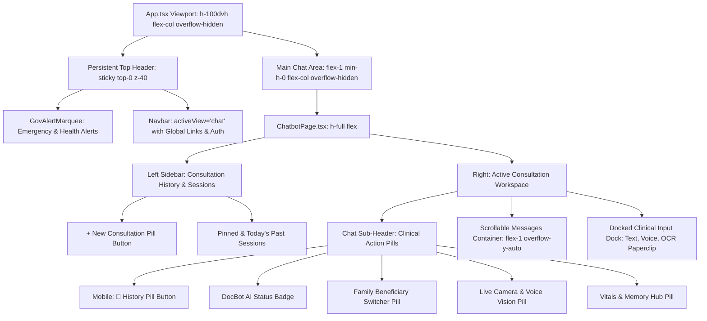

# 🧭 ADR-021: Persistent Unified Header & Navbar Architecture Across the AI Doctor Chat Tab

Back to [[00_Index]]

## Context & Problem Statement

Previously, navigating to the AI Doctor consultation tab (`/chat` or `currentView === 'chat'`) caused the global top header (`GovAlertMarquee` + `Navbar`) to completely disappear. This happened because `App.tsx` executed an early return:

```tsx
if (currentView === 'chat') {
  return <ChatbotPage ... />;
}
```

This produced several critical usability friction points:

1. **Broken Navigation Continuity**: Users inside the chat consultation lost the persistent global navigation bar, preventing them from seamlessly jumping to Home, PMBJP Generic Medicines (`/medicines`), the 24/7 Bed & Facility Locator (`/maps`), or their Health Profile.
2. **Duplicated Sidebar & Action Links**: To compensate for the missing top navbar, `ChatbotPage` had replicated brand logos and global navigation buttons (*Home*, *Chat with AI*, *Speak to Doctor*, *Call Ambulance*, *Medicines*, *Disease Map*) inside its left sidebar, consuming valuable vertical space that should belong to consultation history and past sessions.
3. **Mobile Dual-Hamburger Trap**: On mobile screens, having the chat view unanchored from the top header created confusion around navigation menus and back gestures.

## Decision Drivers

- **Absolute Global Persistence**: The coordinated top header (`GovAlertMarquee` + `Navbar activeView="chat"`) must remain anchored at `sticky top-0 z-40` throughout the entire application lifecycle, including active AI Doctor consultations.
- **Single Page Scroll / Zero Double-Scrollbars**: The chat container must fill the exact remaining viewport height below the sticky header (`h-[100dvh] flex flex-col overflow-hidden` with `min-h-0 flex-1`), ensuring internal messages scroll smoothly without an outer document scrollbar.
- **De-duplication of Controls**:
  - *Left Sidebar*: Dedicated solely to consultation history (`+ New Consultation`, pinned chats, today/past sessions, session rename/delete), stripping out duplicated global navigation buttons.
  - *Chat Sub-Header*: Dedicated to consultation-specific clinical tools (DocBot AI status badge, Family Beneficiary switcher pill, Real-Time Live Camera Vision, Longitudinal Health Memory / Vitals Hub), stripping out duplicate language toggles and user avatars that the persistent Navbar already provides.
- **Mobile Dual-Menu Disambiguation**: On mobile devices, the top Navbar's hamburger menu remains strictly the global HealthGrid drawer. In the Chat sub-header, an explicit `[ 💬 History ]` pill button replaces the secondary hamburger icon to eliminate visual ambiguity.

---

## Architectural Implementation Overview



### 1. Viewport & Layout Composition in `App.tsx`

```tsx
<div className="h-[100dvh] flex flex-col bg-[#F8FAFC] text-slate-900 font-sans selection:bg-teal-500 selection:text-white overflow-hidden">
  <header className="sticky top-0 z-40 w-full flex-shrink-0">
    <GovAlertMarquee ... />
    <Navbar activeView="chat" ... />
  </header>
  <main className="flex-1 w-full overflow-hidden flex flex-col min-h-0">
    <Suspense fallback={<ViewLoadingFallback />}>
      <ChatbotPage ... />
    </Suspense>
  </main>
</div>
```

### 2. Streamlined Left Sidebar & Sub-Header in `ChatbotPage.tsx`

- **Sidebar Header**: Displays `[ 💬 Consultations ]` with subtitle `Chat History & Vault` and mobile `[ ✕ ]` close trigger.
- **Clean Action Pills**: The Chat sub-header retains only consultation-relevant context (Family Beneficiary switcher pill, `📹 Live Vision`, `🩺 Records Hub`, and `➕ New Consultation`), eliminating redundant language switcher and avatar pills.
- **Zero-Unused-Locals Compliance**: Cleaned unused icons (`Home`, `Phone`, `Siren`, `Shield`, `Globe`, `Menu`) to satisfy `tsc -b` and strict compiler standards.

---

## Consequences & Verification

- **Compilation Check**: Validated via `tsc -b && vite build` (zero errors).
- **Navigation Proofing**: Tested transitions between Home (`/`), AI Doctor (`/chat`), PMBJP Medicines (`/medicines`), Bed Locator (`/maps`), and Profile (`/profile`). The top header remains rock-solid without flashing or disappearing.
- **Mobile Experience**: Explicit `[ 💬 History ]` pill button cleanly opens past chats on small touch screens while the top Navbar hamburger provides immediate access to 108 Emergency and site navigation.
