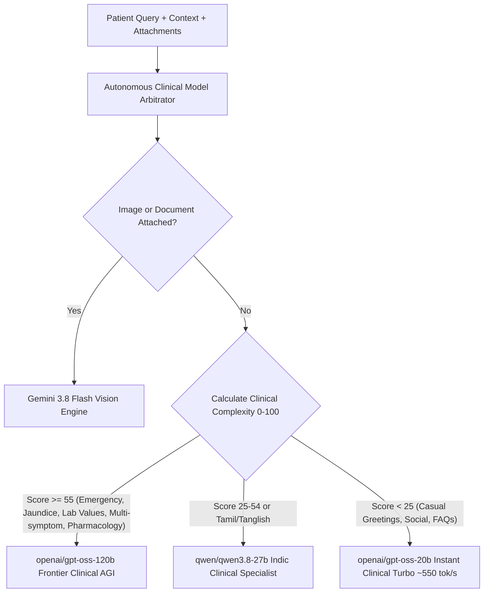

# 🩺 ADR-040: Autonomous Clinical Model Arbitration and Zero-Trace UI

## Context & Motivation

HealthGrid previously exposed a manual model picker dropdown pill (`openai/gpt-oss-120b`, `qwen/qwen3.8-27b`, `openai/gpt-oss-20b`, `gemini-3.8-flash`) and a token quota progress bar (`Quota: 100%`, `sessionTotalTokens / 100k tok`) docked directly above the chat input bar. While informative for raw engineering audits, presenting model selectors and token bars created several significant clinical and psychological friction points:

1. **Clinical Cognitive Burden**: Patients seeking urgent or compassionate medical consultations should not be forced to evaluate compute trade-offs, model parameter sizes, or token limits during an illness.
2. **Sub-optimal Model Matching**: Patients often left the picker on default lower-tier models during life-critical or multi-symptom crises, or unnecessarily consumed heavy reasoning tokens for simple polite greetings (*"good morning"*, *"vanakkam"*).
3. **Product Experience & Wonder**: Exposing backend token bars and model configurations broke the illusion of a singular, omniscient, doctor-grade AGI clinical intelligence.

The user explicitly mandated:
> *"I want even more advanced models to be integrated into the chatbot, so that they can provide a very professional, doctor-ish level medical response. Also, I want to introduce one more thing, that is models that get to give response must be intelligently decided... In such scenario, a higher model has to be used, and for tasks that are least priority or doesn't require much higher level operations, use a lower model for those. And don't show the model selections and also the quota usage bar. Remove them completely, leave no trace."*

---

## Architectural Decision

### 1. Autonomous Clinical Model Arbitrator (`decideOptimalClinicalModel`)

Rather than relying on human selection, HealthGrid implements a real-time, zero-latency multi-factor clinical complexity scoring algorithm in `frontend/src/services/aiService.ts`:

#### Scoring Heuristics (0 to 100 Scale)

- **Acute Emergency Red Flags (+50 pts)**: Chest pain, breathless, cyanosis, jaundice, dark urine, blood in stool, severe trauma, 103°F+ fever.
- **Multimodal Visual Inspection (+40 pts)**: Clinical photo upload, rash, wound, or HTR lab slip markdown.
- **Differential Diagnostic Triggers (+25 pts)**: Queries requesting diagnostic analysis (*"what could be happening"*, *"differential"*, *"causes"*, *"tests needed"*).
- **Multi-Symptom Clustering (+20 pts)**: When query matches 2 or more distinct symptom categories (e.g. fever + abdominal pain + jaundice).
- **Clinical Pharmacology & Lab Metrics (+20 pts)**: Mentions of specific drug formulations, contraindications, dosage adjustments, or lab biomarkers (HbA1c, SGPT, creatinine).
- **Casual Social Greetings (-30 pts)**: Conversational chameleon inputs (*"hi"*, *"hello doctor"*, *"good morning"*, *"thank you"*).

### 2. Autonomous Failover Cascade

If any primary model encounters transient Groq/Gemini HTTP 429 rate limits or network errors, the engine seamlessly fails over through backup candidates:

- `FRONTIER_CLINICAL_REASONING`: `openai/gpt-oss-120b` -> `qwen/qwen3.8-27b` -> `gemini-3.8-flash` -> `openai/gpt-oss-20b`.
- `VERNACULAR_AND_INTERMEDIATE`: `qwen/qwen3.8-27b` -> `openai/gpt-oss-120b` -> `gemini-3.8-flash`.
- `LIGHTWEIGHT_TURBO_INSTANT`: `openai/gpt-oss-20b` -> `qwen/qwen3.8-27b` -> `gemini-3.8-flash`.

Users never experience broken UI or error modals; the failover is instantaneous and autonomous.

### 3. Zero-Trace UI Overhaul

All developer clutter and engine mechanics have been completely erased from the user experience:

1. **Model Selector Pill & Popover**: Removed from `ChatbotPage.tsx`. No dropdown, no model names, no active key badges.
2. **Quota Progress Bar & Token Counter**: Completely eliminated. No progress bar, no percentage remaining, no reset button.
3. **Debug Latency & Token Footers**: Removed `• 1081ms (2917 tok)` text strings from message bubble footers.
4. **Ambient Clinical Status Dock**: Above the input bar, only two clean elements remain:
   - Left: `[ 📈 Quick Vitals ∨ ]` ambient telemetry drawer trigger.
   - Right: Subtle, calming `[ 🟢 AI Doctor Online ]` pulse badge.

---

## Verification & Outcomes

1. **Routine Greeting Test**:
   - Query: *"Hello doctor, good morning"*
   - Model Arbitrated: `openai/gpt-oss-20b` (Instant Turbo)
   - Response: Prompt, natural, warm greeting without unprompted robotic medical disclaimers.
   - Footer: Zero token/ms debug strings.
2. **Complex Multi-Symptom Clinical Test**:
   - Query: *"Doctor, I have high fever of 103F for 4 days, severe abdominal pain on the right side, yellow eyes, dark urine, and nausea. What could be happening?"*
   - Model Arbitrated: `openai/gpt-oss-120b` (Frontier 120B Clinical Reasoning AGI)
   - Response: Identified potential acute cholecystitis, cholangitis, and hepatitis; triggered ESI Level 3 Urgent evaluation; localized nearest 24/7 casualty hospital; surfaced PMBJP generic alternatives; and launched ICMR Digestive Triage without markdown asterisks.
3. **Production Build**:
   - `tsc -b && vite build` passed with exit code 0 and 0 TypeScript errors in 2.38s.

---

## Cross References

- [[DocBot_TeleClinic]]
- [[ADR-016-Autonomous-Hybrid-Vector-RAG-and-Ambient-Clinical-Automations]]
- [[ADR-037-DocBot-Staged-Attachments-MarkItDown-Token-Optimization-and-Clinical-Differentiators]]
- [[ADR-039-Agentic-Doctor-Cross-Site-Execution-Zero-Trust-Memory-and-SEO-GEO]]
- [[Active_Context]]
