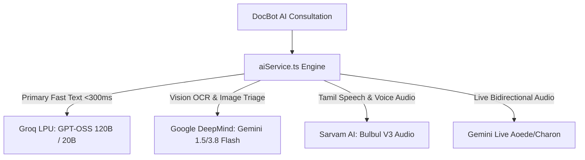

# 🧠 AI Providers, LLM Fallbacks & Multimodal Services

Back to [[00_Index]]

## Overview

HealthGrid implements a resilient multi-provider AI architecture ensuring uninterrupted clinical consultation even during rate limits or provider outages.

## Provider Topology & Capabilities

## Service Files

- `frontend/src/services/aiService.ts`: Core orchestrator with automatic fallback to Gemini if Groq exhausts quota.
- `frontend/src/services/speechService.ts`: Voice input/output with Sarvam and Gemini Live audio.
- `frontend/src/services/prescriptionAiService.ts`: Multimodal handwritten prescription digitization via Gemini Flash OCR.
- `frontend/src/services/liveVisionDoctorService.ts`: Real-time camera symptom inspection (rashes, throat inflammation, eye redness).

## Related Notes

- [[DocBot_TeleClinic]]
- [[Data_Sovereignty_and_Security]]
